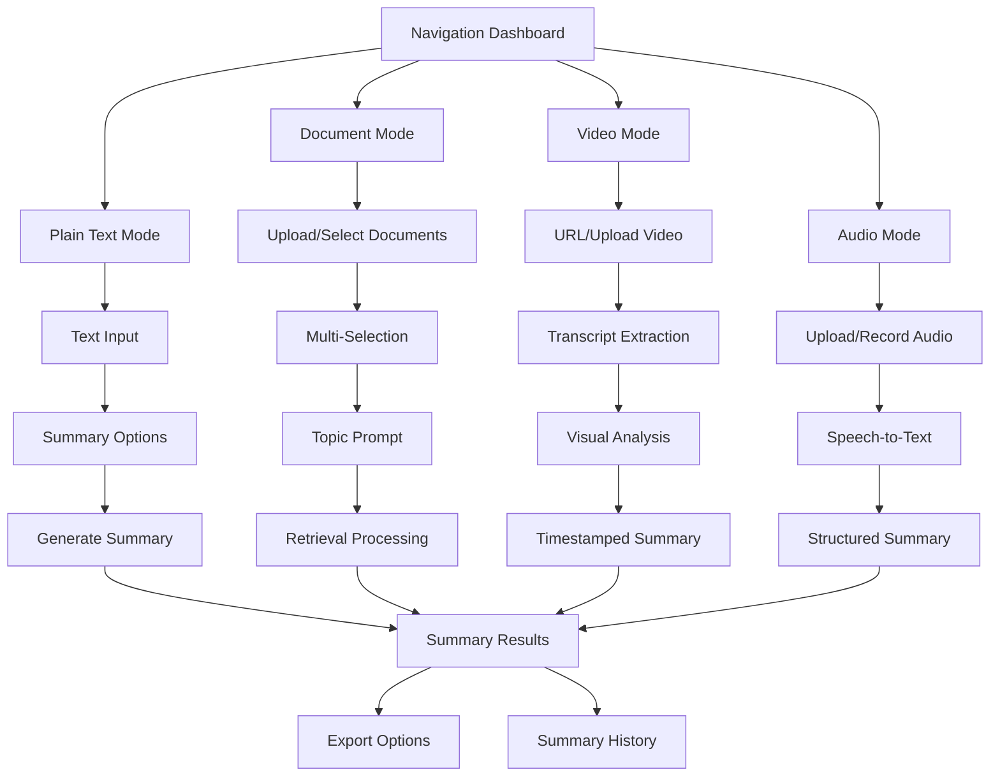

# Enhanced Intelligent Summarization Module - Product Requirements Document

## 1. Product Overview

The Enhanced Intelligent Summarization Module is a comprehensive content processing system that provides four distinct summarization modes through an intuitive card-based navigation interface. The system enables users to process various content types including plain text, documents, videos, and audio files with advanced AI-powered summarization capabilities.

This redesigned module addresses the growing need for versatile content summarization across multiple media formats, serving students, researchers, professionals, and content creators who require efficient information extraction and synthesis from diverse sources.

## 2. Core Features

### 2.1 User Roles

| Role | Registration Method | Core Permissions |
|------|---------------------|------------------|
| Registered User | Email registration with verification | Access to all four summarization modes, document storage, history tracking |
| Premium User | Subscription upgrade | Extended processing limits, advanced features, priority processing |
| Guest User | No registration required | Limited access to Plain Text mode only |

### 2.2 Feature Module

Our enhanced summarization system consists of the following main pages:

1. **Navigation Dashboard**: Card-based interface displaying four summarization modes with feature previews
2. **Plain Text Summary Page**: Text input interface with summary length options and real-time processing
3. **Document Summary Page**: File upload interface, document library, multi-selection tools, and retrieval-based summarization
4. **Video Summary Page**: YouTube link input, video upload interface, transcript display, and timestamped summaries
5. **Audio Summary Page**: Audio upload/recording interface, transcription display, and structured summary output
6. **Summary History Page**: Centralized view of all generated summaries across all modes
7. **Settings Page**: User preferences, processing options, and account management

### 2.3 Page Details

| Page Name | Module Name | Feature Description |
|-----------|-------------|--------------------|
| Navigation Dashboard | Mode Selection Cards | Display four summarization modes as interactive cards with icons, descriptions, and quick access buttons |
| Navigation Dashboard | Recent Activity | Show recent summaries and quick access to frequently used modes |
| Plain Text Summary | Text Input Area | Large text area with paste functionality, character count, and formatting options |
| Plain Text Summary | Summary Options | Radio buttons for summary length (short, medium, detailed) and processing preferences |
| Plain Text Summary | Real-time Processing | Live summary generation with progress indicators and estimated completion time |
| Document Summary | File Upload Zone | Drag-and-drop interface supporting PDF, DOCX, PPT, JPEG with OCR processing |
| Document Summary | Document Library | Grid view of uploaded documents with thumbnails, metadata, and selection checkboxes |
| Document Summary | Multi-Selection Tools | "Select All" button, individual selection, and batch processing options |
| Document Summary | Topic-Specific Prompts | Text input for custom prompts with retrieval-based processing |
| Document Summary | Embedding & Indexing | Background processing for document chunking, embedding generation, and metadata extraction |
| Video Summary | URL Input | YouTube link validation and video information preview |
| Video Summary | Video Upload | File upload with format validation and processing status |
| Video Summary | Transcript Display | Scrollable transcript with timestamp markers and search functionality |
| Video Summary | Visual Content Capture | Representative frame extraction, chart detection, and slide segment identification |
| Video Summary | Timestamped Summaries | Summary points linked to specific video timestamps with playback integration |
| Audio Summary | Audio Upload | File upload supporting multiple audio formats with validation |
| Audio Summary | Recording Interface | Built-in audio recorder with waveform visualization and recording controls |
| Audio Summary | Speech-to-Text | Real-time transcription with speaker identification and confidence scores |
| Audio Summary | Structured Summary | Organized summary output with key points, topics, and action items |
| Summary History | Filter & Search | Filter by mode, date, keywords, and search across all summaries |
| Summary History | Export Options | Export summaries in multiple formats (PDF, DOCX, TXT, JSON) |
| Settings | Processing Preferences | Default summary lengths, language preferences, and quality settings |
| Settings | Storage Management | Document storage limits, cleanup options, and usage statistics |

## 3. Core Process

### Main User Flow

Users begin at the Navigation Dashboard where they select from four summarization modes displayed as cards. Each mode guides users through specific workflows:

**Plain Text Flow**: Select Plain Text card → Input/paste text → Choose summary length → Generate summary → View/export results

**Document Flow**: Select Document card → Upload files OR select from library → Choose documents → Enter optional topic prompt → Generate summary → View/export results

**Video Flow**: Select Video card → Input YouTube URL OR upload video → Process transcript → Generate timestamped summary → View with video playback → Export results

**Audio Flow**: Select Audio card → Upload file OR record audio → Process transcription → Generate structured summary → View/export results

## 4. User Interface Design

### 4.1 Design Style

- **Primary Colors**: Deep blue (#1e40af) for headers and primary actions, light blue (#3b82f6) for accents
- **Secondary Colors**: Gray scale (#f8fafc to #1e293b) for backgrounds and text, green (#10b981) for success states
- **Button Style**: Rounded corners (8px radius), subtle shadows, hover animations with color transitions
- **Typography**: Inter font family, 16px base size for body text, 24px for headings, 14px for captions
- **Layout Style**: Card-based design with clean spacing, responsive grid system, prominent call-to-action buttons
- **Icons**: Outline style icons with 2px stroke width, consistent sizing at 24px for navigation, 16px for inline elements

### 4.2 Page Design Overview

| Page Name | Module Name | UI Elements |
|-----------|-------------|-------------|
| Navigation Dashboard | Mode Cards | Four large cards (300x200px) with gradient backgrounds, mode icons, titles, descriptions, and "Get Started" buttons |
| Navigation Dashboard | Header | Logo, user avatar, notifications, and quick search bar with glassmorphism effect |
| Plain Text Summary | Input Area | Full-width textarea with rounded borders, placeholder text, and character counter |
| Plain Text Summary | Options Panel | Horizontal radio button group with visual length indicators and processing time estimates |
| Document Summary | Upload Zone | Dashed border drop zone with cloud upload icon, supported format list, and progress bars |
| Document Summary | Library Grid | Responsive grid with document cards showing thumbnails, titles, file types, and selection checkboxes |
| Video Summary | Media Player | Embedded video player with custom controls, transcript sidebar, and summary overlay |
| Video Summary | Timeline | Interactive timeline showing summary points as markers with hover previews |
| Audio Summary | Waveform | Visual audio waveform with playback controls and transcript synchronization |
| Audio Summary | Summary Sections | Collapsible sections for key points, topics, and action items with expand/collapse animations |

### 4.3 Responsiveness

The application follows a mobile-first approach with responsive breakpoints at 640px (mobile), 768px (tablet), and 1024px (desktop). Touch interactions are optimized for mobile devices with larger tap targets (44px minimum) and gesture support for audio recording and video playback. The card layout adapts from single column on mobile to 2x2 grid on desktop.

## 5. Technical Requirements

### 5.1 Processing Capabilities

- **Plain Text**: Support for up to 50,000 characters with real-time processing
- **Documents**: OCR processing for images, text extraction from PDFs/DOCX/PPT, embedding generation for retrieval
- **Video**: YouTube API integration, video upload up to 2GB, transcript extraction, frame analysis
- **Audio**: Multiple format support (MP3, WAV, M4A), real-time recording, speech-to-text with speaker identification

### 5.2 Storage & Performance

- **Document Storage**: Persistent storage with user-based organization and search indexing
- **Processing Speed**: Real-time for plain text, under 5 minutes for documents, under 10 minutes for video/audio
- **Concurrent Users**: Support for 100+ simultaneous processing requests
- **Data Retention**: User summaries stored for 1 year, documents for 6 months unless premium

### 5.3 Integration Requirements

- **AI Services**: Integration with GPT-4 for summarization, Whisper for transcription, CLIP for visual analysis
- **External APIs**: YouTube Data API, OCR services, embedding models
- **Database**: Vector database for document embeddings, relational database for user data and metadata
- **File Storage**: Cloud storage for uploaded documents, videos, and audio files with CDN delivery