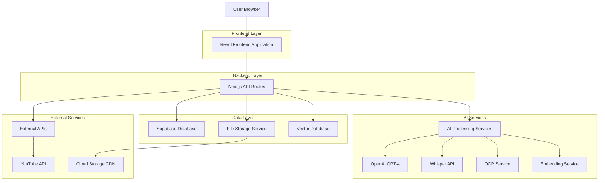
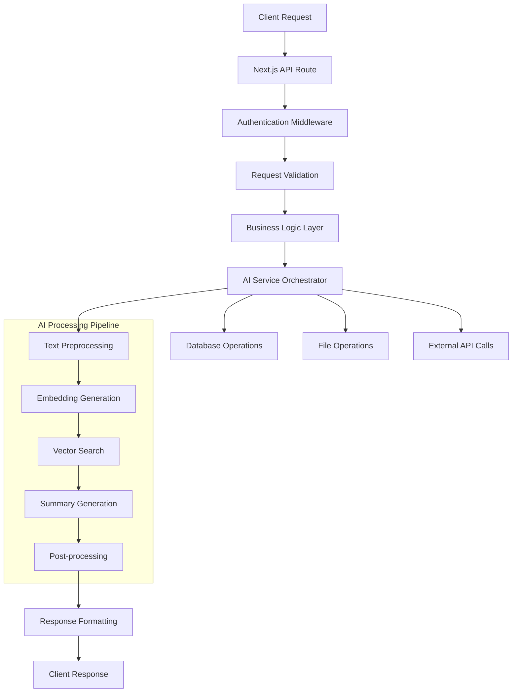
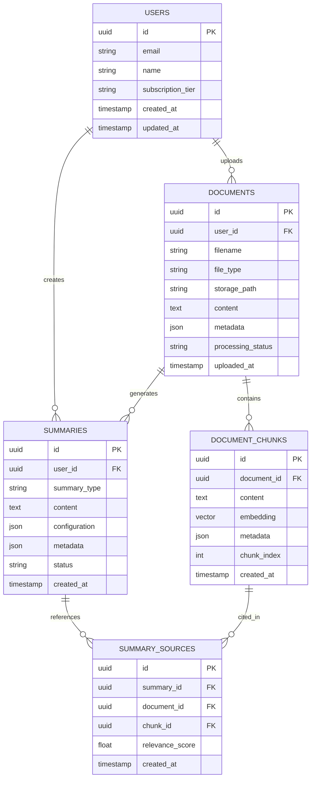

# Enhanced Intelligent Summarization Module - Technical Architecture Document

## 1. Architecture Design



## 2. Technology Description

- Frontend: React@18 + Next.js@14 + TypeScript + Tailwind CSS + Framer Motion
- Backend: Next.js API Routes + Node.js
- Database: Supabase (PostgreSQL) + Pinecone (Vector Database)
- AI Services: OpenAI GPT-4 + Whisper + Custom OCR + Sentence Transformers
- File Storage: Supabase Storage + CloudFront CDN
- External APIs: YouTube Data API v3

## 3. Route Definitions

| Route | Purpose |
|-------|---------|
| / | Main dashboard with four summarization mode cards |
| /summarize/text | Plain text summarization interface |
| /summarize/document | Document upload and library management |
| /summarize/video | Video processing and timestamped summaries |
| /summarize/audio | Audio upload/recording and transcription |
| /history | Summary history across all modes |
| /settings | User preferences and account management |
| /api/auth/* | Authentication endpoints |

## 4. API Definitions

### 4.1 Core API Endpoints

**Plain Text Summarization**
```
POST /api/summarize/text
```

Request:
| Param Name | Param Type | isRequired | Description |
|------------|------------|------------|-------------|
| text | string | true | Raw text content to summarize |
| length | enum | true | Summary length: 'short', 'medium', 'detailed' |
| language | string | false | Target language for summary |

Response:
| Param Name | Param Type | Description |
|------------|------------|-------------|
| summary | string | Generated summary text |
| wordCount | number | Word count of summary |
| processingTime | number | Time taken in milliseconds |

**Document Upload and Processing**
```
POST /api/documents/upload
```

Request:
| Param Name | Param Type | isRequired | Description |
|------------|------------|------------|-------------|
| file | File | true | Document file (PDF, DOCX, PPT, JPEG) |
| userId | string | true | User identifier |

Response:
| Param Name | Param Type | Description |
|------------|------------|-------------|
| documentId | string | Unique document identifier |
| status | string | Processing status |
| metadata | object | Document metadata and text content |

**Document Summarization**
```
POST /api/summarize/documents
```

Request:
| Param Name | Param Type | isRequired | Description |
|------------|------------|------------|-------------|
| documentIds | string[] | true | Array of document IDs to summarize |
| prompt | string | false | Topic-specific prompt for retrieval |
| length | enum | true | Summary length preference |

Response:
| Param Name | Param Type | Description |
|------------|------------|-------------|
| summary | string | Combined summary from selected documents |
| sources | object[] | Source references with document chunks |
| relevanceScores | number[] | Relevance scores for retrieved chunks |

**Video Processing**
```
POST /api/summarize/video
```

Request:
| Param Name | Param Type | isRequired | Description |
|------------|------------|------------|-------------|
| videoUrl | string | false | YouTube URL |
| videoFile | File | false | Uploaded video file |
| extractFrames | boolean | false | Whether to extract key frames |

Response:
| Param Name | Param Type | Description |
|------------|------------|-------------|
| transcript | object[] | Timestamped transcript segments |
| summary | object[] | Summary points with timestamps |
| keyFrames | string[] | URLs of extracted key frames |

**Audio Processing**
```
POST /api/summarize/audio
```

Request:
| Param Name | Param Type | isRequired | Description |
|------------|------------|------------|-------------|
| audioFile | File | true | Audio file to process |
| language | string | false | Expected language for transcription |

Response:
| Param Name | Param Type | Description |
|------------|------------|-------------|
| transcript | string | Full transcription text |
| summary | object | Structured summary with sections |
| speakers | string[] | Identified speakers if multiple |

### 4.2 Supporting API Endpoints

**Document Library**
```
GET /api/documents
```

**Summary History**
```
GET /api/summaries/history
```

**Export Summary**
```
POST /api/summaries/export
```

## 5. Server Architecture Diagram



## 6. Data Model

### 6.1 Data Model Definition



### 6.2 Data Definition Language

**Users Table**
```sql
CREATE TABLE users (
    id UUID PRIMARY KEY DEFAULT gen_random_uuid(),
    email VARCHAR(255) UNIQUE NOT NULL,
    name VARCHAR(100) NOT NULL,
    subscription_tier VARCHAR(20) DEFAULT 'free' CHECK (subscription_tier IN ('free', 'premium')),
    created_at TIMESTAMP WITH TIME ZONE DEFAULT NOW(),
    updated_at TIMESTAMP WITH TIME ZONE DEFAULT NOW()
);

CREATE INDEX idx_users_email ON users(email);
```

**Documents Table**
```sql
CREATE TABLE documents (
    id UUID PRIMARY KEY DEFAULT gen_random_uuid(),
    user_id UUID NOT NULL REFERENCES users(id) ON DELETE CASCADE,
    filename VARCHAR(255) NOT NULL,
    file_type VARCHAR(50) NOT NULL,
    storage_path TEXT NOT NULL,
    content TEXT,
    metadata JSONB DEFAULT '{}',
    processing_status VARCHAR(20) DEFAULT 'pending' CHECK (processing_status IN ('pending', 'processing', 'completed', 'failed')),
    uploaded_at TIMESTAMP WITH TIME ZONE DEFAULT NOW()
);

CREATE INDEX idx_documents_user_id ON documents(user_id);
CREATE INDEX idx_documents_status ON documents(processing_status);
CREATE INDEX idx_documents_type ON documents(file_type);
```

**Document Chunks Table**
```sql
CREATE TABLE document_chunks (
    id UUID PRIMARY KEY DEFAULT gen_random_uuid(),
    document_id UUID NOT NULL REFERENCES documents(id) ON DELETE CASCADE,
    content TEXT NOT NULL,
    embedding VECTOR(1536),
    metadata JSONB DEFAULT '{}',
    chunk_index INTEGER NOT NULL,
    created_at TIMESTAMP WITH TIME ZONE DEFAULT NOW()
);

CREATE INDEX idx_chunks_document_id ON document_chunks(document_id);
CREATE INDEX idx_chunks_embedding ON document_chunks USING ivfflat (embedding vector_cosine_ops);
```

**Summaries Table**
```sql
CREATE TABLE summaries (
    id UUID PRIMARY KEY DEFAULT gen_random_uuid(),
    user_id UUID NOT NULL REFERENCES users(id) ON DELETE CASCADE,
    summary_type VARCHAR(20) NOT NULL CHECK (summary_type IN ('text', 'document', 'video', 'audio')),
    content TEXT NOT NULL,
    configuration JSONB DEFAULT '{}',
    metadata JSONB DEFAULT '{}',
    status VARCHAR(20) DEFAULT 'completed' CHECK (status IN ('pending', 'processing', 'completed', 'failed')),
    created_at TIMESTAMP WITH TIME ZONE DEFAULT NOW()
);

CREATE INDEX idx_summaries_user_id ON summaries(user_id);
CREATE INDEX idx_summaries_type ON summaries(summary_type);
CREATE INDEX idx_summaries_created_at ON summaries(created_at DESC);
```

**Summary Sources Table**
```sql
CREATE TABLE summary_sources (
    id UUID PRIMARY KEY DEFAULT gen_random_uuid(),
    summary_id UUID NOT NULL REFERENCES summaries(id) ON DELETE CASCADE,
    document_id UUID REFERENCES documents(id) ON DELETE CASCADE,
    chunk_id UUID REFERENCES document_chunks(id) ON DELETE CASCADE,
    relevance_score FLOAT DEFAULT 0.0,
    created_at TIMESTAMP WITH TIME ZONE DEFAULT NOW()
);

CREATE INDEX idx_summary_sources_summary_id ON summary_sources(summary_id);
CREATE INDEX idx_summary_sources_relevance ON summary_sources(relevance_score DESC);
```

**Row Level Security Policies**
```sql
-- Enable RLS
ALTER TABLE documents ENABLE ROW LEVEL SECURITY;
ALTER TABLE document_chunks ENABLE ROW LEVEL SECURITY;
ALTER TABLE summaries ENABLE ROW LEVEL SECURITY;
ALTER TABLE summary_sources ENABLE ROW LEVEL SECURITY;

-- Documents policies
CREATE POLICY "Users can view own documents" ON documents
    FOR SELECT USING (auth.uid() = user_id);

CREATE POLICY "Users can insert own documents" ON documents
    FOR INSERT WITH CHECK (auth.uid() = user_id);

CREATE POLICY "Users can update own documents" ON documents
    FOR UPDATE USING (auth.uid() = user_id);

CREATE POLICY "Users can delete own documents" ON documents
    FOR DELETE USING (auth.uid() = user_id);

-- Similar policies for other tables...
```

## 7. AI Processing Pipeline

### 7.1 Document Processing Flow

1. **File Upload**: Validate file type and size
2. **Content Extraction**: Extract text using appropriate parser (PDF.js, mammoth, etc.)
3. **Text Chunking**: Split content into semantic chunks (500-1000 tokens)
4. **Embedding Generation**: Generate vector embeddings using sentence-transformers
5. **Storage**: Store chunks and embeddings in vector database
6. **Indexing**: Create searchable metadata index

### 7.2 Retrieval-Augmented Generation

1. **Query Processing**: Parse user prompt and extract key concepts
2. **Vector Search**: Find relevant document chunks using cosine similarity
3. **Context Assembly**: Combine top-k relevant chunks with user prompt
4. **Summary Generation**: Generate focused summary using GPT-4
5. **Source Attribution**: Link summary points back to source documents

### 7.3 Video Processing Pipeline

1. **Video Input**: Accept YouTube URL or uploaded file
2. **Audio Extraction**: Extract audio track from video
3. **Transcription**: Use Whisper API for speech-to-text
4. **Frame Extraction**: Extract key frames at regular intervals
5. **Visual Analysis**: Analyze frames for charts, slides, text content
6. **Summary Generation**: Create timestamped summary with visual references

### 7.4 Audio Processing Pipeline

1. **Audio Input**: Accept uploaded file or real-time recording
2. **Format Conversion**: Convert to supported format if needed
3. **Transcription**: Use Whisper API with speaker diarization
4. **Text Processing**: Clean and structure transcribed text
5. **Summary Generation**: Create structured summary with key points and topics
6. **Speaker Attribution**: Identify and attribute content to speakers