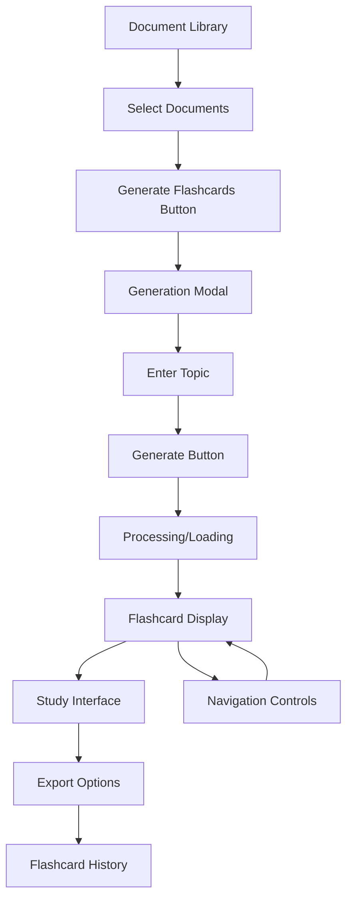

# Flashcard Generator Feature - Product Requirements Document

## 1. Product Overview

The Flashcard Generator feature extends NeuroLearn's document summarization capabilities by allowing users to create interactive flashcards from their uploaded documents based on specific topics. This feature leverages AI-powered content retrieval and generation to transform document content into study-friendly question-answer pairs.

The feature addresses the need for active learning tools that help users better retain information from their documents through spaced repetition and interactive study methods.

## 2. Core Features

### 2.1 User Roles

This feature utilizes the existing NeuroLearn user system without requiring additional role distinctions. All authenticated users can access the flashcard generation functionality.

### 2.2 Feature Module

Our flashcard generator requirements consist of the following main components:

1. **Document Selection Interface**: Multi-select document picker, selected documents state management, validation for minimum document selection.
2. **Flashcard Generation Modal**: Topic input field, generation trigger button, progress indicators during processing.
3. **Flashcard Display Page**: Interactive flip-card UI, navigation between cards, study progress tracking.
4. **Export Functionality**: PDF export, CSV export, Anki-compatible format export.
5. **Flashcard Management**: Save generated flashcards, view flashcard history, delete unwanted sets.

### 2.3 Page Details

| Page Name | Module Name | Feature description |
|-----------|-------------|---------------------|
| Document Library | Document Selection | Multi-select checkboxes for documents, "Generate Flashcards" button, selected count display, validation messages |
| Flashcard Generation Modal | Topic Input | Text input field for topic, character limit indicator, Cancel and Generate buttons, loading states |
| Flashcard Display | Card Interface | Flip animation on click/tap, question on front, answer on back, navigation arrows, progress indicator |
| Flashcard Display | Study Controls | Next/Previous buttons, shuffle option, reset progress, mark as known/unknown |
| Export Options | Download Panel | PDF export with formatting options, CSV export for spreadsheet import, Anki deck export (.apkg format) |
| Flashcard History | Management Interface | List of generated flashcard sets, creation date, topic, source documents, delete and re-export options |

## 3. Core Process

**Main User Flow:**

1. User navigates to document library and selects one or multiple documents using checkboxes
2. User clicks "Generate Flashcards" button to open the generation modal
3. User enters a specific topic in the input field and clicks "Generate"
4. System retrieves relevant content from selected documents based on the topic
5. AI generates 8-10 flashcards with questions and answers
6. User is redirected to flashcard display page with interactive flip cards
7. User can study the flashcards, navigate between them, and track progress
8. User can export flashcards in various formats (PDF, CSV, Anki) for external use
9. Generated flashcard sets are saved to user's flashcard history for future access

## 4. User Interface Design

### 4.1 Design Style

- **Primary Colors**: Blue (#3B82F6) for primary actions, Green (#10B981) for success states
- **Secondary Colors**: Gray (#6B7280) for secondary text, Red (#EF4444) for errors
- **Button Style**: Rounded corners (8px), subtle shadows, hover animations
- **Font**: Inter or system fonts, 14px base size, 16px for headings
- **Layout Style**: Card-based design with clean spacing, consistent with existing NeuroLearn interface
- **Icons**: Feather icons or similar minimalist style, 16px-20px sizes
- **Animations**: Smooth flip transitions (0.3s), fade-in effects for modals

### 4.2 Page Design Overview

| Page Name | Module Name | UI Elements |
|-----------|-------------|-------------|
| Document Library | Selection Interface | Checkboxes with document cards, floating action button for "Generate Flashcards", selection counter badge |
| Generation Modal | Input Form | Centered modal with backdrop blur, topic input with placeholder text, primary/secondary button pair |
| Flashcard Display | Card Component | 3D flip animation, card shadows, question/answer typography hierarchy, progress bar at top |
| Export Panel | Download Options | Icon-based export buttons, format descriptions, download progress indicators |
| Flashcard History | List View | Timeline-style layout, expandable cards showing metadata, action buttons for each set |

### 4.3 Responsiveness

The feature is designed mobile-first with touch-optimized interactions:
- Flashcards support tap-to-flip on mobile devices
- Swipe gestures for navigation between cards
- Responsive modal sizing for different screen sizes
- Touch-friendly button sizes (minimum 44px tap targets)
- Optimized export options for mobile sharing