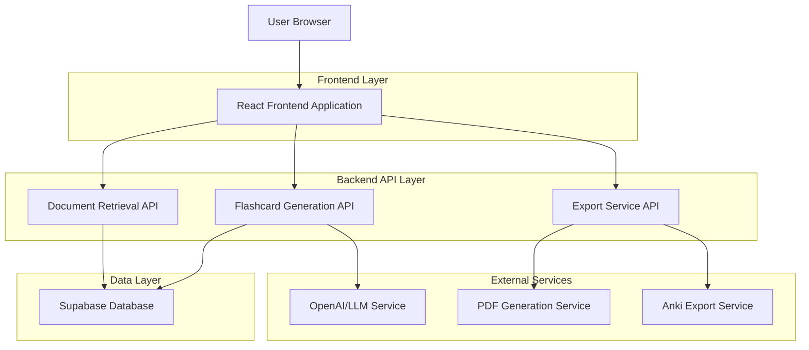
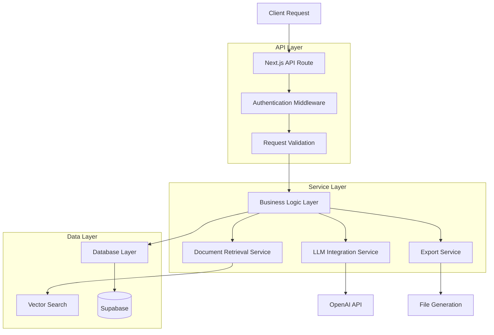
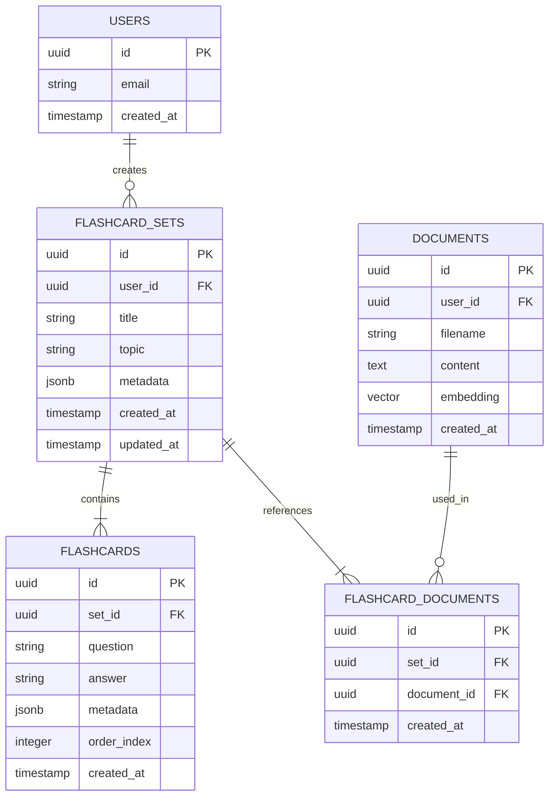

# Flashcard Generator Feature - Technical Architecture Document

## 1. Architecture Design



## 2. Technology Description

- Frontend: React@18 + TypeScript + TailwindCSS@3 + Framer Motion (for animations)
- Backend: Next.js API Routes + Supabase
- Database: Supabase (PostgreSQL)
- AI Service: OpenAI GPT-4 or similar LLM
- Export Libraries: jsPDF (PDF), papaparse (CSV), anki-apkg-export (Anki format)
- Vector Search: Supabase pgvector for document content retrieval

## 3. Route Definitions

| Route | Purpose |
|-------|----------|
| /flashcards | Main flashcard management dashboard |
| /flashcards/generate | Document selection and generation interface |
| /flashcards/study/[setId] | Interactive flashcard study interface |
| /flashcards/history | User's flashcard sets history |
| /flashcards/export/[setId] | Export options and download page |

## 4. API Definitions

### 4.1 Core API Endpoints

**Flashcard Generation**
```
POST /api/flashcards/generate
```

Request:
| Param Name | Param Type | isRequired | Description |
|------------|------------|------------|-------------|
| documentIds | string[] | true | Array of selected document IDs |
| topic | string | true | User-specified topic for flashcard generation |
| count | number | false | Number of flashcards to generate (default: 8-10) |

Response:
| Param Name | Param Type | Description |
|------------|------------|-------------|
| success | boolean | Generation status |
| flashcardSetId | string | Generated flashcard set ID |
| flashcards | Flashcard[] | Array of generated flashcards |

Example Request:
```json
{
  "documentIds": ["doc-123", "doc-456"],
  "topic": "Machine Learning Algorithms",
  "count": 10
}
```

**Document Content Retrieval**
```
POST /api/documents/retrieve
```

Request:
| Param Name | Param Type | isRequired | Description |
|------------|------------|------------|-------------|
| documentIds | string[] | true | Document IDs to search |
| query | string | true | Topic/query for content retrieval |
| maxChunks | number | false | Maximum content chunks to return |

Response:
| Param Name | Param Type | Description |
|------------|------------|-------------|
| success | boolean | Retrieval status |
| chunks | ContentChunk[] | Relevant content chunks |

**Flashcard Set Management**
```
GET /api/flashcards/sets
GET /api/flashcards/sets/[setId]
DELETE /api/flashcards/sets/[setId]
```

**Export Endpoints**
```
GET /api/flashcards/export/[setId]/pdf
GET /api/flashcards/export/[setId]/csv
GET /api/flashcards/export/[setId]/anki
```

## 5. Server Architecture Diagram



## 6. Data Model

### 6.1 Data Model Definition



### 6.2 Data Definition Language

**Flashcard Sets Table**
```sql
CREATE TABLE flashcard_sets (
    id UUID PRIMARY KEY DEFAULT gen_random_uuid(),
    user_id UUID NOT NULL REFERENCES auth.users(id) ON DELETE CASCADE,
    title VARCHAR(255) NOT NULL,
    topic VARCHAR(255) NOT NULL,
    metadata JSONB DEFAULT '{}',
    created_at TIMESTAMP WITH TIME ZONE DEFAULT NOW(),
    updated_at TIMESTAMP WITH TIME ZONE DEFAULT NOW()
);

CREATE INDEX idx_flashcard_sets_user_id ON flashcard_sets(user_id);
CREATE INDEX idx_flashcard_sets_created_at ON flashcard_sets(created_at DESC);
```

**Flashcards Table**
```sql
CREATE TABLE flashcards (
    id UUID PRIMARY KEY DEFAULT gen_random_uuid(),
    set_id UUID NOT NULL REFERENCES flashcard_sets(id) ON DELETE CASCADE,
    question TEXT NOT NULL,
    answer TEXT NOT NULL,
    metadata JSONB DEFAULT '{}',
    order_index INTEGER NOT NULL DEFAULT 0,
    created_at TIMESTAMP WITH TIME ZONE DEFAULT NOW()
);

CREATE INDEX idx_flashcards_set_id ON flashcards(set_id);
CREATE INDEX idx_flashcards_order ON flashcards(set_id, order_index);
```

**Flashcard Documents Junction Table**
```sql
CREATE TABLE flashcard_documents (
    id UUID PRIMARY KEY DEFAULT gen_random_uuid(),
    set_id UUID NOT NULL REFERENCES flashcard_sets(id) ON DELETE CASCADE,
    document_id UUID NOT NULL REFERENCES documents(id) ON DELETE CASCADE,
    created_at TIMESTAMP WITH TIME ZONE DEFAULT NOW(),
    UNIQUE(set_id, document_id)
);

CREATE INDEX idx_flashcard_documents_set_id ON flashcard_documents(set_id);
CREATE INDEX idx_flashcard_documents_document_id ON flashcard_documents(document_id);
```

**Row Level Security Policies**
```sql
-- Enable RLS
ALTER TABLE flashcard_sets ENABLE ROW LEVEL SECURITY;
ALTER TABLE flashcards ENABLE ROW LEVEL SECURITY;
ALTER TABLE flashcard_documents ENABLE ROW LEVEL SECURITY;

-- Policies for flashcard_sets
CREATE POLICY "Users can view own flashcard sets" ON flashcard_sets
    FOR SELECT USING (auth.uid() = user_id);

CREATE POLICY "Users can create own flashcard sets" ON flashcard_sets
    FOR INSERT WITH CHECK (auth.uid() = user_id);

CREATE POLICY "Users can update own flashcard sets" ON flashcard_sets
    FOR UPDATE USING (auth.uid() = user_id);

CREATE POLICY "Users can delete own flashcard sets" ON flashcard_sets
    FOR DELETE USING (auth.uid() = user_id);

-- Policies for flashcards
CREATE POLICY "Users can view flashcards from own sets" ON flashcards
    FOR SELECT USING (
        EXISTS (
            SELECT 1 FROM flashcard_sets 
            WHERE flashcard_sets.id = flashcards.set_id 
            AND flashcard_sets.user_id = auth.uid()
        )
    );

CREATE POLICY "Users can create flashcards in own sets" ON flashcards
    FOR INSERT WITH CHECK (
        EXISTS (
            SELECT 1 FROM flashcard_sets 
            WHERE flashcard_sets.id = flashcards.set_id 
            AND flashcard_sets.user_id = auth.uid()
        )
    );
```

**Triggers for Updated At**
```sql
CREATE TRIGGER update_flashcard_sets_updated_at
    BEFORE UPDATE ON flashcard_sets
    FOR EACH ROW
    EXECUTE FUNCTION update_updated_at_column();
```

**Initial Data**
```sql
-- Grant permissions
GRANT ALL ON flashcard_sets TO authenticated;
GRANT ALL ON flashcards TO authenticated;
GRANT ALL ON flashcard_documents TO authenticated;

GRANT SELECT ON flashcard_sets TO anon;
GRANT SELECT ON flashcards TO anon;
GRANT SELECT ON flashcard_documents TO anon;
```