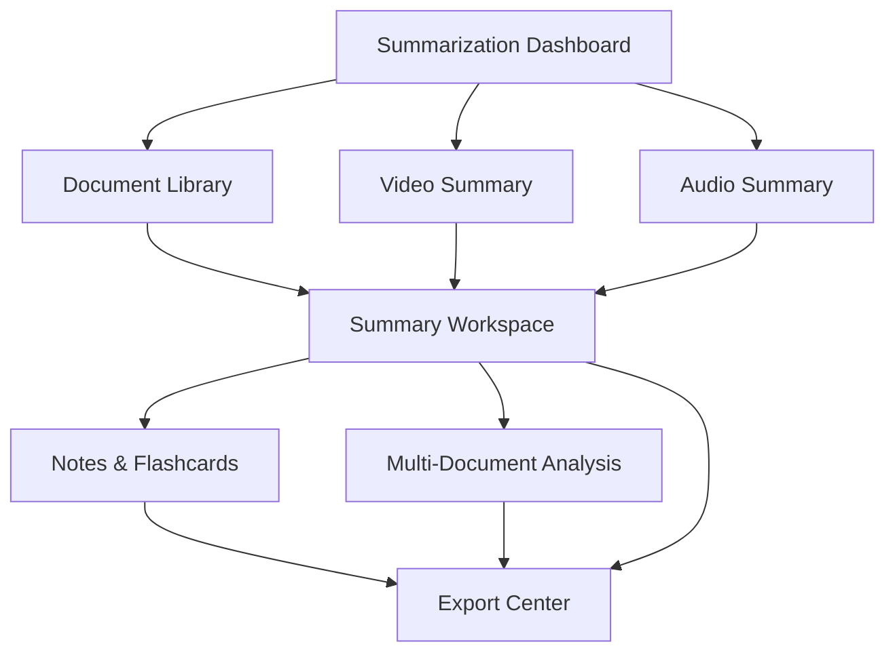

# Intelligent Summarization Module - Product Requirements Document

## 1. Product Overview

The Intelligent Summarization Module enables users to generate customizable, multi-format summaries from diverse content sources including documents, media, speech, and video with advanced personalization, categorization, and accessibility features.

This module transforms NeuroLearn into a comprehensive content analysis platform, allowing users to extract key insights from any content type through AI-powered summarization, query-based retrieval, and multilingual support.

The module targets students, researchers, professionals, and content creators who need efficient content processing and knowledge extraction capabilities.

## 2. Core Features

### 2.1 User Roles

| Role | Registration Method | Core Permissions |
|------|---------------------|------------------|
| Student | Email registration | Can upload documents, generate summaries, create notes and flashcards |
| Educator | Email registration with verification | Can manage document libraries, create shared summaries, export content |
| Premium User | Subscription upgrade | Can process unlimited files, access advanced features, bulk operations |

### 2.2 Feature Module

Our Intelligent Summarization Module consists of the following main pages:

1. **Summarization Dashboard**: content upload interface, processing status, summary history
2. **Document Library**: persistent document storage, document selection, metadata management
3. **Summary Workspace**: summary generation, editing interface, length options, query input
4. **Notes & Flashcards**: structured note creation, flashcard generation, export options
5. **Video Summary**: YouTube link input, video upload, timestamp navigation, visual content extraction
6. **Audio Summary**: audio upload, recording interface, transcription display
7. **Multi-Document Analysis**: document selection, cross-document summarization, topic clustering
8. **Export Center**: format selection, multilingual options, download management

### 2.3 Page Details

| Page Name | Module Name | Feature description |
|-----------|-------------|---------------------|
| Summarization Dashboard | Content Upload | Upload multiple file types (PDF, DOCX, PPT, JPEG), drag-and-drop interface, progress tracking |
| Summarization Dashboard | Processing Status | Real-time processing updates, error handling, retry mechanisms |
| Summarization Dashboard | Summary History | View past summaries, search and filter, quick access to previous work |
| Document Library | Document Storage | Persistent document management, folder organization, metadata tagging |
| Document Library | Document Selection | Multi-select interface, "Select All" option, document preview |
| Document Library | Search & Filter | Full-text search, category filters, date range selection |
| Summary Workspace | Summary Generation | AI-powered summarization, length options (short/medium/detailed), real-time generation |
| Summary Workspace | Query Interface | Natural language query input, retrieval-based summarization, context highlighting |
| Summary Workspace | Summary Editor | Editable summary text, formatting options, manual refinements |
| Notes & Flashcards | Note Creation | Structured outline generation, key point extraction, hierarchical organization |
| Notes & Flashcards | Flashcard Generation | Q&A pair creation, difficulty levels, spaced repetition support |
| Notes & Flashcards | Export Options | Anki format, CSV export, PDF generation |
| Video Summary | URL Input | YouTube link processing, video validation, metadata extraction |
| Video Summary | Transcript Processing | Speech-to-text conversion, timestamp alignment, section detection |
| Video Summary | Visual Analysis | Frame capture, chart detection, slide extraction |
| Audio Summary | Audio Upload | MP3/WAV support, file validation, audio player |
| Audio Summary | Recording Interface | Real-time recording, audio visualization, quality indicators |
| Audio Summary | Transcription Display | Speech-to-text results, speaker identification, confidence scores |
| Multi-Document Analysis | Document Clustering | Topic-based grouping, similarity analysis, redundancy detection |
| Multi-Document Analysis | Cross-Document Summary | Cohesive multi-source summaries, citation tracking, source attribution |
| Export Center | Format Selection | PDF, DOCX, CSV options, template customization |
| Export Center | Multilingual Export | Translation integration, language selection, quality indicators |

## 3. Core Process

**Main User Flow:**
Users begin by uploading content through the Summarization Dashboard, where files are processed and stored in the Document Library. They then navigate to the Summary Workspace to generate summaries with customizable length and query options. Advanced users can perform Multi-Document Analysis for comprehensive insights. Finally, users can create Notes & Flashcards or export their work through the Export Center.

**Content Processing Flow:**
Content ingestion → Preprocessing (OCR, transcription) → Text extraction → Summarization engine → Post-processing (translation, categorization) → Output generation

**Query-Based Flow:**
User query → Document selection → Relevant chunk retrieval → Context-aware summarization → Result presentation with source citations

## 4. User Interface Design

### 4.1 Design Style

- **Primary Colors**: Deep blue (#1e40af) for headers and primary actions, light blue (#dbeafe) for backgrounds
- **Secondary Colors**: Green (#10b981) for success states, amber (#f59e0b) for processing states
- **Button Style**: Rounded corners with subtle shadows, hover animations, gradient backgrounds for primary actions
- **Font**: Inter for headings (16-24px), system fonts for body text (14-16px)
- **Layout Style**: Card-based design with clean spacing, sidebar navigation, responsive grid layouts
- **Icons**: Lucide React icons with consistent sizing, document and media-specific iconography

### 4.2 Page Design Overview

| Page Name | Module Name | UI Elements |
|-----------|-------------|-------------|
| Summarization Dashboard | Content Upload | Drag-and-drop zone with dashed borders, file type icons, progress bars with percentage indicators |
| Document Library | Document Grid | Card layout with document thumbnails, metadata badges, selection checkboxes |
| Summary Workspace | Summary Panel | Split-pane layout, resizable sections, floating action buttons for length options |
| Notes & Flashcards | Note Editor | Rich text editor with outline view, collapsible sections, export buttons |
| Video Summary | Video Player | Embedded player with custom controls, timestamp markers, summary overlay |
| Audio Summary | Audio Interface | Waveform visualization, playback controls, transcription sync highlighting |
| Multi-Document Analysis | Analysis View | Document cluster visualization, connection lines, summary synthesis panel |
| Export Center | Export Options | Format selection cards, preview pane, download progress indicators |

### 4.3 Responsiveness

The module is designed mobile-first with responsive breakpoints at 768px and 1024px. Touch interactions are optimized for mobile devices with larger tap targets and gesture support. Desktop users benefit from keyboard shortcuts and multi-panel layouts for efficient workflow management.
