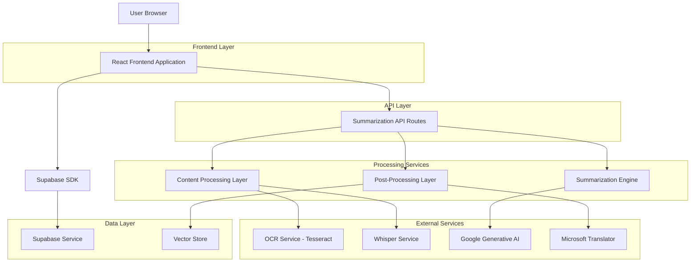
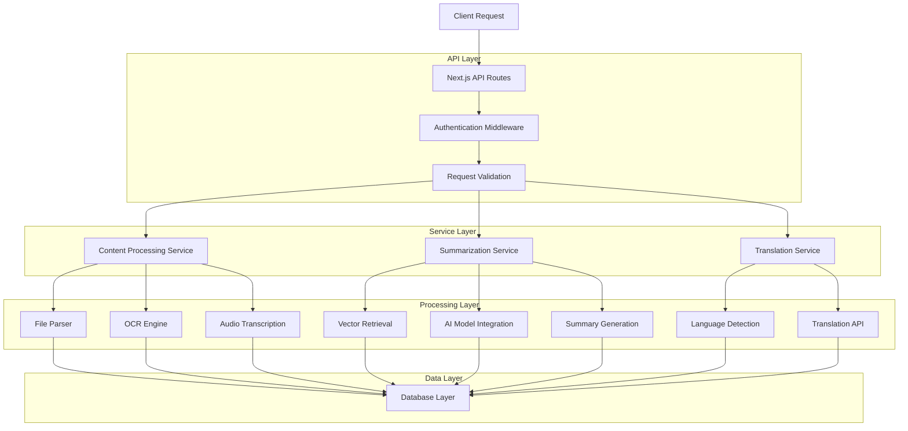
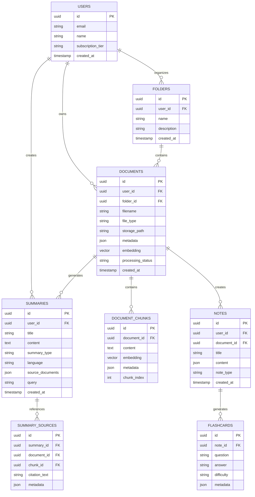

# Intelligent Summarization Module - Technical Architecture Document

## 1. Architecture Design



## 2. Technology Description

- Frontend: React@18 + TypeScript + Tailwind CSS + Framer Motion + Radix UI
- Backend: Next.js API Routes + Node.js
- Database: Supabase (PostgreSQL) with vector extensions
- AI Services: Google Generative AI (Gemini) + OpenAI Whisper
- Translation: Microsoft Translator API
- OCR: Tesseract.js
- File Processing: pdf-parse + mammoth + pptx2json
- Vector Store: Supabase pgvector extension
- Storage: Supabase Storage for file uploads

## 3. Route Definitions

| Route | Purpose |
|-------|----------|
| /summarize | Main summarization dashboard and workspace |
| /summarize/documents | Document library and management |
| /summarize/video | Video summarization interface |
| /summarize/audio | Audio processing and summarization |
| /summarize/notes | Notes and flashcards generation |
| /summarize/multi-doc | Multi-document analysis workspace |
| /summarize/export | Export center and download management |
| /summarize/history | Summary history and search |

## 4. API Definitions

### 4.1 Core API

**Document Upload and Processing**
```
POST /api/summarize/upload
```

Request:
| Param Name | Param Type | isRequired | Description |
|------------|------------|------------|-------------|
| files | File[] | true | Array of uploaded files (PDF, DOCX, PPT, JPEG) |
| userId | string | true | User identifier for document ownership |
| folderId | string | false | Optional folder for organization |

Response:
| Param Name | Param Type | Description |
|------------|------------|-------------|
| documents | Document[] | Array of processed document metadata |
| processingStatus | string | Status of file processing |

**Summary Generation**
```
POST /api/summarize/generate
```

Request:
| Param Name | Param Type | isRequired | Description |
|------------|------------|------------|-------------|
| documentIds | string[] | true | Array of document IDs to summarize |
| summaryType | string | true | Type: 'short', 'medium', 'detailed' |
| query | string | false | Optional query for focused summarization |
| language | string | false | Target language for summary |

Response:
| Param Name | Param Type | Description |
|------------|------------|-------------|
| summary | string | Generated summary text |
| sources | Source[] | Source citations and references |
| processingTime | number | Time taken for generation |

**Video Processing**
```
POST /api/summarize/video
```

Request:
| Param Name | Param Type | isRequired | Description |
|------------|------------|------------|-------------|
| url | string | true | YouTube URL or video file path |
| extractFrames | boolean | false | Whether to extract key frames |

Response:
| Param Name | Param Type | Description |
|------------|------------|-------------|
| transcript | Transcript | Timestamped transcript data |
| summary | TimestampedSummary | Summary with time markers |
| keyFrames | string[] | URLs of extracted frames |

**Audio Processing**
```
POST /api/summarize/audio
```

Request:
| Param Name | Param Type | isRequired | Description |
|------------|------------|------------|-------------|
| audioFile | File | true | Audio file (MP3, WAV) |
| language | string | false | Source language hint |

Response:
| Param Name | Param Type | Description |
|------------|------------|-------------|
| transcription | string | Speech-to-text result |
| summary | string | Generated summary |
| confidence | number | Transcription confidence score |

**Notes and Flashcards**
```
POST /api/summarize/notes
```

Request:
| Param Name | Param Type | isRequired | Description |
|------------|------------|------------|-------------|
| content | string | true | Source content for note generation |
| noteType | string | true | Type: 'outline', 'flashcards' |
| difficulty | string | false | Flashcard difficulty level |

Response:
| Param Name | Param Type | Description |
|------------|------------|-------------|
| notes | Note[] | Structured notes or flashcards |
| exportFormats | string[] | Available export formats |

## 5. Server Architecture Diagram



## 6. Data Model

### 6.1 Data Model Definition



### 6.2 Data Definition Language

**Documents Table**
```sql
-- Create documents table
CREATE TABLE documents (
    id UUID PRIMARY KEY DEFAULT gen_random_uuid(),
    user_id UUID REFERENCES auth.users(id) ON DELETE CASCADE,
    folder_id UUID REFERENCES folders(id) ON DELETE SET NULL,
    filename VARCHAR(255) NOT NULL,
    file_type VARCHAR(50) NOT NULL,
    storage_path TEXT NOT NULL,
    metadata JSONB DEFAULT '{}',
    embedding vector(1536),
    processing_status VARCHAR(50) DEFAULT 'pending',
    created_at TIMESTAMP WITH TIME ZONE DEFAULT NOW(),
    updated_at TIMESTAMP WITH TIME ZONE DEFAULT NOW()
);

-- Create indexes
CREATE INDEX idx_documents_user_id ON documents(user_id);
CREATE INDEX idx_documents_folder_id ON documents(folder_id);
CREATE INDEX idx_documents_file_type ON documents(file_type);
CREATE INDEX idx_documents_embedding ON documents USING ivfflat (embedding vector_cosine_ops);
```

**Document Chunks Table**
```sql
-- Create document chunks table
CREATE TABLE document_chunks (
    id UUID PRIMARY KEY DEFAULT gen_random_uuid(),
    document_id UUID REFERENCES documents(id) ON DELETE CASCADE,
    content TEXT NOT NULL,
    embedding vector(1536),
    metadata JSONB DEFAULT '{}',
    chunk_index INTEGER NOT NULL,
    created_at TIMESTAMP WITH TIME ZONE DEFAULT NOW()
);

-- Create indexes
CREATE INDEX idx_document_chunks_document_id ON document_chunks(document_id);
CREATE INDEX idx_document_chunks_embedding ON document_chunks USING ivfflat (embedding vector_cosine_ops);
```

**Summaries Table**
```sql
-- Create summaries table
CREATE TABLE summaries (
    id UUID PRIMARY KEY DEFAULT gen_random_uuid(),
    user_id UUID REFERENCES auth.users(id) ON DELETE CASCADE,
    title VARCHAR(255) NOT NULL,
    content TEXT NOT NULL,
    summary_type VARCHAR(50) NOT NULL CHECK (summary_type IN ('short', 'medium', 'detailed')),
    language VARCHAR(10) DEFAULT 'en',
    source_documents JSONB DEFAULT '[]',
    query TEXT,
    created_at TIMESTAMP WITH TIME ZONE DEFAULT NOW(),
    updated_at TIMESTAMP WITH TIME ZONE DEFAULT NOW()
);

-- Create indexes
CREATE INDEX idx_summaries_user_id ON summaries(user_id);
CREATE INDEX idx_summaries_created_at ON summaries(created_at DESC);
CREATE INDEX idx_summaries_summary_type ON summaries(summary_type);
```

**Folders Table**
```sql
-- Create folders table
CREATE TABLE folders (
    id UUID PRIMARY KEY DEFAULT gen_random_uuid(),
    user_id UUID REFERENCES auth.users(id) ON DELETE CASCADE,
    name VARCHAR(255) NOT NULL,
    description TEXT,
    created_at TIMESTAMP WITH TIME ZONE DEFAULT NOW()
);

-- Create indexes
CREATE INDEX idx_folders_user_id ON folders(user_id);
```

**Notes and Flashcards Tables**
```sql
-- Create notes table
CREATE TABLE notes (
    id UUID PRIMARY KEY DEFAULT gen_random_uuid(),
    user_id UUID REFERENCES auth.users(id) ON DELETE CASCADE,
    document_id UUID REFERENCES documents(id) ON DELETE CASCADE,
    title VARCHAR(255) NOT NULL,
    content JSONB NOT NULL,
    note_type VARCHAR(50) DEFAULT 'outline',
    created_at TIMESTAMP WITH TIME ZONE DEFAULT NOW(),
    updated_at TIMESTAMP WITH TIME ZONE DEFAULT NOW()
);

-- Create flashcards table
CREATE TABLE flashcards (
    id UUID PRIMARY KEY DEFAULT gen_random_uuid(),
    note_id UUID REFERENCES notes(id) ON DELETE CASCADE,
    question TEXT NOT NULL,
    answer TEXT NOT NULL,
    difficulty VARCHAR(20) DEFAULT 'medium',
    metadata JSONB DEFAULT '{}',
    created_at TIMESTAMP WITH TIME ZONE DEFAULT NOW()
);

-- Create indexes
CREATE INDEX idx_notes_user_id ON notes(user_id);
CREATE INDEX idx_notes_document_id ON notes(document_id);
CREATE INDEX idx_flashcards_note_id ON flashcards(note_id);
```

**Row Level Security Policies**
```sql
-- Enable RLS
ALTER TABLE documents ENABLE ROW LEVEL SECURITY;
ALTER TABLE document_chunks ENABLE ROW LEVEL SECURITY;
ALTER TABLE summaries ENABLE ROW LEVEL SECURITY;
ALTER TABLE folders ENABLE ROW LEVEL SECURITY;
ALTER TABLE notes ENABLE ROW LEVEL SECURITY;
ALTER TABLE flashcards ENABLE ROW LEVEL SECURITY;

-- Documents policies
CREATE POLICY "Users can view own documents" ON documents FOR SELECT USING (auth.uid() = user_id);
CREATE POLICY "Users can insert own documents" ON documents FOR INSERT WITH CHECK (auth.uid() = user_id);
CREATE POLICY "Users can update own documents" ON documents FOR UPDATE USING (auth.uid() = user_id);
CREATE POLICY "Users can delete own documents" ON documents FOR DELETE USING (auth.uid() = user_id);

-- Similar policies for other tables
CREATE POLICY "Users can manage own summaries" ON summaries FOR ALL USING (auth.uid() = user_id);
CREATE POLICY "Users can manage own folders" ON folders FOR ALL USING (auth.uid() = user_id);
CREATE POLICY "Users can manage own notes" ON notes FOR ALL USING (auth.uid() = user_id);

-- Grant permissions
GRANT SELECT ON documents TO anon;
GRANT ALL PRIVILEGES ON documents TO authenticated;
GRANT ALL PRIVILEGES ON document_chunks TO authenticated;
GRANT ALL PRIVILEGES ON summaries TO authenticated;
GRANT ALL PRIVILEGES ON folders TO authenticated;
GRANT ALL PRIVILEGES ON notes TO authenticated;
GRANT ALL PRIVILEGES ON flashcards TO authenticated;
```
