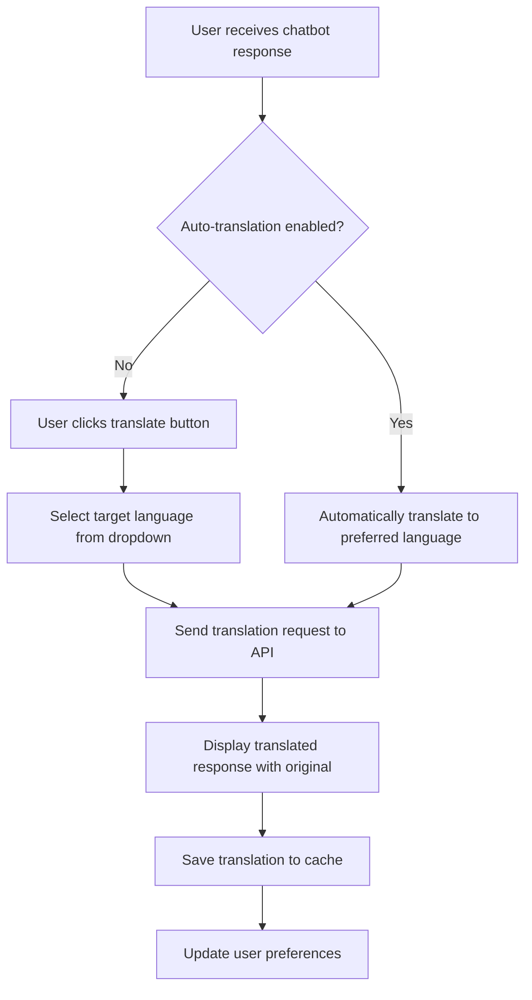

# Language Translation Feature - Product Requirements Document

## 1. Product Overview
A comprehensive language translation feature for the RAG chatbot that enables users to convert responses into their preferred language while maintaining the original content for reference.
- Solves the language barrier problem for international users accessing educational content through the RAG chatbot.
- Enhances accessibility and user experience by providing real-time translation capabilities with context preservation.

## 2. Core Features

### 2.1 User Roles
| Role | Registration Method | Core Permissions |
|------|---------------------|------------------|
| Authenticated User | Existing system login | Can access translation features, save language preferences |
| Guest User | No registration required | Can use translation features with session-based preferences |

### 2.2 Feature Module
Our language translation feature consists of the following main components:
1. **Language Selection Interface**: dropdown menu, language search, preference persistence.
2. **Translation Display Panel**: dual-view layout, original/translated toggle, visual indicators.
3. **Translation Management**: API integration, caching, error handling.
4. **User Preferences**: language settings, auto-translation options, display preferences.

### 2.3 Page Details
| Page Name | Module Name | Feature description |
|-----------|-------------|---------------------|
| Chat Interface | Language Selector | Display dropdown with 50+ major world languages, search functionality, flag icons for visual identification |
| Chat Interface | Translation Panel | Show original and translated responses side-by-side or toggle view, clear language indicators, translation status badges |
| Chat Interface | Translation Controls | Translate button for each response, auto-translate toggle, translation quality feedback |
| User Settings | Language Preferences | Save default target language, auto-translation settings, translation display mode preferences |
| Chat Interface | Translation Cache | Store translated responses locally, manage translation history, offline translation access |

## 3. Core Process

**User Translation Flow:**
1. User receives chatbot response in original language (English)
2. User selects target language from dropdown or uses saved preference
3. System sends translation request to API service
4. Translated response displays alongside original with clear visual indicators
5. User can toggle between original and translated versions
6. Translation preferences are saved for future sessions

**Auto-Translation Flow:**
1. User enables auto-translation in settings
2. System automatically translates all new responses
3. Both original and translated versions are displayed
4. User can disable auto-translation or change target language anytime

## 4. User Interface Design

### 4.1 Design Style
- **Primary Colors**: Blue (#3B82F6) for translation controls, Green (#10B981) for successful translations
- **Secondary Colors**: Gray (#6B7280) for original text indicators, Orange (#F59E0B) for translation in progress
- **Button Style**: Rounded corners with subtle shadows, icon + text combinations
- **Font**: System font stack with support for international characters, 14px base size
- **Layout Style**: Card-based design with clear separation between original and translated content
- **Icons**: Flag emojis for countries, translation icon (🌐), toggle switches for preferences

### 4.2 Page Design Overview
| Page Name | Module Name | UI Elements |
|-----------|-------------|-------------|
| Chat Interface | Language Selector | Dropdown with search, flag icons, language names in native script, recent languages section |
| Chat Interface | Translation Panel | Split-view cards with "Original" and "Translated" headers, language badges, confidence indicators |
| Chat Interface | Translation Controls | Floating translate button, auto-translate toggle switch, translation progress spinner |
| User Settings | Language Preferences | Language grid with flags, toggle switches, save/reset buttons, preview section |

### 4.3 Responsiveness
Mobile-first responsive design with touch-optimized controls, collapsible translation panels on small screens, and adaptive language selector for different screen sizes.

## 5. Technical Requirements

### 5.1 Translation Quality
- Support for 50+ major world languages including RTL languages (Arabic, Hebrew)
- Context-aware translation preserving technical terms and educational content
- Confidence scoring for translation quality assessment
- Fallback mechanisms for unsupported languages

### 5.2 Performance Requirements
- Translation response time < 2 seconds for typical responses
- Caching system to avoid re-translating identical content
- Offline translation capabilities for previously translated content
- Rate limiting and quota management for translation API

### 5.3 User Experience Requirements
- Seamless integration with existing chat interface
- Clear visual distinction between original and translated content
- Undo/redo functionality for translation actions
- Accessibility support for screen readers and keyboard navigation

## 6. Success Metrics
- Translation feature adoption rate > 30% of active users
- User satisfaction score > 4.0/5.0 for translation accuracy
- Average translation response time < 2 seconds
- Reduction in user drop-off rate for non-English speakers by 25%