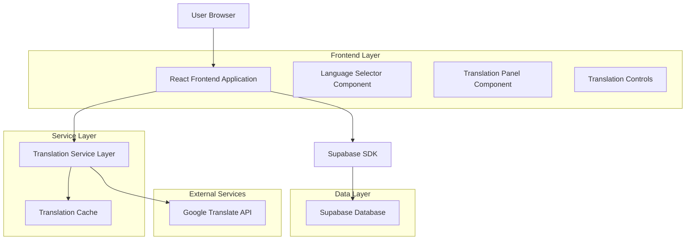
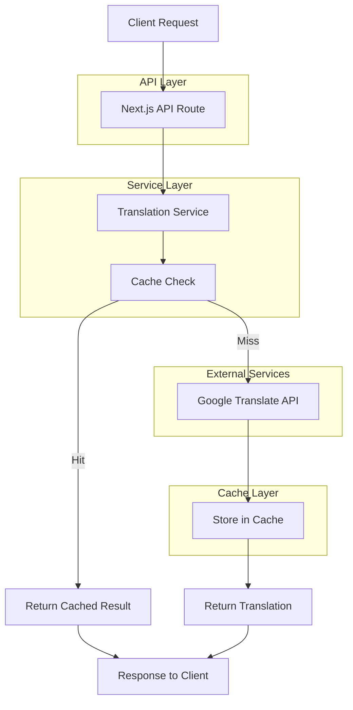
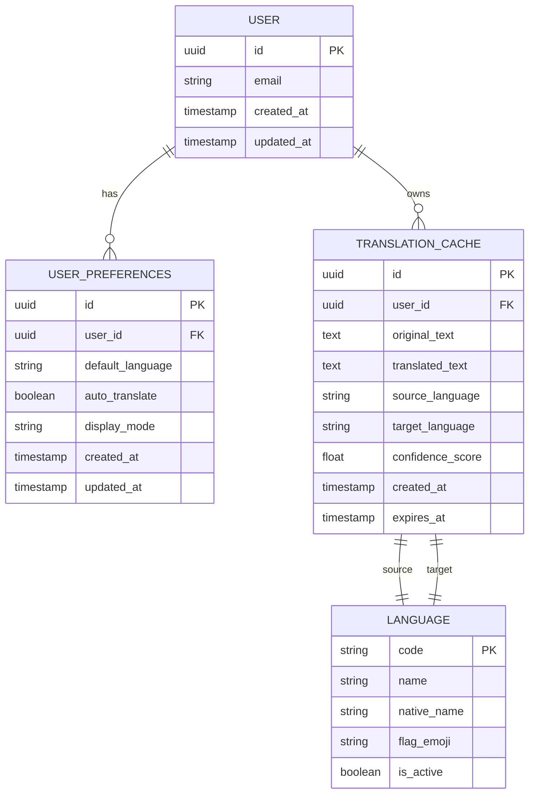

# Language Translation Feature - Technical Architecture Document

## 1. Architecture Design



## 2. Technology Description

- Frontend: React@18 + TypeScript + Tailwind CSS + Vite
- Backend: Next.js API Routes + Google Translate API
- Database: Supabase (PostgreSQL) for user preferences and translation cache
- Caching: Browser localStorage + Supabase for persistent cache
- Translation Service: Google Cloud Translation API v3

## 3. Route Definitions

| Route | Purpose |
|-------|---------|
| /notebooks/[id] | Main chat interface with integrated translation features |
| /api/translate | Translation API endpoint for processing translation requests |
| /api/languages | Endpoint to fetch supported languages list |
| /api/user/preferences | User language preferences management |

## 4. API Definitions

### 4.1 Core Translation API

**Translation Request**
```
POST /api/translate
```

Request:
| Param Name | Param Type | isRequired | Description |
|------------|------------|------------|-------------|
| text | string | true | The text content to translate |
| targetLanguage | string | true | Target language code (ISO 639-1) |
| sourceLanguage | string | false | Source language code (auto-detect if not provided) |
| userId | string | false | User ID for caching and preferences |

Response:
| Param Name | Param Type | Description |
|------------|------------|-------------|
| translatedText | string | The translated content |
| sourceLanguage | string | Detected or provided source language |
| targetLanguage | string | Target language code |
| confidence | number | Translation confidence score (0-1) |
| cached | boolean | Whether result was served from cache |

Example Request:
```json
{
  "text": "Machine learning is a subset of artificial intelligence.",
  "targetLanguage": "es",
  "userId": "user123"
}
```

Example Response:
```json
{
  "translatedText": "El aprendizaje automático es un subconjunto de la inteligencia artificial.",
  "sourceLanguage": "en",
  "targetLanguage": "es",
  "confidence": 0.95,
  "cached": false
}
```

**Supported Languages**
```
GET /api/languages
```

Response:
| Param Name | Param Type | Description |
|------------|------------|-------------|
| languages | array | List of supported language objects |

Example Response:
```json
{
  "languages": [
    {
      "code": "en",
      "name": "English",
      "nativeName": "English",
      "flag": "🇺🇸"
    },
    {
      "code": "es",
      "name": "Spanish",
      "nativeName": "Español",
      "flag": "🇪🇸"
    }
  ]
}
```

**User Preferences**
```
POST /api/user/preferences
```

Request:
| Param Name | Param Type | isRequired | Description |
|------------|------------|------------|-------------|
| userId | string | true | User identifier |
| defaultLanguage | string | true | Default target language code |
| autoTranslate | boolean | true | Auto-translation preference |
| displayMode | string | true | "side-by-side" or "toggle" |

## 5. Server Architecture Diagram



## 6. Data Model

### 6.1 Data Model Definition



### 6.2 Data Definition Language

**User Preferences Table**
```sql
-- Create user preferences table
CREATE TABLE user_translation_preferences (
    id UUID PRIMARY KEY DEFAULT gen_random_uuid(),
    user_id UUID REFERENCES auth.users(id) ON DELETE CASCADE,
    default_language VARCHAR(10) DEFAULT 'en',
    auto_translate BOOLEAN DEFAULT false,
    display_mode VARCHAR(20) DEFAULT 'side-by-side' CHECK (display_mode IN ('side-by-side', 'toggle')),
    created_at TIMESTAMP WITH TIME ZONE DEFAULT NOW(),
    updated_at TIMESTAMP WITH TIME ZONE DEFAULT NOW(),
    UNIQUE(user_id)
);

-- Create index
CREATE INDEX idx_user_translation_preferences_user_id ON user_translation_preferences(user_id);

-- RLS policies
ALTER TABLE user_translation_preferences ENABLE ROW LEVEL SECURITY;

CREATE POLICY "Users can view own preferences" ON user_translation_preferences
    FOR SELECT USING (auth.uid() = user_id);

CREATE POLICY "Users can update own preferences" ON user_translation_preferences
    FOR ALL USING (auth.uid() = user_id);

-- Grant permissions
GRANT SELECT ON user_translation_preferences TO anon;
GRANT ALL PRIVILEGES ON user_translation_preferences TO authenticated;
```

**Translation Cache Table**
```sql
-- Create translation cache table
CREATE TABLE translation_cache (
    id UUID PRIMARY KEY DEFAULT gen_random_uuid(),
    user_id UUID REFERENCES auth.users(id) ON DELETE CASCADE,
    original_text TEXT NOT NULL,
    translated_text TEXT NOT NULL,
    source_language VARCHAR(10) NOT NULL,
    target_language VARCHAR(10) NOT NULL,
    confidence_score FLOAT DEFAULT 0.0,
    text_hash VARCHAR(64) NOT NULL, -- SHA-256 hash of original text for quick lookup
    created_at TIMESTAMP WITH TIME ZONE DEFAULT NOW(),
    expires_at TIMESTAMP WITH TIME ZONE DEFAULT (NOW() + INTERVAL '30 days'),
    UNIQUE(text_hash, source_language, target_language, user_id)
);

-- Create indexes
CREATE INDEX idx_translation_cache_user_id ON translation_cache(user_id);
CREATE INDEX idx_translation_cache_hash ON translation_cache(text_hash, source_language, target_language);
CREATE INDEX idx_translation_cache_expires ON translation_cache(expires_at);

-- RLS policies
ALTER TABLE translation_cache ENABLE ROW LEVEL SECURITY;

CREATE POLICY "Users can view own cache" ON translation_cache
    FOR SELECT USING (auth.uid() = user_id);

CREATE POLICY "Users can manage own cache" ON translation_cache
    FOR ALL USING (auth.uid() = user_id);

-- Grant permissions
GRANT SELECT ON translation_cache TO anon;
GRANT ALL PRIVILEGES ON translation_cache TO authenticated;
```

**Supported Languages Table**
```sql
-- Create supported languages table
CREATE TABLE supported_languages (
    code VARCHAR(10) PRIMARY KEY,
    name VARCHAR(100) NOT NULL,
    native_name VARCHAR(100) NOT NULL,
    flag_emoji VARCHAR(10),
    is_active BOOLEAN DEFAULT true,
    created_at TIMESTAMP WITH TIME ZONE DEFAULT NOW()
);

-- Insert initial data
INSERT INTO supported_languages (code, name, native_name, flag_emoji) VALUES
('en', 'English', 'English', '🇺🇸'),
('es', 'Spanish', 'Español', '🇪🇸'),
('fr', 'French', 'Français', '🇫🇷'),
('de', 'German', 'Deutsch', '🇩🇪'),
('it', 'Italian', 'Italiano', '🇮🇹'),
('pt', 'Portuguese', 'Português', '🇵🇹'),
('ru', 'Russian', 'Русский', '🇷🇺'),
('ja', 'Japanese', '日本語', '🇯🇵'),
('ko', 'Korean', '한국어', '🇰🇷'),
('zh', 'Chinese', '中文', '🇨🇳'),
('ar', 'Arabic', 'العربية', '🇸🇦'),
('hi', 'Hindi', 'हिन्दी', '🇮🇳'),
('th', 'Thai', 'ไทย', '🇹🇭'),
('vi', 'Vietnamese', 'Tiếng Việt', '🇻🇳'),
('nl', 'Dutch', 'Nederlands', '🇳🇱'),
('sv', 'Swedish', 'Svenska', '🇸🇪'),
('da', 'Danish', 'Dansk', '🇩🇰'),
('no', 'Norwegian', 'Norsk', '🇳🇴'),
('fi', 'Finnish', 'Suomi', '🇫🇮'),
('pl', 'Polish', 'Polski', '🇵🇱');

-- Grant public read access
GRANT SELECT ON supported_languages TO anon, authenticated;
```

## 7. Implementation Strategy

### 7.1 Phase 1: Core Translation
- Set up Google Translate API integration
- Create basic translation API endpoints
- Implement language selector component
- Add translation display in chat interface

### 7.2 Phase 2: User Experience
- Add user preferences system
- Implement translation caching
- Create auto-translation functionality
- Add visual indicators and animations

### 7.3 Phase 3: Optimization
- Implement advanced caching strategies
- Add translation quality feedback
- Optimize for mobile responsiveness
- Add accessibility features

### 7.4 Security Considerations
- API key management for Google Translate
- Rate limiting for translation requests
- Input sanitization for translation content
- User data privacy