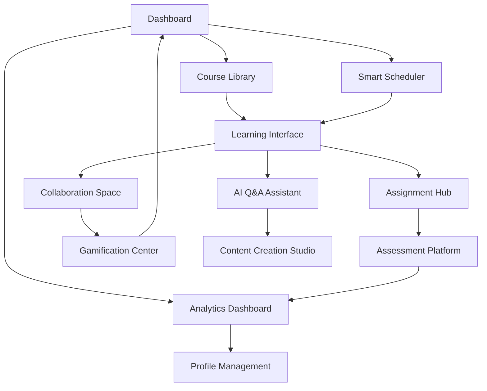

# NeuroLearn - Product Requirements Document

## 1. Product Overview
NeuroLearn is an AI-driven educational platform that personalizes learning experiences through intelligent features and adaptive technologies. The platform transforms traditional education by leveraging artificial intelligence to optimize learning outcomes for students and educators.

The platform addresses the need for personalized, engaging, and efficient learning solutions in modern education, targeting students, educators, and educational institutions seeking enhanced learning experiences.

## 2. Core Features

### 2.1 User Roles

| Role | Registration Method | Core Permissions |
|------|---------------------|------------------|
| Student | Email registration with verification | Access learning materials, submit assignments, participate in discussions, track progress |
| Educator | Invitation-based registration with institution verification | Create courses, manage students, grade assignments, access analytics, moderate discussions |
| Administrator | System-level invitation with admin privileges | Manage users, configure system settings, access all analytics, manage institutions |

### 2.2 Feature Module

Our NeuroLearn platform consists of the following main pages:

1. **Dashboard**: Personalized learning overview, progress tracking, AI recommendations, quick access navigation
2. **Course Library**: Course catalog, search and filtering, enrollment management, course recommendations
3. **Learning Interface**: Interactive content delivery, AI Q&A assistance, note-taking, progress tracking
4. **Assignment Hub**: Assignment submission, grading interface, feedback system, deadline management
5. **Collaboration Space**: Discussion forums, group projects, peer review, real-time messaging
6. **Analytics Dashboard**: Learning analytics, performance insights, progress reports, predictive analytics
7. **Gamification Center**: Achievement system, leaderboards, badges, learning challenges
8. **Smart Scheduler**: AI-powered scheduling, calendar integration, reminder system, optimization suggestions
9. **Content Creation Studio**: Course authoring tools, multimedia integration, template library, AI content assistance
10. **Assessment Platform**: Quiz creation, automated grading, adaptive testing, performance analysis
11. **Profile Management**: User settings, learning preferences, achievement history, social features

### 2.3 Page Details

| Page Name | Module Name | Feature Description |
|-----------|-------------|---------------------|
| Dashboard | Overview Panel | Display personalized learning metrics, recent activities, AI-generated study recommendations, upcoming deadlines |
| Dashboard | Quick Actions | Provide one-click access to frequently used features, recent courses, pending assignments |
| Course Library | Course Catalog | Browse available courses with filtering by subject, difficulty, duration, rating |
| Course Library | Enrollment System | Enroll in courses, manage waitlists, track prerequisites, view course previews |
| Learning Interface | Content Delivery | Present multimedia learning materials with adaptive pacing, bookmarking, note integration |
| Learning Interface | AI Q&A Assistant | Provide instant answers to learning questions, contextual help, concept explanations |
| Learning Interface | Progress Tracking | Monitor completion status, time spent, comprehension levels, milestone achievements |
| Assignment Hub | Submission Portal | Upload assignments, version control, plagiarism detection, submission history |
| Assignment Hub | Grading Interface | Automated and manual grading, rubric-based assessment, feedback delivery |
| Collaboration Space | Discussion Forums | Threaded discussions, topic categorization, moderation tools, search functionality |
| Collaboration Space | Group Projects | Team formation, shared workspaces, task assignment, progress monitoring |
| Analytics Dashboard | Performance Metrics | Display learning analytics, engagement statistics, improvement trends, comparative analysis |
| Analytics Dashboard | Predictive Insights | AI-powered predictions for learning outcomes, risk identification, intervention recommendations |
| Gamification Center | Achievement System | Award badges, track milestones, unlock rewards, display progress streaks |
| Gamification Center | Leaderboards | Rank students by various metrics, seasonal competitions, team challenges |
| Smart Scheduler | Calendar Integration | Sync with external calendars, schedule study sessions, manage deadlines |
| Smart Scheduler | AI Optimization | Suggest optimal study times, balance workload, adapt to learning patterns |
| Content Creation Studio | Authoring Tools | Create interactive content, multimedia integration, template-based design |
| Content Creation Studio | AI Content Assistant | Generate quiz questions, summarize content, suggest improvements, auto-formatting |
| Assessment Platform | Quiz Builder | Create various question types, randomization, time limits, adaptive difficulty |
| Assessment Platform | Auto-Grading | Instant feedback, detailed explanations, performance analytics, remediation suggestions |
| Profile Management | User Settings | Manage personal information, learning preferences, notification settings, privacy controls |
| Profile Management | Achievement Gallery | Display earned badges, certificates, learning milestones, social sharing options |

## 3. Core Process

**Student Learning Flow:**
Students begin by accessing their personalized dashboard, which displays AI-recommended courses and learning paths. They browse the course library, enroll in desired courses, and engage with interactive learning materials. The AI Q&A assistant provides instant support during learning sessions. Students complete assignments through the submission portal, participate in collaborative discussions, and track their progress through analytics. The gamification system motivates continued engagement through achievements and challenges.

**Educator Teaching Flow:**
Educators access the content creation studio to develop courses using AI-assisted authoring tools. They manage student enrollment, monitor progress through analytics dashboards, and provide feedback on assignments. The collaboration space enables interaction with students and peer educators. Smart scheduling helps optimize teaching schedules and student engagement timing.

**System Administration Flow:**
Administrators manage user accounts, configure system settings, and monitor platform performance through comprehensive analytics. They oversee content moderation, manage institutional settings, and ensure platform security and compliance.

## 4. User Interface Design

### 4.1 Design Style

- **Primary Colors**: Deep blue (#1E40AF) for trust and learning, bright green (#10B981) for success and progress
- **Secondary Colors**: Light gray (#F3F4F6) for backgrounds, orange (#F59E0B) for highlights and notifications
- **Button Style**: Rounded corners (8px radius), subtle shadows, hover animations with color transitions
- **Typography**: Inter font family, 16px base size for body text, 24px+ for headings, high contrast ratios
- **Layout Style**: Card-based design with clean spacing, top navigation with sidebar for main sections
- **Icons**: Outline style icons with consistent stroke width, educational and technology-focused iconography

### 4.2 Page Design Overview

| Page Name | Module Name | UI Elements |
|-----------|-------------|-------------|
| Dashboard | Overview Panel | Grid layout with metric cards, progress bars, color-coded status indicators, responsive design |
| Dashboard | Quick Actions | Floating action buttons, icon-based navigation, hover effects, accessibility-compliant contrast |
| Course Library | Course Catalog | Card-based course display, filter sidebar, search bar with autocomplete, pagination controls |
| Learning Interface | Content Delivery | Full-width content area, collapsible sidebar for navigation, progress indicator, distraction-free mode |
| Learning Interface | AI Q&A Assistant | Chat-style interface, floating widget, contextual positioning, typing indicators |
| Assignment Hub | Submission Portal | Drag-and-drop file upload, progress indicators, status badges, deadline countdown timers |
| Collaboration Space | Discussion Forums | Threaded conversation layout, user avatars, timestamp display, reaction buttons |
| Analytics Dashboard | Performance Metrics | Interactive charts and graphs, data visualization, export options, filtering controls |
| Gamification Center | Achievement System | Badge gallery, progress rings, celebration animations, social sharing buttons |
| Smart Scheduler | Calendar Integration | Calendar grid view, event cards, time slot highlighting, drag-and-drop scheduling |

### 4.3 Responsiveness

The platform is designed mobile-first with responsive breakpoints at 768px (tablet) and 1024px (desktop). Touch interactions are optimized for mobile devices with appropriate button sizes (minimum 44px) and gesture support. The interface adapts seamlessly across devices while maintaining functionality and visual hierarchy.