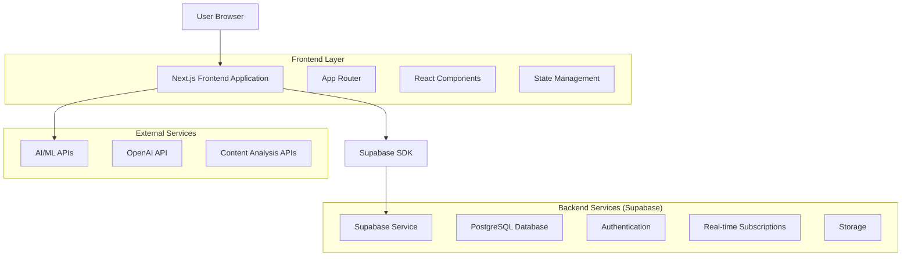
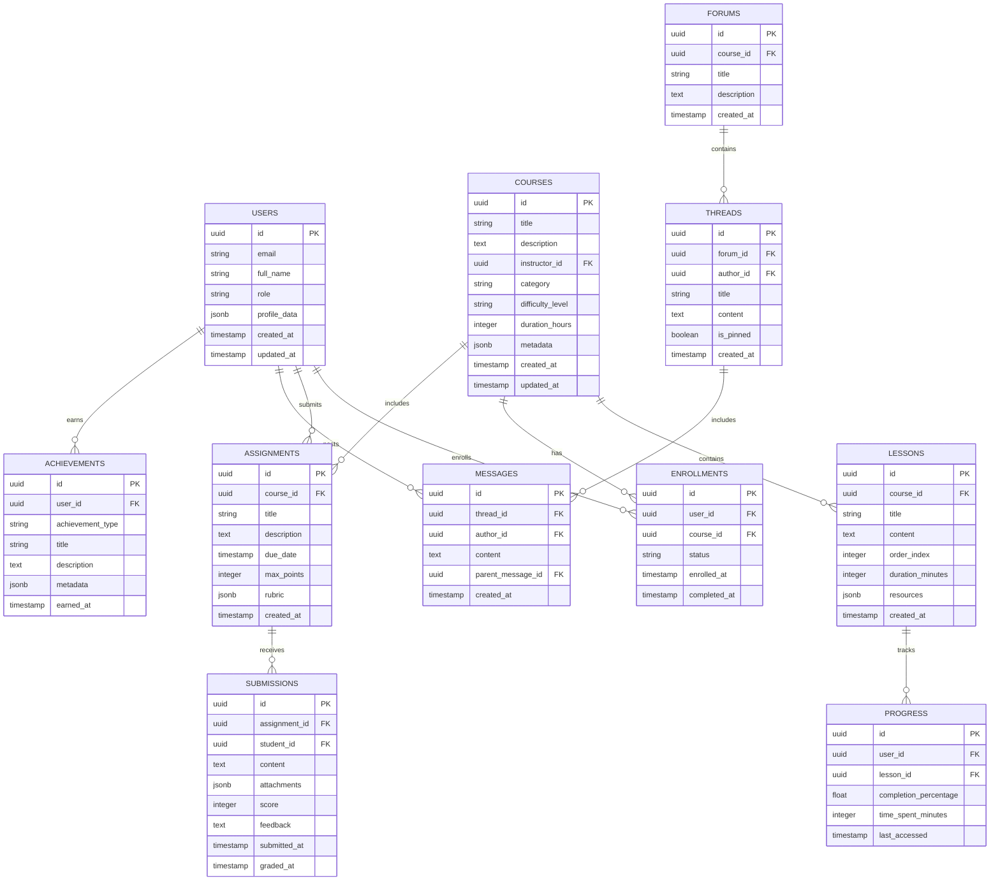

# NeuroLearn - Technical Architecture Document

## 1. Architecture Design



## 2. Technology Description

* Frontend: Next.js\@14 + React\@18 + TypeScript + Tailwind CSS\@3 + Framer Motion

* Backend: Supabase (PostgreSQL, Auth, Real-time, Storage)

* AI Integration: OpenAI API, Hugging Face Transformers

* State Management: Zustand + React Query

* UI Components: Radix UI + Custom Components

* Development: ESLint + Prettier + Husky

## 3. Route Definitions

| Route                          | Purpose                                                |
| ------------------------------ | ------------------------------------------------------ |
| /                              | Landing page with platform overview and authentication |
| /dashboard                     | Main dashboard with personalized learning overview     |
| /courses                       | Course library with search, filtering, and enrollment  |
| /courses/\[id]                 | Individual course page with lessons and materials      |
| /learn/\[courseId]/\[lessonId] | Interactive learning interface with AI assistance      |
| /assignments                   | Assignment hub for submissions and grading             |
| /assignments/\[id]             | Individual assignment view and submission              |
| /collaborate                   | Collaboration space with forums and group projects     |
| /collaborate/forums/\[id]      | Individual forum thread view                           |
| /analytics                     | Analytics dashboard with performance insights          |
| /gamification                  | Gamification center with achievements and leaderboards |
| /schedule                      | Smart scheduler with calendar integration              |
| /create                        | Content creation studio for educators                  |
| /assess                        | Assessment platform for quizzes and tests              |
| /profile                       | User profile management and settings                   |
| /admin                         | Administrative panel for system management             |

## 4. API Definitions

### 4.1 Core API

**Authentication**

```typescript
// Supabase Auth handles authentication automatically
interface AuthUser {
  id: string;
  email: string;
  role: 'student' | 'educator' | 'admin';
  profile: UserProfile;
}
```

**Course Management**

```typescript
interface Course {
  id: string;
  title: string;
  description: string;
  instructor_id: string;
  category: string;
  difficulty_level: 'beginner' | 'intermediate' | 'advanced';
  duration_hours: number;
  created_at: string;
  updated_at: string;
}

interface Lesson {
  id: string;
  course_id: string;
  title: string;
  content: string;
  order_index: number;
  duration_minutes: number;
  resources: LessonResource[];
}
```

**AI Integration**

```typescript
interface AIQARequest {
  question: string;
  context: string;
  course_id?: string;
  lesson_id?: string;
}

interface AIQAResponse {
  answer: string;
  confidence: number;
  sources: string[];
  follow_up_questions: string[];
}

interface ContentSummaryRequest {
  content: string;
  summary_type: 'brief' | 'detailed' | 'key_points';
}
```

**Real-time Features**

```typescript
interface CollaborationMessage {
  id: string;
  user_id: string;
  content: string;
  thread_id: string;
  created_at: string;
  reactions: MessageReaction[];
}

interface LiveSession {
  id: string;
  course_id: string;
  instructor_id: string;
  participants: string[];
  status: 'scheduled' | 'active' | 'ended';
  start_time: string;
}
```

## 5. Data Model

### 5.1 Data Model Definition



### 5.2 Data Definition Language

**Users Table**

```sql
-- Create users table (extends Supabase auth.users)
CREATE TABLE public.users (
    id UUID PRIMARY KEY REFERENCES auth.users(id) ON DELETE CASCADE,
    email VARCHAR(255) UNIQUE NOT NULL,
    full_name VARCHAR(255) NOT NULL,
    role VARCHAR(20) DEFAULT 'student' CHECK (role IN ('student', 'educator', 'admin')),
    profile_data JSONB DEFAULT '{}',
    created_at TIMESTAMP WITH TIME ZONE DEFAULT NOW(),
    updated_at TIMESTAMP WITH TIME ZONE DEFAULT NOW()
);

-- Enable RLS
ALTER TABLE public.users ENABLE ROW LEVEL SECURITY;

-- Create policies
CREATE POLICY "Users can view own profile" ON public.users
    FOR SELECT USING (auth.uid() = id);

CREATE POLICY "Users can update own profile" ON public.users
    FOR UPDATE USING (auth.uid() = id);

-- Grant permissions
GRANT SELECT ON public.users TO anon;
GRANT ALL PRIVILEGES ON public.users TO authenticated;
```

**Courses Table**

```sql
CREATE TABLE public.courses (
    id UUID PRIMARY KEY DEFAULT gen_random_uuid(),
    title VARCHAR(255) NOT NULL,
    description TEXT,
    instructor_id UUID REFERENCES public.users(id) ON DELETE CASCADE,
    category VARCHAR(100) NOT NULL,
    difficulty_level VARCHAR(20) DEFAULT 'beginner' CHECK (difficulty_level IN ('beginner', 'intermediate', 'advanced')),
    duration_hours INTEGER DEFAULT 0,
    metadata JSONB DEFAULT '{}',
    created_at TIMESTAMP WITH TIME ZONE DEFAULT NOW(),
    updated_at TIMESTAMP WITH TIME ZONE DEFAULT NOW()
);

ALTER TABLE public.courses ENABLE ROW LEVEL SECURITY;

CREATE POLICY "Anyone can view published courses" ON public.courses
    FOR SELECT USING (true);

CREATE POLICY "Instructors can manage their courses" ON public.courses
    FOR ALL USING (auth.uid() = instructor_id);

GRANT SELECT ON public.courses TO anon;
GRANT ALL PRIVILEGES ON public.courses TO authenticated;
```

**Lessons Table**

```sql
CREATE TABLE public.lessons (
    id UUID PRIMARY KEY DEFAULT gen_random_uuid(),
    course_id UUID REFERENCES public.courses(id) ON DELETE CASCADE,
    title VARCHAR(255) NOT NULL,
    content TEXT,
    order_index INTEGER NOT NULL,
    duration_minutes INTEGER DEFAULT 0,
    resources JSONB DEFAULT '[]',
    created_at TIMESTAMP WITH TIME ZONE DEFAULT NOW()
);

ALTER TABLE public.lessons ENABLE ROW LEVEL SECURITY;

CREATE POLICY "Enrolled users can view lessons" ON public.lessons
    FOR SELECT USING (
        EXISTS (
            SELECT 1 FROM public.enrollments 
            WHERE user_id = auth.uid() AND course_id = lessons.course_id
        ) OR 
        EXISTS (
            SELECT 1 FROM public.courses 
            WHERE id = lessons.course_id AND instructor_id = auth.uid()
        )
    );

GRANT SELECT ON public.lessons TO anon;
GRANT ALL PRIVILEGES ON public.lessons TO authenticated;
```

**Enrollments Table**

```sql
CREATE TABLE public.enrollments (
    id UUID PRIMARY KEY DEFAULT gen_random_uuid(),
    user_id UUID REFERENCES public.users(id) ON DELETE CASCADE,
    course_id UUID REFERENCES public.courses(id) ON DELETE CASCADE,
    status VARCHAR(20) DEFAULT 'active' CHECK (status IN ('active', 'completed', 'dropped')),
    enrolled_at TIMESTAMP WITH TIME ZONE DEFAULT NOW(),
    completed_at TIMESTAMP WITH TIME ZONE,
    UNIQUE(user_id, course_id)
);

ALTER TABLE public.enrollments ENABLE ROW LEVEL SECURITY;

CREATE POLICY "Users can view their enrollments" ON public.enrollments
    FOR SELECT USING (auth.uid() = user_id);

CREATE POLICY "Users can manage their enrollments" ON public.enrollments
    FOR INSERT WITH CHECK (auth.uid() = user_id);

GRANT SELECT ON public.enrollments TO anon;
GRANT ALL PRIVILEGES ON public.enrollments TO authenticated;
```

**Create indexes for performance**

```sql
CREATE INDEX idx_courses_instructor ON public.courses(instructor_id);
CREATE INDEX idx_courses_category ON public.courses(category);
CREATE INDEX idx_lessons_course ON public.lessons(course_id, order_index);
CREATE INDEX idx_enrollments_user ON public.enrollments(user_id);
CREATE INDEX idx_enrollments_course ON public.enrollments(course_id);
```

**Real-time subscriptions setup**

```sql
-- Enable real-time for collaboration features
ALTER PUBLICATION supabase_realtime ADD TABLE public.messages;
ALTER PUBLICATION supabase_realtime ADD TABLE public.progress;
ALTER PUBLICATION supabase_realtime ADD TABLE public.live_sessions;
```

