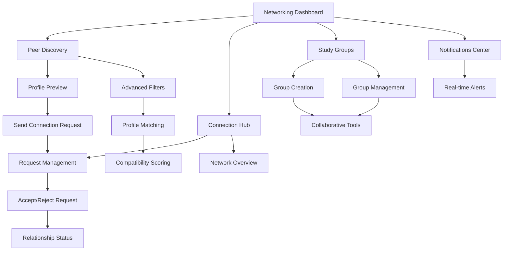

# NeuroLearn Peer Networking Module - Product Requirements Document

## 1. Product Overview

The Peer Networking Module enhances NeuroLearn's social learning capabilities by connecting students with similar academic interests and study goals. This module transforms isolated learning into collaborative experiences through intelligent peer matching and connection management.

The module addresses the need for peer-to-peer learning, study partnerships, and academic collaboration, helping students build meaningful connections that enhance their educational journey and create lasting professional networks.

## 2. Core Features

### 2.1 User Roles

| Role               | Registration Method                                | Core Permissions                                                             |
| ------------------ | -------------------------------------------------- | ---------------------------------------------------------------------------- |
| Student            | Existing NeuroLearn account with completed profile | Send/receive connection requests, join study groups, access peer suggestions |
| Verified Student   | Profile verification through academic institution  | Create study groups, moderate discussions, access advanced matching features |
| Study Group Leader | Elected or appointed within groups                 | Manage group membership, schedule group activities, moderate group content   |

### 2.2 Feature Module

Our Peer Networking Module consists of the following main pages:

1. **Peer Discovery**: AI-powered peer suggestions, advanced filtering, compatibility scoring
2. **Connection Hub**: Connection requests management, peer network overview, relationship status tracking
3. **Study Groups**: Group creation and management, collaborative spaces, shared resources
4. **Networking Dashboard**: Social activity feed, connection analytics, engagement metrics
5. **Notifications Center**: Real-time alerts, connection updates, group activity notifications
6. **Profile Matching**: Interest-based matching, academic field alignment, study goal compatibility

### 2.3 Page Details

| Page Name            | Module Name           | Feature Description                                                                                            |
| -------------------- | --------------------- | -------------------------------------------------------------------------------------------------------------- |
| Peer Discovery       | Suggestion Engine     | Display AI-recommended peers based on shared interests, academic fields, study goals with compatibility scores |
| Peer Discovery       | Advanced Filters      | Filter peers by academic field, study level, interests, availability, location, language preferences           |
| Peer Discovery       | Profile Preview       | Show peer profile cards with key information, mutual connections, shared courses, interaction options          |
| Connection Hub       | Request Management    | Send, accept, reject connection requests with personalized messages and status tracking                        |
| Connection Hub       | Network Overview      | Visualize peer network with connection strength, interaction frequency, mutual connections                     |
| Connection Hub       | Relationship Status   | Track connection types (study partner, project collaborator, mentor/mentee), interaction history               |
| Study Groups         | Group Creation        | Create study groups with description, subject focus, member limits, privacy settings, joining requirements     |
| Study Groups         | Group Management      | Manage member permissions, schedule group sessions, share resources, moderate discussions                      |
| Study Groups         | Collaborative Tools   | Shared whiteboards, document collaboration, group chat, video conferencing integration                         |
| Networking Dashboard | Activity Feed         | Display peer activities, study achievements, group updates, connection milestones                              |
| Networking Dashboard | Engagement Analytics  | Track networking metrics, connection growth, group participation, collaboration effectiveness                  |
| Notifications Center | Real-time Alerts      | Instant notifications for connection requests, group invitations, study session reminders                      |
| Notifications Center | Notification Settings | Customize notification preferences, frequency settings, delivery methods, priority levels                      |
| Profile Matching     | Compatibility Scoring | Calculate and display compatibility percentages based on multiple matching criteria                            |
| Profile Matching     | Interest Alignment    | Match users with similar academic interests, research topics, career goals, learning styles                    |

## 3. Core Process

**Peer Discovery Flow:**
Students access the Peer Discovery page where AI algorithms suggest compatible peers based on their profile data, interests, and study goals. Users can browse suggestions, apply filters, and view detailed compatibility scores. They can send connection requests with personalized messages or save profiles for later review.

**Connection Management Flow:**
Users receive connection requests in their Connection Hub, where they can review requester profiles, mutual connections, and compatibility information. Upon accepting connections, users can categorize relationships (study partner, project collaborator) and begin collaborative activities. The system tracks interaction frequency and suggests strengthening weak connections.

**Study Group Participation Flow:**
Students can create or join study groups based on subjects, courses, or projects. Group leaders manage membership, schedule sessions, and facilitate discussions. Members collaborate through shared tools, participate in group activities, and track collective progress toward study goals.

**Notification and Engagement Flow:**
The system sends real-time notifications for connection activities, group updates, and study opportunities. Users can customize notification preferences and engage with alerts directly from the notification center. Analytics help users understand their networking effectiveness and suggest improvements.



## 4. User Interface Design

### 4.1 Design Style

* **Primary Colors**: Warm blue (#3B82F6) for trust and connection, vibrant green (#22C55E) for successful matches

* **Secondary Colors**: Soft purple (#8B5CF6) for groups and collaboration, coral (#FF6B6B) for notifications

* **Button Style**: Rounded buttons (12px radius) with subtle gradients, connection-themed icons, smooth hover transitions

* **Typography**: Inter font family, 14px for peer cards, 18px for headings, emphasis on readability in social contexts

* **Layout Style**: Card-based peer profiles, grid layouts for discovery, timeline-style activity feeds

* **Icons**: Social and collaboration-focused icons, connection status indicators, group activity symbols

### 4.2 Page Design Overview

| Page Name            | Module Name           | UI Elements                                                                                          |
| -------------------- | --------------------- | ---------------------------------------------------------------------------------------------------- |
| Peer Discovery       | Suggestion Engine     | Masonry grid layout for peer cards, compatibility badges, swipe gestures for mobile, infinite scroll |
| Peer Discovery       | Advanced Filters      | Collapsible filter sidebar, multi-select dropdowns, range sliders, real-time result updates          |
| Connection Hub       | Request Management    | Tabbed interface (pending, accepted, sent), action buttons, profile thumbnails, status indicators    |
| Connection Hub       | Network Overview      | Interactive network visualization, connection strength indicators, hover details, zoom controls      |
| Study Groups         | Group Creation        | Step-by-step wizard, image upload for group avatars, member invitation system, privacy toggles       |
| Study Groups         | Collaborative Tools   | Split-screen layout, real-time collaboration indicators, shared cursor visibility, version history   |
| Networking Dashboard | Activity Feed         | Timeline layout with activity cards, user avatars, timestamp display, interaction buttons            |
| Notifications Center | Real-time Alerts      | Notification cards with action buttons, read/unread states, categorized tabs, batch actions          |
| Profile Matching     | Compatibility Scoring | Progress rings for compatibility metrics, detailed breakdown tooltips, comparison views              |

### 4.3 Responsiveness

The Peer Networking Module is designed with mobile-first principles, featuring touch-optimized peer cards, swipe gestures for connection actions, and responsive grid layouts. Tablet views utilize split-screen layouts for efficient peer browsing, while desktop versions offer advanced filtering and multi-panel views for power users. All interactive elements maintain minimum 44px touch targets with appropriate spacing for accessibility.

## 5. Technical Requirements

### 5.1 Database Schema

**Connections Table:**

```sql
CREATE TABLE connections (
    id BIGSERIAL PRIMARY KEY,
    requester_id UUID REFERENCES auth.users ON DELETE CASCADE,
    receiver_id UUID REFERENCES auth.users ON DELETE CASCADE,
    status TEXT CHECK (status IN ('pending', 'accepted', 'rejected')) DEFAULT 'pending',
    connection_type TEXT CHECK (connection_type IN ('study_partner', 'project_collaborator', 'mentor', 'mentee')) DEFAULT 'study_partner',
    message TEXT,
    created_at TIMESTAMP DEFAULT NOW(),
    updated_at TIMESTAMP DEFAULT NOW(),
    UNIQUE(requester_id, receiver_id)
);
```

**Study Groups Table:**

```sql
CREATE TABLE study_groups (
    id BIGSERIAL PRIMARY KEY,
    name TEXT NOT NULL,
    description TEXT,
    subject TEXT,
    privacy_level TEXT CHECK (privacy_level IN ('public', 'private', 'invite_only')) DEFAULT 'public',
    max_members INTEGER DEFAULT 50,
    creator_id UUID REFERENCES auth.users ON DELETE CASCADE,
    created_at TIMESTAMP DEFAULT NOW(),
    updated_at TIMESTAMP DEFAULT NOW()
);
```

**Group Memberships Table:**

```sql
CREATE TABLE group_memberships (
    group_id BIGINT REFERENCES study_groups(id) ON DELETE CASCADE,
    user_id UUID REFERENCES auth.users ON DELETE CASCADE,
    role TEXT CHECK (role IN ('member', 'moderator', 'leader')) DEFAULT 'member',
    joined_at TIMESTAMP DEFAULT NOW(),
    PRIMARY KEY (group_id, user_id)
);
```

**Notifications Table:**

```sql
CREATE TABLE notifications (
    id BIGSERIAL PRIMARY KEY,
    user_id UUID REFERENCES auth.users ON DELETE CASCADE,
    type TEXT CHECK (type IN ('connection_request', 'connection_accepted', 'group_invitation', 'group_activity')) NOT NULL,
    title TEXT NOT NULL,
    message TEXT,
    related_id BIGINT,
    is_read BOOLEAN DEFAULT FALSE,
    created_at TIMESTAMP DEFAULT NOW()
);
```

### 5.2 API Endpoints

**Peer Suggestions:**

* `GET /api/peers/suggestions` - Get AI-recommended peers

* `GET /api/peers/search` - Search peers with filters

* `GET /api/peers/compatibility/:userId` - Calculate compatibility score

**Connection Management:**

* `POST /api/connections/request` - Send connection request

* `PUT /api/connections/:id/accept` - Accept connection request

* `PUT /api/connections/:id/reject` - Reject connection request

* `GET /api/connections/my-network` - Get user's connections

* `DELETE /api/connections/:id` - Remove connection

**Study Groups:**

* `POST /api/groups` - Create study group

* `GET /api/groups/my-groups` - Get user's groups

* `POST /api/groups/:id/join` - Join study group

* `DELETE /api/groups/:id/leave` - Leave study group

* `GET /api/groups/:id/members` - Get group members

**Notifications:**

* `GET /api/notifications` - Get user notifications

* `PUT /api/notifications/:id/read` - Mark notification as read

* `PUT /api/notifications/read-all` - Mark all notifications as read

### 5.3 Matching Algorithm

The peer suggestion algorithm considers multiple factors:

1. **Interest Overlap** (40% weight): Array intersection of user interests
2. **Academic Field Match** (25% weight): Exact or related field matching
3. **Study Goals Alignment** (20% weight): Similar learning objectives
4. **Activity Level** (10% weight): Platform engagement compatibility
5. **Mutual Connections** (5% weight): Shared network connections

**Compatibility Score Calculation:**

```javascript
function calculateCompatibility(user1, user2) {
    const interestScore = calculateInterestOverlap(user1.interests, user2.interests) * 0.4;
    const fieldScore = calculateFieldMatch(user1.academic_field, user2.academic_field) * 0.25;
    const goalScore = calculateGoalAlignment(user1.study_goals, user2.study_goals) * 0.2;
    const activityScore = calculateActivityCompatibility(user1.activity_level, user2.activity_level) * 0.1;
    const mutualScore = calculateMutualConnections(user1.id, user2.id) * 0.05;
    
    return Math.round((interestScore + fieldScore + goalScore + activityScore + mutualScore) * 100);
}
```

### 5.4 Real-time Features

* **Live Notifications**: WebSocket connections for instant alerts

* **Online Status**: Real-time presence indicators for connected peers

* **Group Chat**: Live messaging within study groups

* **Collaborative Tools**: Real-time document editing and whiteboard sharing

### 5.5 Privacy and Security

* **Connection Privacy**: Users control who can send them connection requests

* **Profile Visibility**: Granular privacy settings for profile information

* **Group Privacy**: Public, private, and invite-only group options

* **Data Protection**: Encrypted sensitive data, GDPR compliance

* **Reporting System**: Tools to report inappropriate behavior or content

