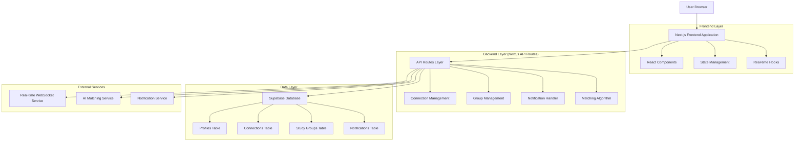
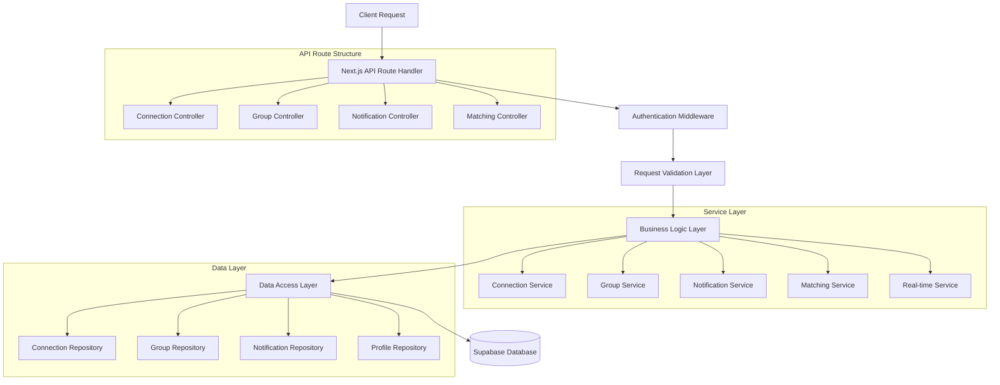
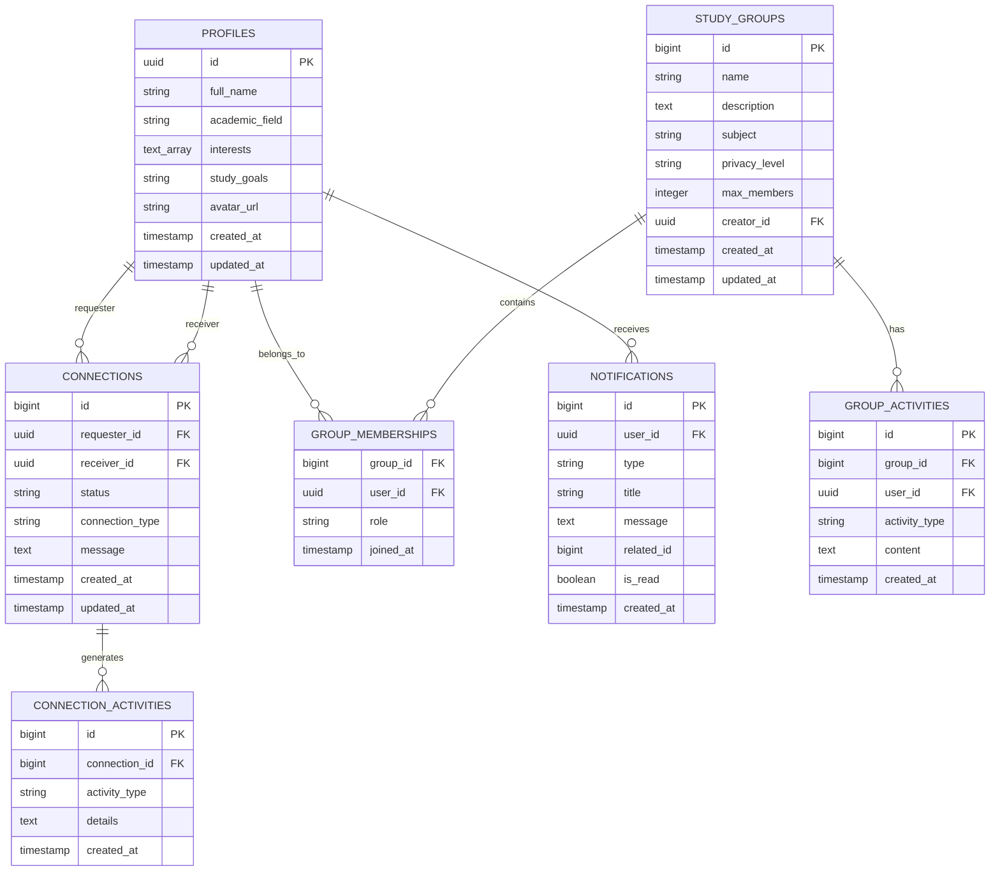

# NeuroLearn Peer Networking Module - Technical Architecture Document

## 1. Architecture Design



## 2. Technology Description

- **Frontend**: Next.js 14 + React 18 + TypeScript + Tailwind CSS + Framer Motion
- **Backend**: Next.js API Routes + Supabase Edge Functions
- **Database**: Supabase (PostgreSQL) with Row Level Security
- **Real-time**: Supabase Realtime + WebSocket connections
- **State Management**: Zustand + React Query for server state
- **UI Components**: Radix UI + Custom component library
- **Authentication**: Supabase Auth with existing user system

## 3. Route Definitions

| Route | Purpose |
|-------|---------|
| /networking | Main networking dashboard with activity feed and quick actions |
| /networking/discover | Peer discovery page with AI suggestions and filtering |
| /networking/connections | Connection management hub for requests and network overview |
| /networking/groups | Study groups listing and management interface |
| /networking/groups/[id] | Individual study group workspace with collaborative tools |
| /networking/groups/create | Study group creation wizard with settings configuration |
| /networking/notifications | Notification center with real-time alerts and settings |
| /networking/profile/[userId] | Peer profile view with connection options and compatibility |

## 4. API Definitions

### 4.1 Core API Endpoints

**Peer Discovery and Matching**
```
GET /api/networking/peers/suggestions
```

Request:
| Param Name | Param Type | isRequired | Description |
|------------|------------|------------|-------------|
| limit | number | false | Number of suggestions to return (default: 20) |
| filters | object | false | Filter criteria (academic_field, interests, study_level) |

Response:
| Param Name | Param Type | Description |
|------------|------------|-------------|
| suggestions | array | Array of suggested peer objects with compatibility scores |
| total_count | number | Total number of available suggestions |

Example Response:
```json
{
  "suggestions": [
    {
      "id": "uuid",
      "full_name": "John Doe",
      "academic_field": "Computer Science",
      "interests": ["AI", "Machine Learning"],
      "compatibility_score": 85,
      "avatar_url": "https://...",
      "mutual_connections": 3
    }
  ],
  "total_count": 45
}
```

**Connection Management**
```
POST /api/networking/connections/request
```

Request:
| Param Name | Param Type | isRequired | Description |
|------------|------------|------------|-------------|
| receiver_id | string | true | UUID of the user to connect with |
| connection_type | string | false | Type of connection (study_partner, project_collaborator) |
| message | string | false | Personal message with the request |

Response:
| Param Name | Param Type | Description |
|------------|------------|-------------|
| success | boolean | Request status |
| connection_id | string | ID of the created connection request |

```
PUT /api/networking/connections/[id]/respond
```

Request:
| Param Name | Param Type | isRequired | Description |
|------------|------------|------------|-------------|
| action | string | true | Response action ('accept' or 'reject') |
| connection_type | string | false | Type of connection if accepting |

**Study Groups Management**
```
POST /api/networking/groups
```

Request:
| Param Name | Param Type | isRequired | Description |
|------------|------------|------------|-------------|
| name | string | true | Group name |
| description | string | false | Group description |
| subject | string | false | Academic subject focus |
| privacy_level | string | false | Privacy setting (public, private, invite_only) |
| max_members | number | false | Maximum number of members |

Response:
| Param Name | Param Type | Description |
|------------|------------|-------------|
| group | object | Created group object with ID and settings |
| invitation_code | string | Unique code for joining (if private/invite_only) |

```
POST /api/networking/groups/[id]/join
```

Request:
| Param Name | Param Type | isRequired | Description |
|------------|------------|------------|-------------|
| invitation_code | string | false | Required for private/invite_only groups |

**Notifications System**
```
GET /api/networking/notifications
```

Request:
| Param Name | Param Type | isRequired | Description |
|------------|------------|------------|-------------|
| unread_only | boolean | false | Filter for unread notifications only |
| type | string | false | Filter by notification type |
| limit | number | false | Number of notifications to return |

Response:
| Param Name | Param Type | Description |
|------------|------------|-------------|
| notifications | array | Array of notification objects |
| unread_count | number | Total number of unread notifications |

```
PUT /api/networking/notifications/[id]/read
```

Request: No body required

Response:
| Param Name | Param Type | Description |
|------------|------------|-------------|
| success | boolean | Update status |

## 5. Server Architecture Diagram



## 6. Data Model

### 6.1 Data Model Definition



### 6.2 Data Definition Language

**Connections Table**
```sql
-- Create connections table
CREATE TABLE connections (
    id BIGSERIAL PRIMARY KEY,
    requester_id UUID REFERENCES auth.users ON DELETE CASCADE,
    receiver_id UUID REFERENCES auth.users ON DELETE CASCADE,
    status TEXT CHECK (status IN ('pending', 'accepted', 'rejected')) DEFAULT 'pending',
    connection_type TEXT CHECK (connection_type IN ('study_partner', 'project_collaborator', 'mentor', 'mentee')) DEFAULT 'study_partner',
    message TEXT,
    created_at TIMESTAMP WITH TIME ZONE DEFAULT NOW(),
    updated_at TIMESTAMP WITH TIME ZONE DEFAULT NOW(),
    UNIQUE(requester_id, receiver_id)
);

-- Create indexes for performance
CREATE INDEX idx_connections_requester ON connections(requester_id);
CREATE INDEX idx_connections_receiver ON connections(receiver_id);
CREATE INDEX idx_connections_status ON connections(status);
CREATE INDEX idx_connections_created_at ON connections(created_at DESC);

-- Row Level Security
ALTER TABLE connections ENABLE ROW LEVEL SECURITY;

-- Policy for users to see their own connections
CREATE POLICY "Users can view their own connections" ON connections
    FOR SELECT USING (
        auth.uid() = requester_id OR auth.uid() = receiver_id
    );

-- Policy for users to create connection requests
CREATE POLICY "Users can create connection requests" ON connections
    FOR INSERT WITH CHECK (auth.uid() = requester_id);

-- Policy for users to update their received requests
CREATE POLICY "Users can update received requests" ON connections
    FOR UPDATE USING (auth.uid() = receiver_id);

-- Grant permissions
GRANT SELECT, INSERT, UPDATE ON connections TO authenticated;
GRANT USAGE ON SEQUENCE connections_id_seq TO authenticated;
```

**Study Groups Table**
```sql
-- Create study groups table
CREATE TABLE study_groups (
    id BIGSERIAL PRIMARY KEY,
    name TEXT NOT NULL,
    description TEXT,
    subject TEXT,
    privacy_level TEXT CHECK (privacy_level IN ('public', 'private', 'invite_only')) DEFAULT 'public',
    max_members INTEGER DEFAULT 50,
    creator_id UUID REFERENCES auth.users ON DELETE CASCADE,
    invitation_code TEXT UNIQUE,
    created_at TIMESTAMP WITH TIME ZONE DEFAULT NOW(),
    updated_at TIMESTAMP WITH TIME ZONE DEFAULT NOW()
);

-- Create indexes
CREATE INDEX idx_study_groups_creator ON study_groups(creator_id);
CREATE INDEX idx_study_groups_subject ON study_groups(subject);
CREATE INDEX idx_study_groups_privacy ON study_groups(privacy_level);
CREATE INDEX idx_study_groups_invitation_code ON study_groups(invitation_code);

-- Row Level Security
ALTER TABLE study_groups ENABLE ROW LEVEL SECURITY;

-- Policy for public groups visibility
CREATE POLICY "Public groups are visible to all" ON study_groups
    FOR SELECT USING (privacy_level = 'public');

-- Policy for group creators
CREATE POLICY "Creators can manage their groups" ON study_groups
    FOR ALL USING (auth.uid() = creator_id);

-- Policy for group members to view private groups
CREATE POLICY "Members can view their groups" ON study_groups
    FOR SELECT USING (
        id IN (
            SELECT group_id FROM group_memberships 
            WHERE user_id = auth.uid()
        )
    );

-- Grant permissions
GRANT SELECT, INSERT, UPDATE, DELETE ON study_groups TO authenticated;
GRANT USAGE ON SEQUENCE study_groups_id_seq TO authenticated;
```

**Group Memberships Table**
```sql
-- Create group memberships table
CREATE TABLE group_memberships (
    group_id BIGINT REFERENCES study_groups(id) ON DELETE CASCADE,
    user_id UUID REFERENCES auth.users ON DELETE CASCADE,
    role TEXT CHECK (role IN ('member', 'moderator', 'leader')) DEFAULT 'member',
    joined_at TIMESTAMP WITH TIME ZONE DEFAULT NOW(),
    PRIMARY KEY (group_id, user_id)
);

-- Create indexes
CREATE INDEX idx_group_memberships_user ON group_memberships(user_id);
CREATE INDEX idx_group_memberships_group ON group_memberships(group_id);
CREATE INDEX idx_group_memberships_role ON group_memberships(role);

-- Row Level Security
ALTER TABLE group_memberships ENABLE ROW LEVEL SECURITY;

-- Policy for users to see memberships in their groups
CREATE POLICY "Users can view group memberships" ON group_memberships
    FOR SELECT USING (
        group_id IN (
            SELECT group_id FROM group_memberships 
            WHERE user_id = auth.uid()
        )
        OR group_id IN (
            SELECT id FROM study_groups 
            WHERE privacy_level = 'public'
        )
    );

-- Policy for joining groups
CREATE POLICY "Users can join groups" ON group_memberships
    FOR INSERT WITH CHECK (auth.uid() = user_id);

-- Policy for leaving groups
CREATE POLICY "Users can leave groups" ON group_memberships
    FOR DELETE USING (auth.uid() = user_id);

-- Grant permissions
GRANT SELECT, INSERT, DELETE ON group_memberships TO authenticated;
```

**Notifications Table**
```sql
-- Create notifications table
CREATE TABLE notifications (
    id BIGSERIAL PRIMARY KEY,
    user_id UUID REFERENCES auth.users ON DELETE CASCADE,
    type TEXT CHECK (type IN ('connection_request', 'connection_accepted', 'connection_rejected', 'group_invitation', 'group_activity', 'new_peer_suggestion')) NOT NULL,
    title TEXT NOT NULL,
    message TEXT,
    related_id BIGINT,
    related_type TEXT,
    is_read BOOLEAN DEFAULT FALSE,
    created_at TIMESTAMP WITH TIME ZONE DEFAULT NOW()
);

-- Create indexes
CREATE INDEX idx_notifications_user ON notifications(user_id);
CREATE INDEX idx_notifications_type ON notifications(type);
CREATE INDEX idx_notifications_is_read ON notifications(is_read);
CREATE INDEX idx_notifications_created_at ON notifications(created_at DESC);

-- Row Level Security
ALTER TABLE notifications ENABLE ROW LEVEL SECURITY;

-- Policy for users to see their own notifications
CREATE POLICY "Users can view their own notifications" ON notifications
    FOR SELECT USING (auth.uid() = user_id);

-- Policy for users to update their own notifications
CREATE POLICY "Users can update their own notifications" ON notifications
    FOR UPDATE USING (auth.uid() = user_id);

-- Grant permissions
GRANT SELECT, UPDATE ON notifications TO authenticated;
GRANT USAGE ON SEQUENCE notifications_id_seq TO authenticated;
```

**Database Functions and Triggers**
```sql
-- Function to automatically create notifications for new connection requests
CREATE OR REPLACE FUNCTION notify_connection_request()
RETURNS TRIGGER AS $$
BEGIN
    INSERT INTO notifications (user_id, type, title, message, related_id, related_type)
    SELECT 
        NEW.receiver_id,
        'connection_request',
        'New Connection Request',
        (SELECT full_name FROM profiles WHERE id = NEW.requester_id) || ' sent you a connection request',
        NEW.id,
        'connection'
    WHERE NEW.status = 'pending';
    
    RETURN NEW;
END;
$$ LANGUAGE plpgsql;

-- Trigger for connection request notifications
CREATE TRIGGER connection_request_notify
    AFTER INSERT ON connections
    FOR EACH ROW
    EXECUTE FUNCTION notify_connection_request();

-- Function to notify when connection is accepted
CREATE OR REPLACE FUNCTION notify_connection_accepted()
RETURNS TRIGGER AS $$
BEGIN
    IF OLD.status = 'pending' AND NEW.status = 'accepted' THEN
        INSERT INTO notifications (user_id, type, title, message, related_id, related_type)
        SELECT 
            NEW.requester_id,
            'connection_accepted',
            'Connection Accepted',
            (SELECT full_name FROM profiles WHERE id = NEW.receiver_id) || ' accepted your connection request',
            NEW.id,
            'connection';
    END IF;
    
    RETURN NEW;
END;
$$ LANGUAGE plpgsql;

-- Trigger for connection acceptance notifications
CREATE TRIGGER connection_accepted_notify
    AFTER UPDATE ON connections
    FOR EACH ROW
    EXECUTE FUNCTION notify_connection_accepted();

-- Function to suggest new peers with shared interests
CREATE OR REPLACE FUNCTION notify_shared_interest_peers()
RETURNS TRIGGER AS $$
BEGIN
    INSERT INTO notifications (user_id, type, title, message, related_id, related_type)
    SELECT 
        p.id,
        'new_peer_suggestion',
        'New Peer with Shared Interests',
        'A new peer with similar interests joined NeuroLearn!',
        NEW.id,
        'profile'
    FROM profiles p
    WHERE p.id != NEW.id
        AND p.interests && NEW.interests
        AND array_length(p.interests & NEW.interests, 1) >= 2;
    
    RETURN NEW;
END;
$$ LANGUAGE plpgsql;

-- Trigger for new peer suggestions
CREATE TRIGGER new_peer_notify
    AFTER INSERT ON profiles
    FOR EACH ROW
    EXECUTE FUNCTION notify_shared_interest_peers();
```

**Initial Data Setup**
```sql
-- Insert sample notification types configuration
INSERT INTO notifications (user_id, type, title, message, is_read, created_at)
VALUES 
    -- These are template examples, actual notifications will be created by triggers
    ('00000000-0000-0000-0000-000000000000', 'connection_request', 'Welcome to Peer Networking', 'Start connecting with peers who share your interests!', false, NOW());

-- Create initial study group categories
INSERT INTO study_groups (name, description, subject, privacy_level, creator_id, created_at)
VALUES 
    ('Computer Science Study Group', 'General discussion and collaboration for CS students', 'Computer Science', 'public', '00000000-0000-0000-0000-000000000000', NOW()),
    ('Mathematics Peer Learning', 'Collaborative problem solving and study sessions', 'Mathematics', 'public', '00000000-0000-0000-0000-000000000000', NOW()),
    ('Research Collaboration Hub', 'Connect with peers for research projects and academic papers', 'Research', 'public', '00000000-0000-0000-0000-000000000000', NOW());
```