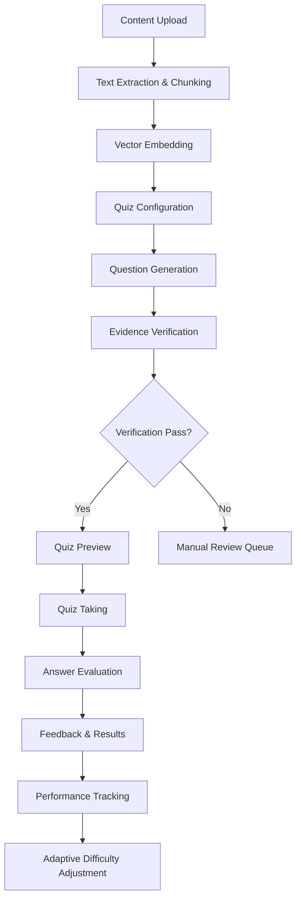

# Quiz Module - Product Requirements Document

## 1. Product Overview

The Quiz Module is an intelligent assessment system that automatically generates quizzes from uploaded educational content including documents, notes, and transcripts. It provides adaptive learning experiences with real-time feedback and evidence-based question validation to ensure accuracy and prevent hallucination.

The module addresses the need for automated assessment creation in educational platforms, helping educators and learners create comprehensive practice tests from existing content while maintaining high quality through AI-powered verification and adaptive difficulty adjustment.

## 2. Core Features

### 2.1 User Roles

| Role | Registration Method | Core Permissions |
|------|---------------------|------------------|
| Student | Standard user registration | Can take quizzes, view feedback, track progress |
| Educator | Standard user registration | Can create quizzes, review flagged questions, access analytics |
| Admin | System invitation | Can manage all quizzes, review verification queue, access monitoring |

### 2.2 Feature Module

Our Quiz Module requirements consist of the following main pages:

1. **Quiz Creation Page**: Content upload, quiz configuration, preview functionality
2. **Quiz Taking Page**: Question display, timer management, answer submission
3. **Results & Feedback Page**: Score display, detailed explanations, evidence presentation
4. **Quiz Management Dashboard**: Quiz library, performance analytics, flagged question review
5. **Admin Review Panel**: Verification queue, monitoring dashboard, system analytics

### 2.3 Page Details

| Page Name | Module Name | Feature description |
|-----------|-------------|---------------------|
| Quiz Creation Page | Content Uploader | Upload PDF, TXT, MD, audio/video files for quiz generation |
| Quiz Creation Page | Quiz Configuration | Set number of questions, difficulty range, question types, time limits |
| Quiz Creation Page | Preview & Validation | Review generated questions, verify evidence, approve or reject questions |
| Quiz Taking Page | Question Display | Present questions with multiple choice, short answer, fill-in-blank, true/false, numeric formats |
| Quiz Taking Page | Timer Management | Enforce timed mode with server-side validation, support untimed mode |
| Quiz Taking Page | Answer Submission | Capture user responses, track time per question, submit for evaluation |
| Results & Feedback Page | Score Calculation | Display overall score, question-by-question results, performance metrics |
| Results & Feedback Page | Feedback System | Show correct answers, explanations, evidence snippets for incorrect responses |
| Results & Feedback Page | Question Flagging | Allow users to flag questionable questions for admin review |
| Quiz Management Dashboard | Quiz Library | Browse created quizzes, filter by topic/difficulty, access attempt history |
| Quiz Management Dashboard | Performance Analytics | Track user progress, adaptive difficulty adjustments, skill assessment |
| Quiz Management Dashboard | Content Management | Manage uploaded documents, view chunk processing status, embedding metrics |
| Admin Review Panel | Verification Queue | Review flagged questions, validate evidence, approve or reject modifications |
| Admin Review Panel | Monitoring Dashboard | Track system performance, hallucination rates, verification success rates |
| Admin Review Panel | User Management | Manage user roles, access permissions, system usage analytics |

## 3. Core Process

### Student Flow
1. Student uploads educational content (documents, notes, transcripts)
2. System processes content into chunks and generates embeddings
3. Student configures quiz preferences (question count, types, difficulty)
4. AI generates questions with evidence validation
5. Student takes quiz in timed or untimed mode
6. System provides immediate feedback with explanations and evidence
7. Adaptive engine adjusts future question difficulty based on performance

### Educator Flow
1. Educator uploads course materials for quiz generation
2. System creates comprehensive question bank from content
3. Educator reviews and approves generated questions
4. Students access approved quizzes for practice
5. Educator monitors student performance and progress analytics
6. System flags questionable questions for educator review

## 4. User Interface Design

### 4.1 Design Style

- **Primary Colors**: Deep blue (#1e40af) for headers and primary actions, light blue (#dbeafe) for backgrounds
- **Secondary Colors**: Green (#10b981) for correct answers, red (#ef4444) for incorrect answers, amber (#f59e0b) for warnings
- **Button Style**: Rounded corners (8px radius), subtle shadows, hover animations
- **Font**: Inter font family, 16px base size for body text, 24px for headings
- **Layout Style**: Card-based design with clean spacing, top navigation with breadcrumbs
- **Icons**: Outline style icons for consistency, quiz-related emojis (📝, ✅, ❌, 🎯)

### 4.2 Page Design Overview

| Page Name | Module Name | UI Elements |
|-----------|-------------|-------------|
| Quiz Creation Page | Content Uploader | Drag-and-drop file upload area, progress indicators, file type validation messages |
| Quiz Creation Page | Quiz Configuration | Slider controls for question count, checkbox groups for question types, difficulty range selector |
| Quiz Taking Page | Question Display | Clean question cards, radio buttons for MCQ, text inputs for short answers, progress bar |
| Quiz Taking Page | Timer Management | Prominent countdown timer, time warnings, auto-submit functionality |
| Results & Feedback Page | Score Display | Circular progress indicator, color-coded score ranges, performance comparison charts |
| Results & Feedback Page | Feedback System | Expandable answer explanations, highlighted evidence snippets, reference links |
| Admin Review Panel | Verification Queue | Table view with filtering, approval/rejection buttons, evidence preview modals |

### 4.3 Responsiveness

The Quiz Module is designed mobile-first with responsive breakpoints at 768px and 1024px. Touch interactions are optimized for mobile quiz-taking with larger tap targets and swipe gestures for navigation. Desktop versions include keyboard shortcuts and enhanced data visualization for analytics dashboards.