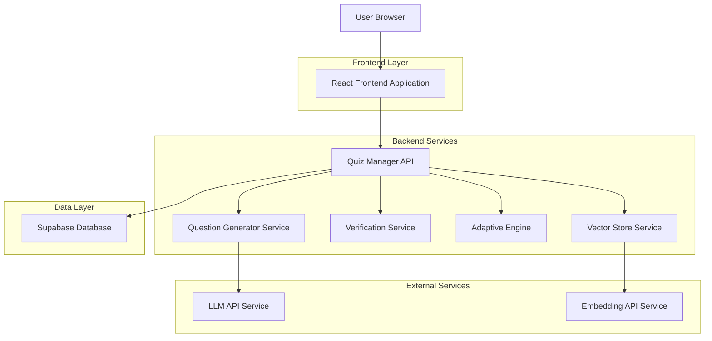
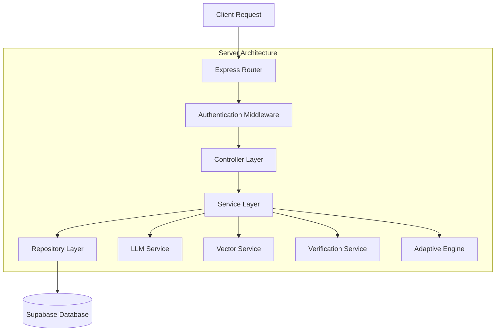
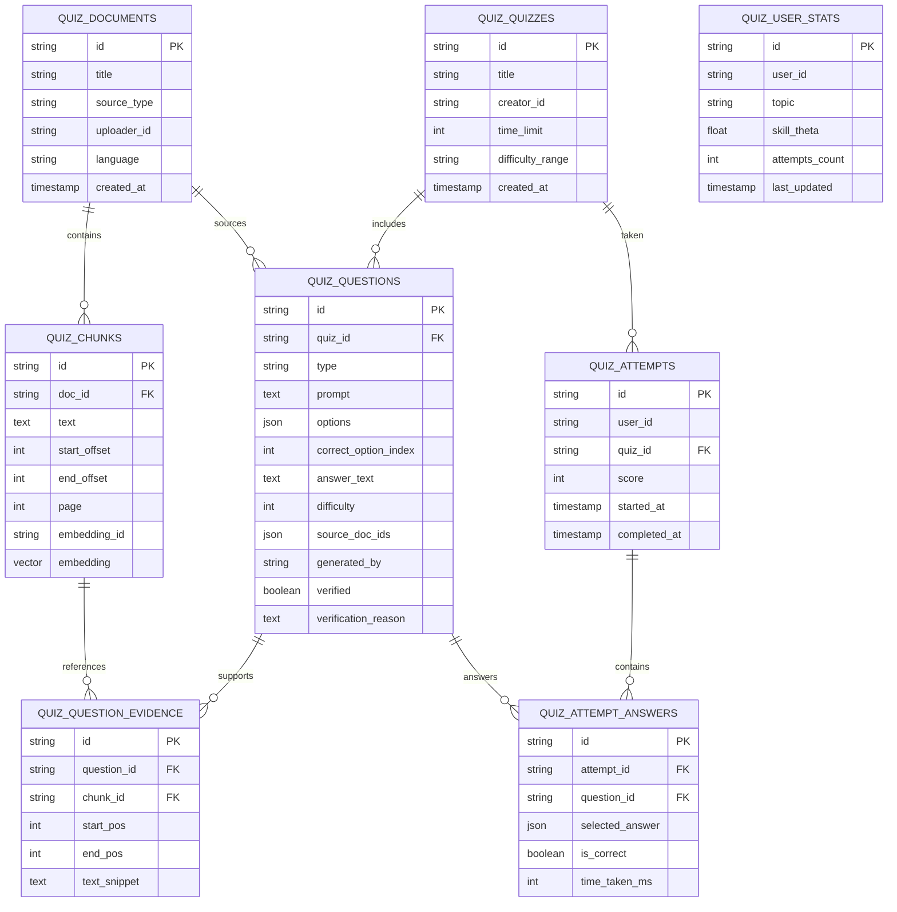

# Quiz Module - Technical Architecture Document

## 1. Architecture Design



## 2. Technology Description

* Frontend: React\@18 + TypeScript + TailwindCSS\@3 + Vite

* Backend: Node.js + Express\@4 + TypeScript

* Database: Supabase (PostgreSQL)

* Vector Store: Supabase Vector (pgvector extension)

* Authentication: Supabase Auth

* File Storage: Supabase Storage

* LLM Service: OpenAI GPT-4 API

* Embedding Service: OpenAI Embeddings API

## 3. Route Definitions

| Route             | Purpose                                                  |
| ----------------- | -------------------------------------------------------- |
| /quiz/create      | Quiz creation page with content upload and configuration |
| /quiz/:id         | Quiz taking interface with question display and timer    |
| /quiz/:id/results | Results and feedback page with detailed explanations     |
| /quiz/dashboard   | Quiz management dashboard with library and analytics     |
| /quiz/admin       | Admin review panel for verification queue and monitoring |
| /quiz/library     | Browse and filter available quizzes                      |

## 4. API Definitions

### 4.1 Core API

**Quiz Generation**

```
POST /api/quizzes/generate
```

Request:

| Param Name              | Param Type | isRequired | Description                                                  |
| ----------------------- | ---------- | ---------- | ------------------------------------------------------------ |
| user\_id                | string     | true       | User identifier                                              |
| doc\_ids                | string\[]  | true       | Array of document IDs to generate quiz from                  |
| prefs                   | object     | true       | Quiz preferences object                                      |
| prefs.num\_questions    | number     | true       | Number of questions to generate (1-50)                       |
| prefs.types             | string\[]  | true       | Question types: mcq, short\_answer, fill\_blank, tf, numeric |
| prefs.difficulty\_range | string     | true       | Difficulty range: 1-5                                        |

Response:

| Param Name | Param Type  | Description                  |
| ---------- | ----------- | ---------------------------- |
| quiz\_id   | string      | Generated quiz identifier    |
| questions  | Question\[] | Array of generated questions |
| status     | string      | Generation status            |

**Quiz Retrieval**

```
GET /api/quizzes/{id}
```

Response:

| Param Name  | Param Type  | Description                              |
| ----------- | ----------- | ---------------------------------------- |
| id          | string      | Quiz identifier                          |
| title       | string      | Quiz title                               |
| questions   | Question\[] | Questions without correct answers        |
| time\_limit | number      | Time limit in minutes (null for untimed) |
| created\_at | string      | ISO8601 timestamp                        |

**Quiz Submission**

```
POST /api/quizzes/{id}/submit
```

Request:

| Param Name    | Param Type | isRequired | Description               |
| ------------- | ---------- | ---------- | ------------------------- |
| user\_id      | string     | true       | User identifier           |
| answers       | Answer\[]  | true       | Array of user answers     |
| started\_at   | string     | true       | Quiz start timestamp      |
| completed\_at | string     | true       | Quiz completion timestamp |

Response:

| Param Name | Param Type        | Description                   |
| ---------- | ----------------- | ----------------------------- |
| score      | number            | Overall score percentage      |
| results    | QuestionResult\[] | Detailed results per question |
| feedback   | Feedback\[]       | Explanations and evidence     |

**Question Flagging**

```
POST /api/quizzes/{id}/flag
```

Request:

| Param Name   | Param Type | isRequired | Description         |
| ------------ | ---------- | ---------- | ------------------- |
| question\_id | string     | true       | Question identifier |
| user\_id     | string     | true       | User who flagged    |
| reason       | string     | true       | Reason for flagging |

## 5. Server Architecture Diagram



## 6. Data Model

### 6.1 Data Model Definition



### 6.2 Data Definition Language

**Quiz Documents Table**

```sql
CREATE TABLE quiz_documents (
    id UUID PRIMARY KEY DEFAULT gen_random_uuid(),
    title VARCHAR(255) NOT NULL,
    source_type VARCHAR(20) CHECK (source_type IN ('pdf', 'txt', 'video', 'audio', 'md')),
    uploader_id UUID NOT NULL,
    language VARCHAR(10) DEFAULT 'en',
    created_at TIMESTAMP WITH TIME ZONE DEFAULT NOW()
);

CREATE INDEX idx_quiz_documents_uploader ON quiz_documents(uploader_id);
CREATE INDEX idx_quiz_documents_created ON quiz_documents(created_at DESC);
```

**Quiz Chunks Table**

```sql
CREATE TABLE quiz_chunks (
    id UUID PRIMARY KEY DEFAULT gen_random_uuid(),
    doc_id UUID REFERENCES quiz_documents(id) ON DELETE CASCADE,
    text TEXT NOT NULL,
    start_offset INTEGER NOT NULL,
    end_offset INTEGER NOT NULL,
    page INTEGER,
    embedding_id VARCHAR(255),
    embedding vector(1536)
);

CREATE INDEX idx_quiz_chunks_doc_id ON quiz_chunks(doc_id);
CREATE INDEX idx_quiz_chunks_embedding ON quiz_chunks USING ivfflat (embedding vector_cosine_ops);
```

**Quiz Quizzes Table**

```sql
CREATE TABLE quiz_quizzes (
    id UUID PRIMARY KEY DEFAULT gen_random_uuid(),
    title VARCHAR(255) NOT NULL,
    creator_id UUID NOT NULL,
    time_limit INTEGER, -- minutes, null for untimed
    difficulty_range VARCHAR(10) DEFAULT '1-5',
    created_at TIMESTAMP WITH TIME ZONE DEFAULT NOW()
);

CREATE INDEX idx_quiz_quizzes_creator ON quiz_quizzes(creator_id);
```

**Quiz Questions Table**

```sql
CREATE TABLE quiz_questions (
    id UUID PRIMARY KEY DEFAULT gen_random_uuid(),
    quiz_id UUID REFERENCES quiz_quizzes(id) ON DELETE CASCADE,
    type VARCHAR(20) CHECK (type IN ('mcq', 'short_answer', 'fill_blank', 'tf', 'numeric')),
    prompt TEXT NOT NULL,
    options JSONB, -- array of options for MCQ
    correct_option_index INTEGER,
    answer_text TEXT,
    difficulty INTEGER CHECK (difficulty BETWEEN 1 AND 5),
    source_doc_ids JSONB, -- array of document IDs
    generated_by VARCHAR(50) DEFAULT 'llm_v1',
    verified BOOLEAN DEFAULT false,
    verification_reason TEXT
);

CREATE INDEX idx_quiz_questions_quiz_id ON quiz_questions(quiz_id);
CREATE INDEX idx_quiz_questions_verified ON quiz_questions(verified);
```

**Quiz Question Evidence Table**

```sql
CREATE TABLE quiz_question_evidence (
    id UUID PRIMARY KEY DEFAULT gen_random_uuid(),
    question_id UUID REFERENCES quiz_questions(id) ON DELETE CASCADE,
    chunk_id UUID REFERENCES quiz_chunks(id) ON DELETE CASCADE,
    start_pos INTEGER NOT NULL,
    end_pos INTEGER NOT NULL,
    text_snippet TEXT NOT NULL
);

CREATE INDEX idx_quiz_evidence_question ON quiz_question_evidence(question_id);
```

**Quiz Attempts Table**

```sql
CREATE TABLE quiz_attempts (
    id UUID PRIMARY KEY DEFAULT gen_random_uuid(),
    user_id UUID NOT NULL,
    quiz_id UUID REFERENCES quiz_quizzes(id) ON DELETE CASCADE,
    score INTEGER CHECK (score BETWEEN 0 AND 100),
    started_at TIMESTAMP WITH TIME ZONE NOT NULL,
    completed_at TIMESTAMP WITH TIME ZONE
);

CREATE INDEX idx_quiz_attempts_user ON quiz_attempts(user_id);
CREATE INDEX idx_quiz_attempts_quiz ON quiz_attempts(quiz_id);
```

**Quiz Attempt Answers Table**

```sql
CREATE TABLE quiz_attempt_answers (
    id UUID PRIMARY KEY DEFAULT gen_random_uuid(),
    attempt_id UUID REFERENCES quiz_attempts(id) ON DELETE CASCADE,
    question_id UUID REFERENCES quiz_questions(id) ON DELETE CASCADE,
    selected_answer JSONB, -- flexible for different answer types
    is_correct BOOLEAN NOT NULL,
    time_taken_ms INTEGER
);

CREATE INDEX idx_quiz_answers_attempt ON quiz_attempt_answers(attempt_id);
```

**Quiz User Stats Table**

```sql
CREATE TABLE quiz_user_stats (
    id UUID PRIMARY KEY DEFAULT gen_random_uuid(),
    user_id UUID NOT NULL,
    topic VARCHAR(255) NOT NULL,
    skill_theta FLOAT DEFAULT 0.0, -- adaptive difficulty score
    attempts_count INTEGER DEFAULT 0,
    last_updated TIMESTAMP WITH TIME ZONE DEFAULT NOW(),
    UNIQUE(user_id, topic)
);

CREATE INDEX idx_quiz_stats_user ON quiz_user_stats(user_id);
```

**Row Level Security Policies**

```sql
-- Enable RLS on all tables
ALTER TABLE quiz_documents ENABLE ROW LEVEL SECURITY;
ALTER TABLE quiz_chunks ENABLE ROW LEVEL SECURITY;
ALTER TABLE quiz_quizzes ENABLE ROW LEVEL SECURITY;
ALTER TABLE quiz_questions ENABLE ROW LEVEL SECURITY;
ALTER TABLE quiz_question_evidence ENABLE ROW LEVEL SECURITY;
ALTER TABLE quiz_attempts ENABLE ROW LEVEL SECURITY;
ALTER TABLE quiz_attempt_answers ENABLE ROW LEVEL SECURITY;
ALTER TABLE quiz_user_stats ENABLE ROW LEVEL SECURITY;

-- Grant permissions
GRANT SELECT ON quiz_documents TO anon;
GRANT ALL PRIVILEGES ON quiz_documents TO authenticated;
GRANT ALL PRIVILEGES ON quiz_chunks TO authenticated;
GRANT ALL PRIVILEGES ON quiz_quizzes TO authenticated;
GRANT ALL PRIVILEGES ON quiz_questions TO authenticated;
GRANT ALL PRIVILEGES ON quiz_question_evidence TO authenticated;
GRANT ALL PRIVILEGES ON quiz_attempts TO authenticated;
GRANT ALL PRIVILEGES ON quiz_attempt_answers TO authenticated;
GRANT ALL PRIVILEGES ON quiz_user_stats TO authenticated;
```

