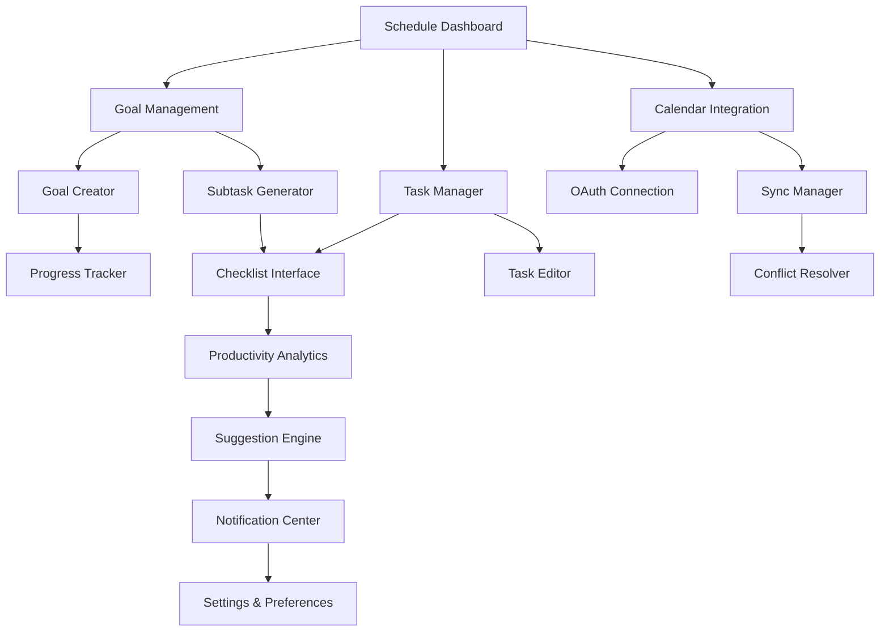

# Smart Schedule Planner - Product Requirements Document

## 1. Product Overview
The Smart Schedule Planner is an intelligent scheduling system that adapts to user goals, productivity patterns, and priorities to help students and educators stay on track, manage time effectively, and meet deadlines seamlessly. The module integrates with NeuroLearn's existing educational platform to provide comprehensive time management and goal tracking capabilities.

This feature addresses the critical need for personalized time management in educational environments, targeting students who struggle with deadline management and educators who need to balance multiple responsibilities while maintaining optimal productivity.

## 2. Core Features

### 2.1 User Roles

| Role | Registration Method | Core Permissions |
|------|---------------------|------------------|
| Student | Existing NeuroLearn registration | Create goals, manage tasks, view schedules, receive notifications |
| Educator | Existing NeuroLearn registration | All student permissions plus class scheduling, assignment deadline management |
| Administrator | System-level access | Manage system-wide scheduling policies, analytics access, user management |

### 2.2 Feature Module

Our Smart Schedule Planner consists of the following main pages:

1. **Schedule Dashboard**: Overview of goals, tasks, calendar integration, productivity insights
2. **Goal Management**: Goal creation, subtask generation, progress tracking, categorization
3. **Task Manager**: To-do list interface, checklist management, task filtering, status updates
4. **Calendar Integration**: External calendar sync, conflict resolution, scheduling suggestions
5. **Productivity Analytics**: Pattern analysis, performance insights, optimization recommendations
6. **Notification Center**: Reminder management, alert preferences, notification history
7. **Settings & Preferences**: Calendar connections, notification settings, productivity preferences

### 2.3 Page Details

| Page Name | Module Name | Feature Description |
|-----------|-------------|---------------------|
| Schedule Dashboard | Overview Panel | Display upcoming tasks, goal progress, productivity metrics, calendar events |
| Schedule Dashboard | Quick Actions | Provide one-click task creation, goal setup, calendar sync, notification management |
| Goal Management | Goal Creator | Input goal details (title, description, deadline, availability), auto-generate subtasks |
| Goal Management | Subtask Generator | AI-powered breakdown of goals into actionable checklist items with time estimates |
| Goal Management | Progress Tracker | Visual progress indicators, completion statistics, milestone celebrations |
| Task Manager | Checklist Interface | Display tasks with checkboxes, status indicators, priority levels, due dates |
| Task Manager | Task Editor | Create, edit, delete tasks manually with drag-and-drop reordering |
| Task Manager | Filter System | Filter by completion status, tags, priority, due date, goal association |
| Calendar Integration | OAuth Connection | Connect Google Calendar and Outlook with secure authentication |
| Calendar Integration | Sync Manager | Bidirectional sync of tasks and events, conflict detection, resolution suggestions |
| Calendar Integration | Conflict Resolver | Highlight scheduling conflicts, suggest alternative time slots, auto-reschedule |
| Productivity Analytics | Pattern Analysis | Track completion times, identify productive hours, analyze task difficulty patterns |
| Productivity Analytics | Suggestion Engine | Recommend optimal task scheduling based on historical performance data |
| Productivity Analytics | Performance Insights | Visual charts of productivity trends, goal achievement rates, time utilization |
| Notification Center | Reminder System | Send timely notifications for upcoming tasks, overdue items, goal deadlines |
| Notification Center | Alert Manager | Customizable notification preferences, snooze functionality, rate limiting |
| Notification Center | History Tracker | Log of all notifications sent, user interactions, effectiveness metrics |
| Settings & Preferences | Calendar Settings | Manage external calendar connections, sync preferences, default scheduling |
| Settings & Preferences | Notification Preferences | Configure reminder timing, delivery methods, frequency limits |
| Settings & Preferences | Productivity Settings | Set working hours, break preferences, task difficulty calibration |

## 3. Core Process

**Student Goal Management Flow:**
Students create goals with deadlines and availability constraints. The AI system automatically generates subtasks and schedules them across available time slots. Students interact with checklist-style task management, marking items complete as they progress. The system tracks completion patterns and suggests optimal scheduling for future tasks based on productivity analytics.

**Dynamic Rescheduling Flow:**
When tasks are missed or uncompleted, the system automatically identifies conflicts and suggests rescheduling options. Users can accept suggestions or manually adjust schedules. The system learns from these interactions to improve future scheduling recommendations.

**Calendar Integration Flow:**
Users connect external calendars through OAuth authentication. The system syncs tasks as calendar events and monitors for conflicts. When conflicts arise, the system suggests alternative scheduling and maintains synchronization across all connected platforms.

**Productivity Optimization Flow:**
The system continuously tracks when users complete tasks, analyzing patterns by time of day, task type, and difficulty. It generates suggestions for optimal task placement and provides insights into productivity trends through visual analytics.

## 4. User Interface Design

### 4.1 Design Style

- **Primary Colors**: Deep blue (#1E40AF) for headers and primary actions, light blue (#DBEAFE) for backgrounds
- **Secondary Colors**: Green (#10B981) for completed tasks, orange (#F59E0B) for pending items, red (#EF4444) for overdue tasks
- **Button Style**: Rounded corners (8px radius), subtle shadows, smooth hover animations with color transitions
- **Typography**: Inter font family, 16px base size for body text, 24px+ for headings, consistent with NeuroLearn design
- **Layout Style**: Card-based design with clean spacing, sidebar navigation, responsive grid layouts
- **Icons**: Outline style icons with calendar, task, and productivity themes, consistent stroke width

### 4.2 Page Design Overview

| Page Name | Module Name | UI Elements |
|-----------|-------------|-------------|
| Schedule Dashboard | Overview Panel | Grid layout with metric cards, progress rings, upcoming task list, calendar widget |
| Schedule Dashboard | Quick Actions | Floating action buttons, modal dialogs, drag-and-drop task creation |
| Goal Management | Goal Creator | Multi-step form with progress indicator, date pickers, availability selector |
| Goal Management | Subtask Generator | Expandable task tree, checkbox hierarchy, time estimation sliders |
| Task Manager | Checklist Interface | Clean task cards with checkboxes, priority indicators, due date badges |
| Task Manager | Filter System | Dropdown filters, search bar, tag chips, status toggles |
| Calendar Integration | OAuth Connection | Branded login buttons, connection status indicators, sync progress bars |
| Calendar Integration | Conflict Resolver | Split-screen calendar view, conflict highlighting, suggestion panels |
| Productivity Analytics | Pattern Analysis | Interactive charts, heatmaps, trend lines, performance metrics |
| Notification Center | Reminder System | Toast notifications, in-app alerts, notification badges, action buttons |

### 4.3 Responsiveness

The Smart Schedule Planner is designed mobile-first with responsive breakpoints at 768px (tablet) and 1024px (desktop). Touch interactions are optimized for mobile devices with appropriate button sizes and gesture support. The calendar view adapts from monthly to weekly to daily views based on screen size, maintaining full functionality across all devices.

## 5. Integration Requirements

### 5.1 NeuroLearn Platform Integration
- Seamless authentication using existing Supabase Auth system
- Integration with user profiles and preferences
- Connection to existing notification system
- Compatibility with current UI component library
- Data sharing with learning analytics and progress tracking

### 5.2 External Service Integration
- Google Calendar API for calendar synchronization
- Microsoft Graph API for Outlook integration
- Push notification services for mobile alerts
- AI services for task generation and productivity analysis

### 5.3 Data Privacy and Security
- Encrypted storage of calendar access tokens
- GDPR-compliant data handling for productivity analytics
- User consent management for external integrations
- Secure API endpoints with proper authentication
- Data retention policies for scheduling and productivity data