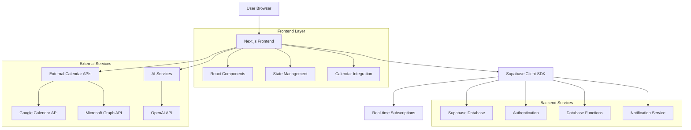
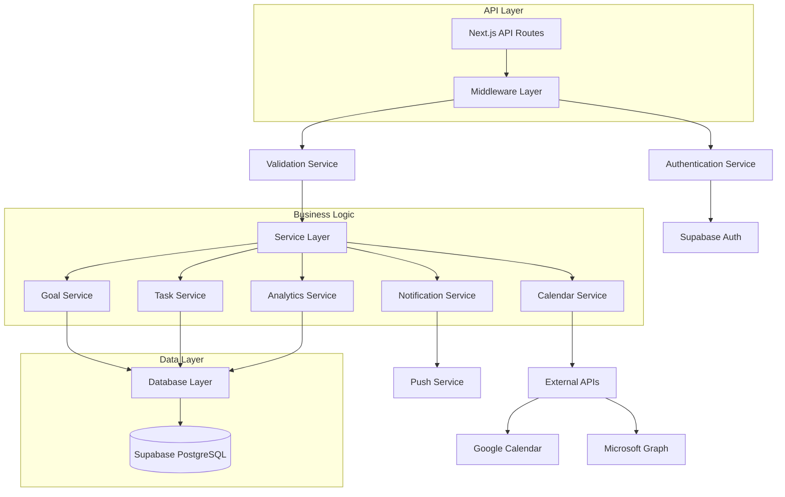
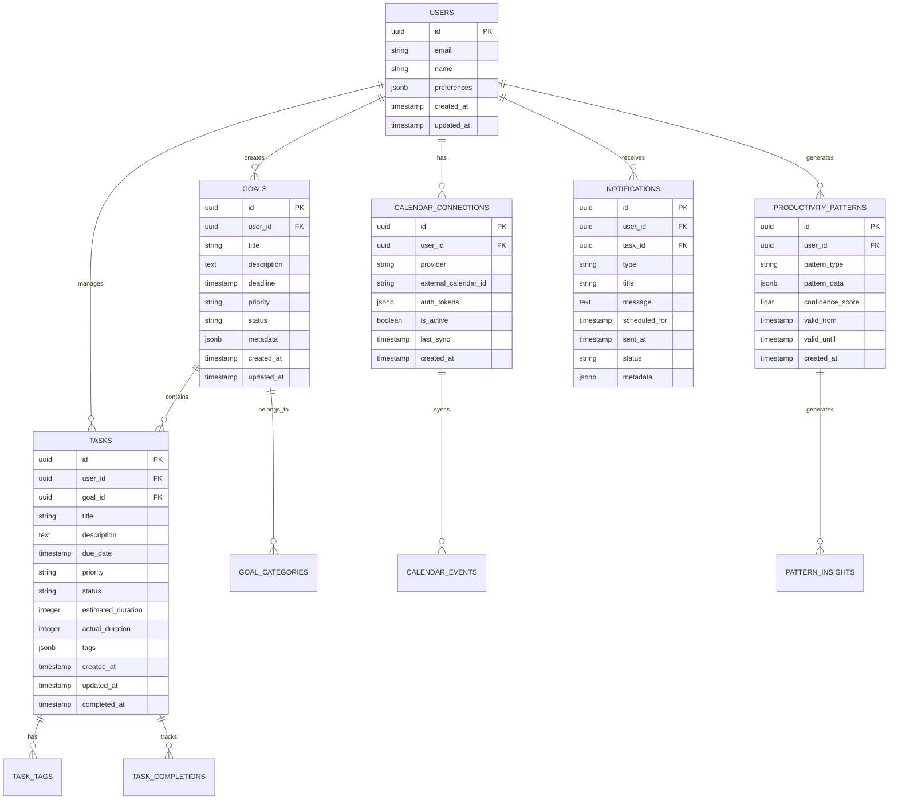

# Smart Schedule Planner - Technical Architecture Document

## 1. Architecture Design



## 2. Technology Description

* **Frontend**: Next.js 14 + React 18 + TypeScript + Tailwind CSS + Zustand (state management)

* **Backend**: Supabase (PostgreSQL + Auth + Real-time + Storage)

* **External APIs**: Google Calendar API + Microsoft Graph API + OpenAI API

* **UI Components**: Radix UI + Lucide Icons + React Hook Form + Date-fns

* **Calendar**: React Big Calendar + FullCalendar integration

* **Notifications**: React Hot Toast + Web Push API

## 3. Route Definitions

| Route                   | Purpose                                                 |
| ----------------------- | ------------------------------------------------------- |
| /schedule               | Main schedule dashboard with overview and quick actions |
| /schedule/goals         | Goal management interface with creation and tracking    |
| /schedule/tasks         | Task manager with checklist interface and filtering     |
| /schedule/calendar      | Calendar integration and sync management                |
| /schedule/analytics     | Productivity analytics and insights dashboard           |
| /schedule/notifications | Notification center and preferences                     |
| /schedule/settings      | Schedule planner settings and external connections      |

## 4. API Definitions

### 4.1 Goals API

**Create Goal**

```
POST /api/schedule/goals
```

Request:

| Param Name   | Param Type | isRequired | Description          |
| ------------ | ---------- | ---------- | -------------------- |
| title        | string     | true       | Goal title           |
| description  | string     | false      | Detailed description |
| deadline     | string     | true       | ISO date string      |
| priority     | string     | true       | high, medium, low    |
| category     | string     | false      | Goal category/tag    |
| availability | object     | true       | Available time slots |

Response:

| Param Name | Param Type | Description             |
| ---------- | ---------- | ----------------------- |
| id         | string     | Generated goal ID       |
| subtasks   | array      | Auto-generated subtasks |
| schedule   | object     | Suggested schedule      |

**Get Goals**

```
GET /api/schedule/goals
```

Query Parameters:

| Param Name | Param Type | Description                 |
| ---------- | ---------- | --------------------------- |
| status     | string     | active, completed, archived |
| category   | string     | Filter by category          |
| limit      | number     | Number of results           |

### 4.2 Tasks API

**Create Task**

```
POST /api/schedule/tasks
```

Request:

| Param Name          | Param Type | isRequired | Description        |
| ------------------- | ---------- | ---------- | ------------------ |
| title               | string     | true       | Task title         |
| description         | string     | false      | Task description   |
| goal\_id            | string     | false      | Associated goal ID |
| due\_date           | string     | false      | ISO date string    |
| priority            | string     | true       | high, medium, low  |
| estimated\_duration | number     | false      | Minutes            |
| tags                | array      | false      | Task tags          |

**Update Task Status**

```
PATCH /api/schedule/tasks/{id}/status
```

Request:

| Param Name    | Param Type | isRequired | Description                |
| ------------- | ---------- | ---------- | -------------------------- |
| status        | string     | true       | pending, completed, missed |
| completed\_at | string     | false      | ISO date string            |

### 4.3 Calendar Integration API

**Connect Calendar**

```
POST /api/schedule/calendar/connect
```

Request:

| Param Name | Param Type | isRequired | Description              |
| ---------- | ---------- | ---------- | ------------------------ |
| provider   | string     | true       | google, outlook          |
| auth\_code | string     | true       | OAuth authorization code |

**Sync Calendar**

```
POST /api/schedule/calendar/sync
```

Request:

| Param Name      | Param Type | isRequired | Description                   |
| --------------- | ---------- | ---------- | ----------------------------- |
| calendar\_id    | string     | true       | External calendar ID          |
| sync\_direction | string     | true       | import, export, bidirectional |

### 4.4 Productivity Analytics API

**Get Productivity Patterns**

```
GET /api/schedule/analytics/patterns
```

Query Parameters:

| Param Name | Param Type | Description                        |
| ---------- | ---------- | ---------------------------------- |
| period     | string     | week, month, quarter               |
| metric     | string     | completion\_rate, time\_efficiency |

Response:

| Param Name  | Param Type | Description                   |
| ----------- | ---------- | ----------------------------- |
| patterns    | array      | Productivity patterns by time |
| suggestions | array      | Optimization recommendations  |
| metrics     | object     | Performance statistics        |

### 4.5 Notifications API

**Create Reminder**

```
POST /api/schedule/notifications/reminders
```

Request:

| Param Name       | Param Type | isRequired | Description                        |
| ---------------- | ---------- | ---------- | ---------------------------------- |
| task\_id         | string     | true       | Associated task ID                 |
| reminder\_time   | string     | true       | ISO date string                    |
| type             | string     | true       | due\_soon, overdue, daily\_summary |
| delivery\_method | string     | true       | push, email, in\_app               |

## 5. Server Architecture Diagram



## 6. Data Model

### 6.1 Data Model Definition



### 6.2 Data Definition Language

**Goals Table**

```sql
-- Create goals table
CREATE TABLE goals (
    id UUID PRIMARY KEY DEFAULT gen_random_uuid(),
    user_id UUID NOT NULL REFERENCES auth.users(id) ON DELETE CASCADE,
    title VARCHAR(255) NOT NULL,
    description TEXT,
    deadline TIMESTAMP WITH TIME ZONE NOT NULL,
    priority VARCHAR(20) DEFAULT 'medium' CHECK (priority IN ('low', 'medium', 'high')),
    status VARCHAR(20) DEFAULT 'active' CHECK (status IN ('active', 'completed', 'paused', 'archived')),
    category VARCHAR(100),
    metadata JSONB DEFAULT '{}',
    created_at TIMESTAMP WITH TIME ZONE DEFAULT NOW(),
    updated_at TIMESTAMP WITH TIME ZONE DEFAULT NOW()
);

-- Create indexes
CREATE INDEX idx_goals_user_id ON goals(user_id);
CREATE INDEX idx_goals_status ON goals(status);
CREATE INDEX idx_goals_deadline ON goals(deadline);
CREATE INDEX idx_goals_category ON goals(category);

-- Row Level Security
ALTER TABLE goals ENABLE ROW LEVEL SECURITY;
CREATE POLICY "Users can manage their own goals" ON goals
    FOR ALL USING (auth.uid() = user_id);

-- Grant permissions
GRANT SELECT ON goals TO anon;
GRANT ALL PRIVILEGES ON goals TO authenticated;
```

**Tasks Table**

```sql
-- Create tasks table
CREATE TABLE tasks (
    id UUID PRIMARY KEY DEFAULT gen_random_uuid(),
    user_id UUID NOT NULL REFERENCES auth.users(id) ON DELETE CASCADE,
    goal_id UUID REFERENCES goals(id) ON DELETE SET NULL,
    title VARCHAR(255) NOT NULL,
    description TEXT,
    due_date TIMESTAMP WITH TIME ZONE,
    priority VARCHAR(20) DEFAULT 'medium' CHECK (priority IN ('low', 'medium', 'high')),
    status VARCHAR(20) DEFAULT 'pending' CHECK (status IN ('pending', 'in_progress', 'completed', 'missed', 'cancelled')),
    estimated_duration INTEGER, -- in minutes
    actual_duration INTEGER, -- in minutes
    tags JSONB DEFAULT '[]',
    metadata JSONB DEFAULT '{}',
    created_at TIMESTAMP WITH TIME ZONE DEFAULT NOW(),
    updated_at TIMESTAMP WITH TIME ZONE DEFAULT NOW(),
    completed_at TIMESTAMP WITH TIME ZONE
);

-- Create indexes
CREATE INDEX idx_tasks_user_id ON tasks(user_id);
CREATE INDEX idx_tasks_goal_id ON tasks(goal_id);
CREATE INDEX idx_tasks_status ON tasks(status);
CREATE INDEX idx_tasks_due_date ON tasks(due_date);
CREATE INDEX idx_tasks_priority ON tasks(priority);
CREATE INDEX idx_tasks_tags ON tasks USING GIN(tags);

-- Row Level Security
ALTER TABLE tasks ENABLE ROW LEVEL SECURITY;
CREATE POLICY "Users can manage their own tasks" ON tasks
    FOR ALL USING (auth.uid() = user_id);

-- Grant permissions
GRANT SELECT ON tasks TO anon;
GRANT ALL PRIVILEGES ON tasks TO authenticated;
```

**Calendar Connections Table**

```sql
-- Create calendar_connections table
CREATE TABLE calendar_connections (
    id UUID PRIMARY KEY DEFAULT gen_random_uuid(),
    user_id UUID NOT NULL REFERENCES auth.users(id) ON DELETE CASCADE,
    provider VARCHAR(50) NOT NULL CHECK (provider IN ('google', 'outlook')),
    external_calendar_id VARCHAR(255) NOT NULL,
    calendar_name VARCHAR(255),
    auth_tokens JSONB NOT NULL,
    sync_settings JSONB DEFAULT '{}',
    is_active BOOLEAN DEFAULT true,
    last_sync TIMESTAMP WITH TIME ZONE,
    sync_errors JSONB DEFAULT '[]',
    created_at TIMESTAMP WITH TIME ZONE DEFAULT NOW(),
    updated_at TIMESTAMP WITH TIME ZONE DEFAULT NOW(),
    UNIQUE(user_id, provider, external_calendar_id)
);

-- Create indexes
CREATE INDEX idx_calendar_connections_user_id ON calendar_connections(user_id);
CREATE INDEX idx_calendar_connections_provider ON calendar_connections(provider);
CREATE INDEX idx_calendar_connections_active ON calendar_connections(is_active);

-- Row Level Security
ALTER TABLE calendar_connections ENABLE ROW LEVEL SECURITY;
CREATE POLICY "Users can manage their own calendar connections" ON calendar_connections
    FOR ALL USING (auth.uid() = user_id);

-- Grant permissions
GRANT ALL PRIVILEGES ON calendar_connections TO authenticated;
```

**Productivity Patterns Table**

```sql
-- Create productivity_patterns table
CREATE TABLE productivity_patterns (
    id UUID PRIMARY KEY DEFAULT gen_random_uuid(),
    user_id UUID NOT NULL REFERENCES auth.users(id) ON DELETE CASCADE,
    pattern_type VARCHAR(50) NOT NULL CHECK (pattern_type IN ('time_preference', 'task_difficulty', 'completion_rate', 'focus_duration')),
    pattern_data JSONB NOT NULL,
    confidence_score FLOAT DEFAULT 0.0 CHECK (confidence_score >= 0.0 AND confidence_score <= 1.0),
    sample_size INTEGER DEFAULT 0,
    valid_from TIMESTAMP WITH TIME ZONE DEFAULT NOW(),
    valid_until TIMESTAMP WITH TIME ZONE,
    created_at TIMESTAMP WITH TIME ZONE DEFAULT NOW(),
    updated_at TIMESTAMP WITH TIME ZONE DEFAULT NOW()
);

-- Create indexes
CREATE INDEX idx_productivity_patterns_user_id ON productivity_patterns(user_id);
CREATE INDEX idx_productivity_patterns_type ON productivity_patterns(pattern_type);
CREATE INDEX idx_productivity_patterns_confidence ON productivity_patterns(confidence_score DESC);
CREATE INDEX idx_productivity_patterns_valid ON productivity_patterns(valid_from, valid_until);

-- Row Level Security
ALTER TABLE productivity_patterns ENABLE ROW LEVEL SECURITY;
CREATE POLICY "Users can view their own productivity patterns" ON productivity_patterns
    FOR ALL USING (auth.uid() = user_id);

-- Grant permissions
GRANT ALL PRIVILEGES ON productivity_patterns TO authenticated;
```

**Notifications Table**

```sql
-- Create notifications table
CREATE TABLE notifications (
    id UUID PRIMARY KEY DEFAULT gen_random_uuid(),
    user_id UUID NOT NULL REFERENCES auth.users(id) ON DELETE CASCADE,
    task_id UUID REFERENCES tasks(id) ON DELETE CASCADE,
    goal_id UUID REFERENCES goals(id) ON DELETE CASCADE,
    type VARCHAR(50) NOT NULL CHECK (type IN ('due_soon', 'overdue', 'daily_summary', 'goal_deadline', 'productivity_insight')),
    title VARCHAR(255) NOT NULL,
    message TEXT NOT NULL,
    scheduled_for TIMESTAMP WITH TIME ZONE NOT NULL,
    sent_at TIMESTAMP WITH TIME ZONE,
    status VARCHAR(20) DEFAULT 'pending' CHECK (status IN ('pending', 'sent', 'failed', 'cancelled')),
    delivery_method VARCHAR(20) DEFAULT 'in_app' CHECK (delivery_method IN ('in_app', 'push', 'email')),
    metadata JSONB DEFAULT '{}',
    created_at TIMESTAMP WITH TIME ZONE DEFAULT NOW()
);

-- Create indexes
CREATE INDEX idx_notifications_user_id ON notifications(user_id);
CREATE INDEX idx_notifications_task_id ON notifications(task_id);
CREATE INDEX idx_notifications_scheduled ON notifications(scheduled_for);
CREATE INDEX idx_notifications_status ON notifications(status);
CREATE INDEX idx_notifications_type ON notifications(type);

-- Row Level Security
ALTER TABLE notifications ENABLE ROW LEVEL SECURITY;
CREATE POLICY "Users can view their own notifications" ON notifications
    FOR ALL USING (auth.uid() = user_id);

-- Grant permissions
GRANT ALL PRIVILEGES ON notifications TO authenticated;
```

**Database Functions**

```sql
-- Function to auto-generate subtasks from goals
CREATE OR REPLACE FUNCTION generate_subtasks(goal_id UUID, goal_title TEXT, goal_description TEXT)
RETURNS SETOF tasks AS $$
BEGIN
    -- This would integrate with AI service to generate subtasks
    -- For now, return a simple breakdown
    RETURN QUERY
    INSERT INTO tasks (user_id, goal_id, title, priority, estimated_duration)
    SELECT 
        g.user_id,
        g.id,
        'Research and planning for: ' || g.title,
        'high',
        60
    FROM goals g WHERE g.id = goal_id
    RETURNING *;
END;
$$ LANGUAGE plpgsql SECURITY DEFINER;

-- Function to update productivity patterns
CREATE OR REPLACE FUNCTION update_productivity_patterns()
RETURNS TRIGGER AS $$
BEGIN
    -- Update patterns when tasks are completed
    IF NEW.status = 'completed' AND OLD.status != 'completed' THEN
        -- Insert or update time preference pattern
        INSERT INTO productivity_patterns (user_id, pattern_type, pattern_data)
        VALUES (
            NEW.user_id,
            'time_preference',
            jsonb_build_object(
                'hour', EXTRACT(HOUR FROM NEW.completed_at),
                'day_of_week', EXTRACT(DOW FROM NEW.completed_at),
                'task_priority', NEW.priority,
                'completion_time', NEW.actual_duration
            )
        );
    END IF;
    RETURN NEW;
END;
$$ LANGUAGE plpgsql;

-- Create trigger for productivity pattern updates
CREATE TRIGGER update_productivity_patterns_trigger
    AFTER UPDATE ON tasks
    FOR EACH ROW
    EXECUTE FUNCTION update_productivity_patterns();
```

