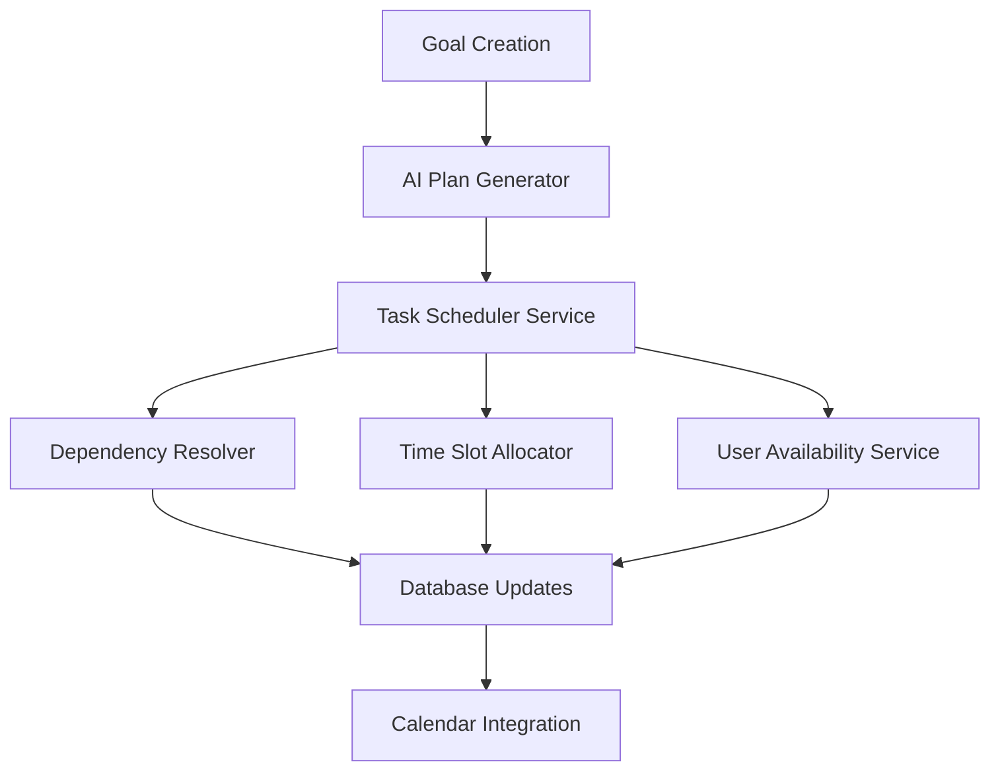

# Smart Task Scheduling Enhancement - Technical Specification

## 1. Overview

This document outlines the technical requirements for enhancing the AI Plan Generator to automatically assign due dates and time slots to generated tasks. The current system creates tasks without proper scheduling, resulting in tasks with `null` due dates that don't appear in the calendar view.

### Current Issues
- Tasks generated from goals have `due_date: null`
- No intelligent distribution of tasks across the goal timeline
- Missing time slot assignments for specific scheduling
- No consideration of task dependencies in scheduling
- Lack of user availability integration

## 2. System Architecture Enhancement

### 2.1 Core Components



### 2.2 New Services

#### TaskSchedulerService
- **Purpose**: Intelligent scheduling of tasks based on goal deadlines
- **Location**: `src/lib/services/taskScheduler.ts`
- **Dependencies**: AI Plan Generator, User Preferences, Calendar Service

#### DependencyResolver
- **Purpose**: Resolve task dependencies and create scheduling constraints
- **Location**: `src/lib/services/dependencyResolver.ts`
- **Dependencies**: Task data, dependency graph algorithms

#### TimeSlotAllocator
- **Purpose**: Assign specific time slots to tasks
- **Location**: `src/lib/services/timeSlotAllocator.ts`
- **Dependencies**: User availability, calendar conflicts, task duration

## 3. Database Schema Updates

### 3.1 Enhanced Tasks Table

```sql
-- Add new columns to tasks table
ALTER TABLE tasks ADD COLUMN IF NOT EXISTS due_date TIMESTAMP WITH TIME ZONE;
ALTER TABLE tasks ADD COLUMN IF NOT EXISTS scheduled_start_time TIMESTAMP WITH TIME ZONE;
ALTER TABLE tasks ADD COLUMN IF NOT EXISTS scheduled_end_time TIMESTAMP WITH TIME ZONE;
ALTER TABLE tasks ADD COLUMN IF NOT EXISTS time_slot_type VARCHAR(20) DEFAULT 'flexible' 
    CHECK (time_slot_type IN ('flexible', 'fixed', 'deadline_driven'));
ALTER TABLE tasks ADD COLUMN IF NOT EXISTS scheduling_priority INTEGER DEFAULT 50;
ALTER TABLE tasks ADD COLUMN IF NOT EXISTS buffer_time INTEGER DEFAULT 0; -- minutes
ALTER TABLE tasks ADD COLUMN IF NOT EXISTS auto_scheduled BOOLEAN DEFAULT false;

-- Create indexes for scheduling queries
CREATE INDEX IF NOT EXISTS idx_tasks_due_date ON tasks(due_date);
CREATE INDEX IF NOT EXISTS idx_tasks_scheduled_start ON tasks(scheduled_start_time);
CREATE INDEX IF NOT EXISTS idx_tasks_scheduling_priority ON tasks(scheduling_priority);
CREATE INDEX IF NOT EXISTS idx_tasks_auto_scheduled ON tasks(auto_scheduled);
```

### 3.2 User Availability Table

```sql
-- Create user availability patterns table
CREATE TABLE IF NOT EXISTS user_availability (
    id UUID PRIMARY KEY DEFAULT gen_random_uuid(),
    user_id UUID NOT NULL REFERENCES auth.users(id) ON DELETE CASCADE,
    day_of_week INTEGER NOT NULL CHECK (day_of_week BETWEEN 0 AND 6), -- 0=Sunday
    start_time TIME NOT NULL,
    end_time TIME NOT NULL,
    availability_type VARCHAR(20) DEFAULT 'work' 
        CHECK (availability_type IN ('work', 'personal', 'study', 'flexible')),
    timezone VARCHAR(50) DEFAULT 'UTC',
    is_active BOOLEAN DEFAULT true,
    created_at TIMESTAMP WITH TIME ZONE DEFAULT NOW(),
    updated_at TIMESTAMP WITH TIME ZONE DEFAULT NOW()
);

-- Create indexes
CREATE INDEX IF NOT EXISTS idx_user_availability_user_id ON user_availability(user_id);
CREATE INDEX IF NOT EXISTS idx_user_availability_day ON user_availability(day_of_week);
CREATE INDEX IF NOT EXISTS idx_user_availability_active ON user_availability(is_active);

-- Enable RLS
ALTER TABLE user_availability ENABLE ROW LEVEL SECURITY;
CREATE POLICY "Users can manage their own availability" ON user_availability
    FOR ALL USING (auth.uid() = user_id);

-- Grant permissions
GRANT SELECT ON user_availability TO anon;
GRANT ALL PRIVILEGES ON user_availability TO authenticated;
```

### 3.3 Task Scheduling Conflicts Table

```sql
-- Create table to track scheduling conflicts and resolutions
CREATE TABLE IF NOT EXISTS task_scheduling_conflicts (
    id UUID PRIMARY KEY DEFAULT gen_random_uuid(),
    user_id UUID NOT NULL REFERENCES auth.users(id) ON DELETE CASCADE,
    task_id UUID NOT NULL REFERENCES tasks(id) ON DELETE CASCADE,
    conflict_type VARCHAR(30) NOT NULL 
        CHECK (conflict_type IN ('dependency_violation', 'time_overlap', 'availability_conflict', 'deadline_impossible')),
    conflict_description TEXT,
    suggested_resolution JSONB,
    resolved BOOLEAN DEFAULT false,
    resolved_at TIMESTAMP WITH TIME ZONE,
    created_at TIMESTAMP WITH TIME ZONE DEFAULT NOW()
);

-- Create indexes
CREATE INDEX IF NOT EXISTS idx_scheduling_conflicts_user_id ON task_scheduling_conflicts(user_id);
CREATE INDEX IF NOT EXISTS idx_scheduling_conflicts_task_id ON task_scheduling_conflicts(task_id);
CREATE INDEX IF NOT EXISTS idx_scheduling_conflicts_resolved ON task_scheduling_conflicts(resolved);

-- Enable RLS
ALTER TABLE task_scheduling_conflicts ENABLE ROW LEVEL SECURITY;
CREATE POLICY "Users can view their own scheduling conflicts" ON task_scheduling_conflicts
    FOR ALL USING (auth.uid() = user_id);

-- Grant permissions
GRANT SELECT ON task_scheduling_conflicts TO anon;
GRANT ALL PRIVILEGES ON task_scheduling_conflicts TO authenticated;
```

## 4. API Enhancements

### 4.1 Enhanced Goal Creation API

**Endpoint**: `POST /api/schedule/goals`

**Enhanced Request Body**:
```typescript
interface EnhancedGoalRequest {
  title: string;
  description?: string;
  deadline: string;
  priority?: TaskPriority;
  category?: TaskCategory;
  availability?: UserAvailability;
  scheduling_preferences?: SchedulingPreferences;
}

interface SchedulingPreferences {
  preferred_work_hours?: {
    start: string; // "09:00"
    end: string;   // "17:00"
  };
  break_duration?: number; // minutes between tasks
  max_daily_task_hours?: number;
  avoid_weekends?: boolean;
  buffer_before_deadline?: number; // days
}
```

**Enhanced Response**:
```typescript
interface EnhancedGoalResponse {
  goal: Goal;
  subtasks: ScheduledTask[];
  milestones: Milestone[];
  scheduling_summary: SchedulingSummary;
  conflicts?: SchedulingConflict[];
}

interface ScheduledTask extends Task {
  due_date: string;
  scheduled_start_time?: string;
  scheduled_end_time?: string;
  scheduling_rationale?: string;
}

interface SchedulingSummary {
  total_tasks: number;
  scheduled_tasks: number;
  unscheduled_tasks: number;
  earliest_start: string;
  latest_completion: string;
  total_estimated_hours: number;
  conflicts_detected: number;
}
```

### 4.2 New Task Scheduling API

**Endpoint**: `POST /api/schedule/tasks/reschedule`

```typescript
interface RescheduleRequest {
  task_ids: string[];
  scheduling_preferences?: SchedulingPreferences;
  force_reschedule?: boolean;
}

interface RescheduleResponse {
  rescheduled_tasks: ScheduledTask[];
  conflicts: SchedulingConflict[];
  summary: {
    successful: number;
    failed: number;
    conflicts_resolved: number;
  };
}
```

### 4.3 User Availability API

**Endpoint**: `GET/POST/PUT /api/schedule/availability`

```typescript
interface AvailabilitySlot {
  day_of_week: number; // 0-6
  start_time: string;  // "HH:MM"
  end_time: string;    // "HH:MM"
  availability_type: 'work' | 'personal' | 'study' | 'flexible';
}

interface UserAvailability {
  timezone: string;
  weekly_schedule: AvailabilitySlot[];
  exceptions?: {
    date: string; // "YYYY-MM-DD"
    available: boolean;
    custom_hours?: {
      start_time: string;
      end_time: string;
    };
  }[];
}
```

## 5. Scheduling Algorithm

### 5.1 Core Scheduling Logic

```typescript
interface SchedulingAlgorithm {
  // Main scheduling function
  scheduleTasksForGoal(
    goal: Goal,
    tasks: Task[],
    userAvailability: UserAvailability,
    preferences: SchedulingPreferences
  ): Promise<SchedulingResult>;
  
  // Dependency resolution
  resolveDependencies(tasks: Task[]): DependencyGraph;
  
  // Time slot allocation
  allocateTimeSlots(
    tasks: Task[],
    availableSlots: TimeSlot[],
    constraints: SchedulingConstraints
  ): TimeSlotAllocation[];
  
  // Conflict detection and resolution
  detectConflicts(scheduledTasks: ScheduledTask[]): SchedulingConflict[];
  resolveConflicts(conflicts: SchedulingConflict[]): ConflictResolution[];
}
```

### 5.2 Scheduling Priority Algorithm

```typescript
interface TaskSchedulingPriority {
  calculatePriority(task: Task, context: SchedulingContext): number;
}

// Priority calculation factors:
// 1. Task priority (high=100, medium=50, low=25)
// 2. Dependency urgency (blocking other tasks = +30)
// 3. Deadline proximity (closer = higher priority)
// 4. Estimated duration (longer tasks scheduled earlier)
// 5. User preference alignment
```

### 5.3 Time Distribution Strategy

```typescript
enum DistributionStrategy {
  EVEN_DISTRIBUTION = 'even',      // Spread tasks evenly
  FRONT_LOADED = 'front_loaded',   // Schedule earlier
  DEADLINE_DRIVEN = 'deadline',    // Work backwards from deadline
  DEPENDENCY_FIRST = 'dependency'  // Prioritize dependency chains
}

interface TimeDistribution {
  strategy: DistributionStrategy;
  buffer_percentage: number; // % of time to reserve as buffer
  max_daily_load: number;    // Max hours per day
  break_duration: number;    // Minutes between tasks
}
```

## 6. Enhanced AI Plan Generator

### 6.1 Scheduling-Aware Task Generation

```typescript
interface SchedulingAwareTaskGeneration {
  generateTasksWithScheduling(
    goalDetails: GoalDetails,
    schedulingContext: SchedulingContext
  ): Promise<ScheduledTaskPlan>;
}

interface SchedulingContext {
  goal_deadline: Date;
  user_availability: UserAvailability;
  existing_commitments: ExistingCommitment[];
  scheduling_preferences: SchedulingPreferences;
  timezone: string;
}

interface ScheduledTaskPlan {
  tasks: GeneratedTask[];
  milestones: GeneratedMilestone[];
  scheduling_metadata: {
    distribution_strategy: DistributionStrategy;
    total_working_days: number;
    average_daily_load: number;
    buffer_days: number;
    critical_path_duration: number;
  };
}
```

### 6.2 Enhanced Task Generation Prompt

The AI prompt will be enhanced to include scheduling considerations:

```typescript
const schedulingPrompt = `
Consider the following scheduling constraints when generating tasks:

**Timeline**: Goal deadline is ${deadline}, giving us ${workingDays} working days
**User Availability**: ${availabilityDescription}
**Existing Commitments**: ${existingCommitments}

For each task, consider:
1. **Realistic Duration**: Account for learning curves and complexity
2. **Dependencies**: Which tasks must be completed before others
3. **Scheduling Priority**: Critical path items vs. parallel work
4. **Buffer Time**: Include time for unexpected issues
5. **User Capacity**: Don't overload any single day

Generate tasks with suggested due dates distributed intelligently across the available timeline.
`;
```

## 7. Database Functions

### 7.1 Enhanced Task Insertion Function

```sql
-- Enhanced function to insert tasks with scheduling
CREATE OR REPLACE FUNCTION insert_scheduled_subtasks(
    p_goal_id UUID,
    p_subtasks JSON,
    p_scheduling_preferences JSON DEFAULT '{}'::JSON
)
RETURNS SETOF tasks AS $$
DECLARE
    subtask JSON;
    goal_record goals%ROWTYPE;
    calculated_due_date TIMESTAMP WITH TIME ZONE;
    task_order INTEGER := 1;
    total_tasks INTEGER;
    days_available INTEGER;
    current_task tasks%ROWTYPE;
BEGIN
    -- Get goal details
    SELECT * INTO goal_record FROM goals WHERE id = p_goal_id;
    
    IF NOT FOUND THEN
        RAISE EXCEPTION 'Goal not found';
    END IF;
    
    -- Calculate scheduling parameters
    total_tasks := json_array_length(p_subtasks);
    days_available := EXTRACT(DAY FROM (goal_record.deadline - NOW()));
    
    -- Insert each subtask with calculated due date
    FOR subtask IN SELECT * FROM json_array_elements(p_subtasks)
    LOOP
        -- Calculate due date based on task order and dependencies
        calculated_due_date := calculate_task_due_date(
            goal_record.deadline,
            (subtask->>'order_index')::INTEGER,
            total_tasks,
            (subtask->>'estimated_duration')::INTEGER,
            (subtask->'dependencies')::JSONB
        );
        
        RETURN QUERY
        INSERT INTO tasks (
            user_id,
            goal_id,
            title,
            description,
            priority,
            estimated_duration,
            due_date,
            order_index,
            dependencies,
            status,
            auto_scheduled,
            scheduling_priority
        )
        VALUES (
            goal_record.user_id,
            p_goal_id,
            (subtask->>'title')::VARCHAR(255),
            (subtask->>'description')::TEXT,
            (subtask->>'priority')::VARCHAR(20),
            (subtask->>'estimated_duration')::INTEGER,
            calculated_due_date,
            (subtask->>'order_index')::INTEGER,
            COALESCE((subtask->'dependencies')::JSONB, '[]'::JSONB),
            'pending',
            true,
            calculate_scheduling_priority(subtask, goal_record)
        )
        RETURNING *;
        
        task_order := task_order + 1;
    END LOOP;
END;
$$ LANGUAGE plpgsql SECURITY DEFINER;
```

### 7.2 Due Date Calculation Function

```sql
-- Function to calculate intelligent due dates
CREATE OR REPLACE FUNCTION calculate_task_due_date(
    goal_deadline TIMESTAMP WITH TIME ZONE,
    task_order INTEGER,
    total_tasks INTEGER,
    estimated_duration INTEGER,
    dependencies JSONB
)
RETURNS TIMESTAMP WITH TIME ZONE AS $$
DECLARE
    days_available INTEGER;
    task_position_ratio DECIMAL;
    buffer_days INTEGER := 2;
    calculated_date TIMESTAMP WITH TIME ZONE;
BEGIN
    -- Calculate available working days (excluding weekends)
    days_available := calculate_working_days(NOW(), goal_deadline);
    
    -- Calculate position ratio (0.0 to 1.0)
    task_position_ratio := task_order::DECIMAL / total_tasks::DECIMAL;
    
    -- Apply buffer for dependencies
    IF json_array_length(dependencies) > 0 THEN
        buffer_days := buffer_days + json_array_length(dependencies);
    END IF;
    
    -- Calculate due date with buffer
    calculated_date := goal_deadline - INTERVAL '1 day' * buffer_days;
    calculated_date := calculated_date - INTERVAL '1 day' * 
        ((1.0 - task_position_ratio) * (days_available - buffer_days));
    
    -- Ensure it's not in the past
    IF calculated_date < NOW() THEN
        calculated_date := NOW() + INTERVAL '1 day';
    END IF;
    
    RETURN calculated_date;
END;
$$ LANGUAGE plpgsql;
```

### 7.3 Working Days Calculation Function

```sql
-- Function to calculate working days between dates
CREATE OR REPLACE FUNCTION calculate_working_days(
    start_date TIMESTAMP WITH TIME ZONE,
    end_date TIMESTAMP WITH TIME ZONE
)
RETURNS INTEGER AS $$
DECLARE
    total_days INTEGER;
    working_days INTEGER;
    current_date DATE;
BEGIN
    total_days := EXTRACT(DAY FROM (end_date - start_date));
    working_days := 0;
    current_date := start_date::DATE;
    
    -- Count working days (Monday=1 to Friday=5)
    FOR i IN 0..total_days LOOP
        IF EXTRACT(DOW FROM current_date + i) BETWEEN 1 AND 5 THEN
            working_days := working_days + 1;
        END IF;
    END LOOP;
    
    RETURN working_days;
END;
$$ LANGUAGE plpgsql;
```

## 8. Implementation Plan

### Phase 1: Database Schema Updates (Week 1)
1. Create migration files for new tables and columns
2. Implement database functions for scheduling calculations
3. Update existing data to include default availability patterns

### Phase 2: Core Scheduling Services (Week 2-3)
1. Implement TaskSchedulerService
2. Create DependencyResolver
3. Build TimeSlotAllocator
4. Add conflict detection and resolution

### Phase 3: API Enhancements (Week 4)
1. Update goal creation API with scheduling
2. Implement task rescheduling endpoints
3. Create user availability management APIs
4. Add scheduling conflict reporting

### Phase 4: AI Plan Generator Enhancement (Week 5)
1. Update AI prompts to include scheduling context
2. Enhance task generation with due date calculation
3. Implement scheduling-aware milestone creation
4. Add intelligent task distribution algorithms

### Phase 5: Frontend Integration (Week 6)
1. Update calendar component to show scheduled tasks
2. Add user availability configuration UI
3. Implement conflict resolution interface
4. Create scheduling summary dashboard

### Phase 6: Testing and Optimization (Week 7)
1. Comprehensive testing of scheduling algorithms
2. Performance optimization for large task sets
3. User acceptance testing
4. Bug fixes and refinements

## 9. Success Metrics

### 9.1 Technical Metrics
- **Task Scheduling Coverage**: >95% of generated tasks have due dates
- **Scheduling Accuracy**: <5% of tasks require manual rescheduling
- **Conflict Resolution**: >90% of conflicts automatically resolved
- **Performance**: Task scheduling completes in <2 seconds for typical goals

### 9.2 User Experience Metrics
- **Calendar Utilization**: Increase in calendar page usage by 200%
- **Task Completion Rate**: 15% improvement in on-time task completion
- **User Satisfaction**: >4.5/5 rating for scheduling accuracy
- **Adoption Rate**: >80% of users enable automatic scheduling

## 10. Risk Mitigation

### 10.1 Technical Risks
- **Algorithm Complexity**: Start with simple distribution, iterate to sophistication
- **Performance Issues**: Implement caching and optimize database queries
- **Data Migration**: Careful testing of schema updates with existing data

### 10.2 User Experience Risks
- **Over-scheduling**: Provide user controls to adjust scheduling density
- **Inflexibility**: Allow manual override of all automatic scheduling decisions
- **Complexity**: Provide sensible defaults and progressive disclosure of advanced features

This technical specification provides a comprehensive roadmap for implementing intelligent task scheduling in the NeuroLearn system, addressing the current gap where tasks are created without proper due dates and time assignments.