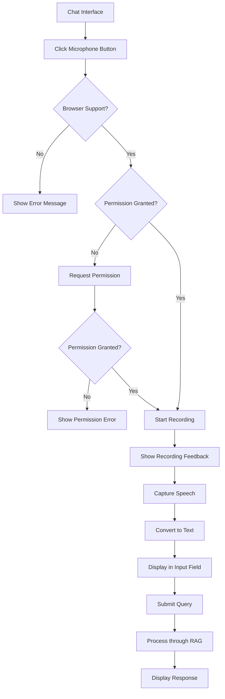

# Voice Query Feature - Product Requirements Document

## 1. Product Overview
Implement a voice input capability for the NeuroLearn RAG chatbot that allows users to speak their queries instead of typing, enhancing accessibility and user experience through natural voice interaction.

This feature addresses the need for hands-free interaction and improved accessibility, targeting students and educators who prefer voice communication or have typing limitations. The voice query system will increase user engagement and make the learning platform more inclusive.

## 2. Core Features

### 2.1 User Roles
No additional user roles required - this feature extends existing functionality for all authenticated users.

### 2.2 Feature Module
Our voice query feature consists of the following main components:
1. **Voice Input Interface**: microphone button, recording indicator, audio visualization
2. **Speech Processing**: speech-to-text conversion, audio capture management
3. **Error Handling**: browser compatibility checks, permission management, fallback options
4. **Integration Layer**: seamless connection with existing chat system

### 2.3 Page Details

| Page Name | Module Name | Feature description |
|-----------|-------------|---------------------|
| Chat Interface | Voice Input Button | Display microphone icon button next to text input. Toggle recording state on click. Show visual feedback during recording |
| Chat Interface | Recording Indicator | Display pulsing animation and "Recording..." text when active. Show audio waveform visualization during speech capture |
| Chat Interface | Speech Processing | Convert speech to text using Web Speech API. Handle continuous recognition and interim results. Process final transcript |
| Chat Interface | Error Handling | Detect browser compatibility. Request microphone permissions. Display error messages for unsupported features or denied permissions |
| Chat Interface | Query Integration | Insert transcribed text into existing input field. Trigger query submission automatically or allow user review before sending |

## 3. Core Process

**Voice Query User Flow:**
1. User clicks microphone button in chat interface
2. System requests microphone permission (if not granted)
3. Recording starts with visual feedback (pulsing button, waveform)
4. User speaks their query
5. System converts speech to text in real-time
6. User can review transcribed text or submit automatically
7. Query processes through existing RAG system
8. Response displays normally in chat interface

**Error Handling Flow:**
1. System checks browser compatibility on page load
2. If unsupported, hide voice button and show tooltip
3. On permission denial, show error message with instructions
4. On recognition errors, allow retry or fallback to typing

## 4. User Interface Design

### 4.1 Design Style
- **Primary Colors**: Blue (#3B82F6) for active states, Gray (#6B7280) for inactive
- **Button Style**: Circular microphone icon with subtle shadow and hover effects
- **Animation**: Smooth pulsing animation during recording, gentle fade transitions
- **Typography**: Same font family as existing chat interface (Inter/system fonts)
- **Visual Feedback**: Animated waveform bars, color-coded status indicators
- **Icons**: Microphone, stop, error, and loading icons with consistent styling

### 4.2 Page Design Overview

| Page Name | Module Name | UI Elements |
|-----------|-------------|-------------|
| Chat Interface | Voice Button | Circular button (40px) with microphone icon. Position: right of text input. Colors: gray (inactive), blue (active), red (recording). Hover effects and smooth transitions |
| Chat Interface | Recording Indicator | Pulsing red dot next to button. "Recording..." text below input. Animated waveform bars showing audio levels. Semi-transparent overlay on chat area |
| Chat Interface | Text Display | Real-time transcript appears in input field with different styling (italic, lighter color) for interim results. Final text appears in normal styling |
| Chat Interface | Error States | Toast notifications for errors. Tooltip on disabled button explaining browser requirements. Permission dialog with clear instructions |
| Chat Interface | Loading States | Spinning icon during processing. Fade-in animation for transcribed text. Smooth button state transitions |

### 4.3 Responsiveness
Designed mobile-first with touch-friendly button sizing (minimum 44px touch target). Voice button scales appropriately on different screen sizes. Recording indicator adapts to available space. Error messages use responsive toast positioning.

## 5. Technical Requirements

### 5.1 Browser Compatibility
- **Supported**: Chrome 25+, Firefox 44+, Safari 14.1+, Edge 79+
- **Fallback**: Hide voice button for unsupported browsers
- **Detection**: Feature detection using `window.SpeechRecognition` or `window.webkitSpeechRecognition`

### 5.2 Performance Requirements
- **Response Time**: Speech recognition starts within 200ms of button click
- **Accuracy**: Target 90%+ accuracy for clear speech in quiet environments
- **Resource Usage**: Minimal impact on existing chat performance
- **Battery**: Optimize for mobile battery consumption during recording

### 5.3 Accessibility
- **Keyboard Navigation**: Voice button accessible via Tab key
- **Screen Readers**: Proper ARIA labels and live regions for status updates
- **Visual Indicators**: Clear visual feedback for all states
- **Alternative Access**: Keyboard shortcut (Ctrl/Cmd + M) to activate voice input

### 5.4 Security & Privacy
- **Permissions**: Request microphone access only when needed
- **Data Handling**: No audio data stored locally or transmitted to servers
- **Privacy Notice**: Clear indication when microphone is active
- **User Control**: Easy way to stop recording and revoke permissions