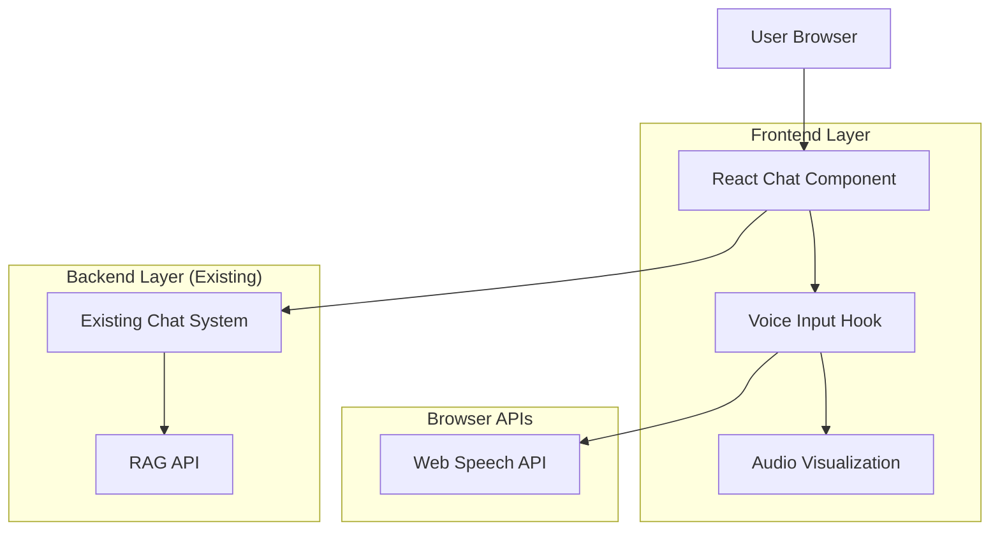

# Voice Query Feature - Technical Architecture Document

## 1. Architecture Design



## 2. Technology Description

- **Frontend**: React@18 + TypeScript + tailwindcss@3 + Web Speech API
- **Audio Processing**: Native Web Speech API (SpeechRecognition)
- **State Management**: React hooks (useState, useEffect, useCallback)
- **Animation**: CSS animations + Framer Motion (optional)
- **Backend**: No changes required - integrates with existing chat API

## 3. Route Definitions

No new routes required. Voice functionality integrates with existing chat interface:

| Route | Purpose | Voice Integration |
|-------|---------|-------------------|
| /notebooks/[id] | Notebook chat interface | Add voice input component to existing chat |
| /chat | General chat interface | Add voice input component (if applicable) |

## 4. Component Architecture

### 4.1 Core Components

**VoiceInput Component**
```typescript
interface VoiceInputProps {
  onTranscript: (text: string) => void;
  onError: (error: string) => void;
  disabled?: boolean;
  className?: string;
}

interface VoiceInputState {
  isRecording: boolean;
  isSupported: boolean;
  hasPermission: boolean;
  transcript: string;
  interimTranscript: string;
  error: string | null;
}
```

**useVoiceRecognition Hook**
```typescript
interface UseVoiceRecognitionReturn {
  isRecording: boolean;
  isSupported: boolean;
  transcript: string;
  interimTranscript: string;
  error: string | null;
  startRecording: () => void;
  stopRecording: () => void;
  resetTranscript: () => void;
}

function useVoiceRecognition({
  continuous = true,
  interimResults = true,
  language = 'en-US'
}): UseVoiceRecognitionReturn
```

### 4.2 Integration Points

**Chat Component Integration**
```typescript
// Existing chat component modification
const ChatInterface = () => {
  const [message, setMessage] = useState('');
  const { transcript, isRecording, startRecording, stopRecording } = useVoiceRecognition({
    onTranscript: (text) => setMessage(prev => prev + text),
    onError: (error) => showErrorToast(error)
  });

  return (
    <div className="chat-interface">
      <div className="input-container">
        <input 
          value={message} 
          onChange={(e) => setMessage(e.target.value)}
          placeholder="Type your message or use voice input..."
        />
        <VoiceInputButton 
          isRecording={isRecording}
          onStart={startRecording}
          onStop={stopRecording}
        />
      </div>
    </div>
  );
};
```

## 5. Implementation Details

### 5.1 Web Speech API Integration

**Browser Compatibility Detection**
```typescript
const checkSpeechRecognitionSupport = (): boolean => {
  return 'SpeechRecognition' in window || 'webkitSpeechRecognition' in window;
};

const getSpeechRecognition = (): SpeechRecognition | null => {
  if ('SpeechRecognition' in window) {
    return new SpeechRecognition();
  } else if ('webkitSpeechRecognition' in window) {
    return new (window as any).webkitSpeechRecognition();
  }
  return null;
};
```

**Recognition Configuration**
```typescript
const setupSpeechRecognition = (recognition: SpeechRecognition) => {
  recognition.continuous = true;
  recognition.interimResults = true;
  recognition.lang = 'en-US';
  recognition.maxAlternatives = 1;
  
  // Event handlers
  recognition.onstart = () => setIsRecording(true);
  recognition.onend = () => setIsRecording(false);
  recognition.onerror = (event) => handleError(event.error);
  recognition.onresult = (event) => handleResults(event.results);
};
```

### 5.2 Error Handling Strategy

**Error Types and Responses**
```typescript
const handleSpeechError = (error: string) => {
  switch (error) {
    case 'not-allowed':
      return 'Microphone access denied. Please enable microphone permissions.';
    case 'no-speech':
      return 'No speech detected. Please try again.';
    case 'audio-capture':
      return 'Microphone not available. Please check your audio settings.';
    case 'network':
      return 'Network error. Please check your internet connection.';
    case 'not-supported':
      return 'Speech recognition not supported in this browser.';
    default:
      return 'Speech recognition error. Please try again.';
  }
};
```

**Permission Management**
```typescript
const requestMicrophonePermission = async (): Promise<boolean> => {
  try {
    const stream = await navigator.mediaDevices.getUserMedia({ audio: true });
    stream.getTracks().forEach(track => track.stop());
    return true;
  } catch (error) {
    console.error('Microphone permission denied:', error);
    return false;
  }
};
```

### 5.3 Audio Visualization

**Real-time Audio Level Detection**
```typescript
const useAudioVisualization = () => {
  const [audioLevel, setAudioLevel] = useState(0);
  const analyserRef = useRef<AnalyserNode | null>(null);
  
  const startVisualization = async () => {
    const stream = await navigator.mediaDevices.getUserMedia({ audio: true });
    const audioContext = new AudioContext();
    const analyser = audioContext.createAnalyser();
    const microphone = audioContext.createMediaStreamSource(stream);
    
    microphone.connect(analyser);
    analyser.fftSize = 256;
    
    const dataArray = new Uint8Array(analyser.frequencyBinCount);
    
    const updateLevel = () => {
      analyser.getByteFrequencyData(dataArray);
      const average = dataArray.reduce((a, b) => a + b) / dataArray.length;
      setAudioLevel(average / 255);
      requestAnimationFrame(updateLevel);
    };
    
    updateLevel();
  };
  
  return { audioLevel, startVisualization };
};
```

## 6. State Management

### 6.1 Voice Input State

```typescript
interface VoiceState {
  isRecording: boolean;
  isSupported: boolean;
  hasPermission: boolean | null;
  transcript: string;
  interimTranscript: string;
  confidence: number;
  error: VoiceError | null;
  audioLevel: number;
}

type VoiceAction = 
  | { type: 'START_RECORDING' }
  | { type: 'STOP_RECORDING' }
  | { type: 'SET_TRANSCRIPT'; payload: { transcript: string; interim: string; confidence: number } }
  | { type: 'SET_ERROR'; payload: VoiceError }
  | { type: 'CLEAR_ERROR' }
  | { type: 'SET_AUDIO_LEVEL'; payload: number }
  | { type: 'RESET' };
```

### 6.2 Integration with Existing Chat State

```typescript
// Extend existing chat reducer
const chatReducer = (state: ChatState, action: ChatAction | VoiceAction) => {
  switch (action.type) {
    case 'VOICE_TRANSCRIPT_RECEIVED':
      return {
        ...state,
        currentMessage: state.currentMessage + action.payload.transcript,
        isVoiceInput: true
      };
    case 'VOICE_INPUT_COMPLETE':
      return {
        ...state,
        isVoiceInput: false
      };
    // ... existing cases
  }
};
```

## 7. Performance Optimization

### 7.1 Debouncing and Throttling

```typescript
const useDebounceTranscript = (transcript: string, delay: number = 300) => {
  const [debouncedTranscript, setDebouncedTranscript] = useState(transcript);
  
  useEffect(() => {
    const handler = setTimeout(() => {
      setDebouncedTranscript(transcript);
    }, delay);
    
    return () => clearTimeout(handler);
  }, [transcript, delay]);
  
  return debouncedTranscript;
};
```

### 7.2 Memory Management

```typescript
const useVoiceRecognition = () => {
  const recognitionRef = useRef<SpeechRecognition | null>(null);
  
  useEffect(() => {
    return () => {
      // Cleanup on unmount
      if (recognitionRef.current) {
        recognitionRef.current.stop();
        recognitionRef.current = null;
      }
    };
  }, []);
};
```

## 8. Testing Strategy

### 8.1 Unit Tests

```typescript
// Test voice recognition hook
describe('useVoiceRecognition', () => {
  it('should detect browser support', () => {
    const { result } = renderHook(() => useVoiceRecognition());
    expect(result.current.isSupported).toBeDefined();
  });
  
  it('should handle permission requests', async () => {
    // Mock getUserMedia
    Object.defineProperty(navigator, 'mediaDevices', {
      value: {
        getUserMedia: jest.fn().mockResolvedValue(mockStream)
      }
    });
    
    const { result } = renderHook(() => useVoiceRecognition());
    await act(async () => {
      result.current.startRecording();
    });
    
    expect(result.current.isRecording).toBe(true);
  });
});
```

### 8.2 Integration Tests

```typescript
// Test chat integration
describe('Voice Chat Integration', () => {
  it('should add transcript to message input', async () => {
    render(<ChatInterface />);
    
    const voiceButton = screen.getByRole('button', { name: /voice input/i });
    fireEvent.click(voiceButton);
    
    // Simulate speech recognition result
    const mockTranscript = 'Hello, this is a test message';
    fireEvent(window, new CustomEvent('speechresult', {
      detail: { transcript: mockTranscript }
    }));
    
    const messageInput = screen.getByRole('textbox');
    expect(messageInput).toHaveValue(mockTranscript);
  });
});
```

## 9. Security Considerations

### 9.1 Privacy Protection

- **No Audio Storage**: Audio data never leaves the browser
- **Permission Management**: Clear permission requests and revocation
- **User Awareness**: Visual indicators when microphone is active
- **Secure Context**: HTTPS required for microphone access

### 9.2 Content Security Policy

```typescript
// Add to CSP headers
const cspDirectives = {
  'media-src': "'self'",
  'microphone': "'self'"
};
```

## 10. Deployment Considerations

### 10.1 Feature Flags

```typescript
const VOICE_FEATURE_ENABLED = process.env.NEXT_PUBLIC_VOICE_FEATURE_ENABLED === 'true';

const ChatInterface = () => {
  return (
    <div>
      {/* existing chat UI */}
      {VOICE_FEATURE_ENABLED && <VoiceInputButton />}
    </div>
  );
};
```

### 10.2 Progressive Enhancement

```typescript
const VoiceInputButton = () => {
  const [isSupported, setIsSupported] = useState(false);
  
  useEffect(() => {
    setIsSupported(checkSpeechRecognitionSupport());
  }, []);
  
  if (!isSupported) {
    return null; // Graceful degradation
  }
  
  return <VoiceButton />;
};
```