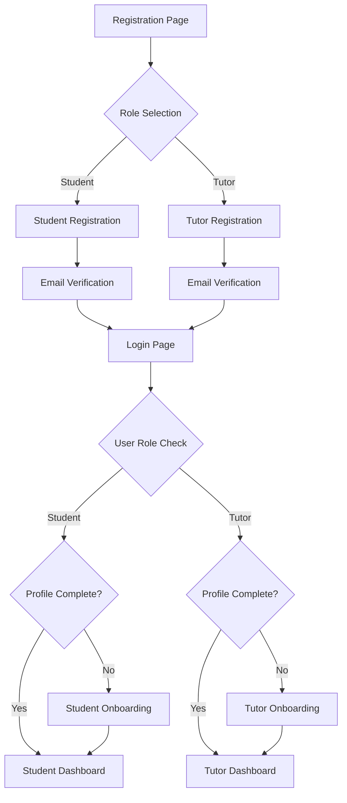

# NeuroLearn Dual-Role Authentication System - Product Requirements Document

## 1. Product Overview

NeuroLearn will be enhanced to support two distinct user roles: Students and Tutors, enabling a comprehensive educational platform that serves both learners and educators. This enhancement transforms NeuroLearn from a student-only platform into a dual-sided marketplace connecting students with qualified tutors.

The system will maintain backward compatibility with existing student-focused features while introducing tutor-specific functionality and role-based access control. This creates value for both user segments: students gain access to personalized tutoring, while tutors can monetize their expertise through the platform.

## 2. Core Features

### 2.1 User Roles

| Role | Registration Method | Core Permissions |
|------|---------------------|------------------|
| Student | Email registration with role selection | Access to learning dashboard, course materials, quiz system, study tools, tutor booking |
| Tutor | Email registration with role selection + onboarding | Access to tutor dashboard, subject management, student interaction tools, earnings tracking |

### 2.2 Feature Module

Our dual-role authentication system consists of the following main pages:

1. **Enhanced Registration Page**: Role selection field, user information collection, email verification
2. **Role-Based Login Redirection**: Automatic routing based on user role and profile completion status
3. **Tutor Onboarding Page**: Subject selection, specialization setup, qualification verification
4. **Student Dashboard**: Existing learning interface with enhanced tutor discovery features
5. **Tutor Dashboard**: New interface for managing tutoring activities and profile
6. **Profile Management**: Role-specific profile editing and settings

### 2.3 Page Details

| Page Name | Module Name | Feature description |
|-----------|-------------|---------------------|
| Registration Page | Role Selection | Add radio buttons or dropdown for Student/Tutor role selection. Store role in user metadata during signup |
| Registration Page | Enhanced Form | Collect additional role-specific information during registration process |
| Login Page | Role-Based Redirect | Implement conditional routing: Students to dashboard, Tutors to onboarding (if incomplete) or tutor dashboard |
| Tutor Onboarding | Subject Selection | Multi-select interface for academic subjects (Math, Science, Languages, etc.) |
| Tutor Onboarding | Specialization Setup | Text input and tags for specific areas of expertise within chosen subjects |
| Tutor Onboarding | Profile Completion | Bio, experience level, teaching preferences, availability setup |
| Tutor Dashboard | Profile Overview | Display tutor profile summary, subjects taught, student ratings |
| Tutor Dashboard | Subject Management | Add/edit/remove subjects and specializations |
| Student Dashboard | Tutor Discovery | Browse and search available tutors by subject and specialization |
| Profile Management | Role-Specific Settings | Different profile fields and options based on user role |

## 3. Core Process

**Student Registration Flow:**
1. User visits registration page and selects "Student" role
2. Completes standard registration form with student-specific fields
3. Receives email verification
4. Upon login, redirected to student dashboard
5. Can immediately access all learning features

**Tutor Registration Flow:**
1. User visits registration page and selects "Tutor" role
2. Completes registration form with basic information
3. Receives email verification
4. Upon first login, redirected to tutor onboarding page
5. Completes subject selection and specialization setup
6. Sets up teaching profile and preferences
7. Redirected to tutor dashboard upon completion

**Login Redirection Logic:**
- Students with complete profiles → Student Dashboard
- Students with incomplete profiles → Student Onboarding (existing)
- Tutors with complete profiles → Tutor Dashboard
- Tutors with incomplete profiles → Tutor Onboarding

## 4. User Interface Design

### 4.1 Design Style

- **Primary Colors**: Maintain existing NeuroLearn brand colors (primary blue/purple gradient)
- **Secondary Colors**: Introduce role-specific accent colors (green for students, orange for tutors)
- **Button Style**: Consistent with existing rounded button design, add role-specific color variants
- **Font**: Continue using existing font hierarchy with clear role indicators
- **Layout Style**: Card-based design with top navigation, add role-specific navigation items
- **Icons**: Use education-themed icons (📚 for students, 👨‍🏫 for tutors) and Lucide React icons

### 4.2 Page Design Overview

| Page Name | Module Name | UI Elements |
|-----------|-------------|-------------|
| Registration Page | Role Selection | Radio button group with clear visual distinction, icons for each role, descriptive text |
| Tutor Onboarding | Subject Selection | Multi-select cards with subject icons, search functionality, category grouping |
| Tutor Onboarding | Specialization Input | Tag-based input system, autocomplete suggestions, visual feedback |
| Tutor Dashboard | Main Interface | Clean card layout, role-specific color scheme (orange accents), navigation sidebar |
| Student Dashboard | Enhanced Features | Existing design with added tutor discovery section, role indicator in header |

### 4.3 Responsiveness

The application maintains mobile-first responsive design with touch-optimized interactions for role selection and onboarding flows. All new components follow existing responsive patterns and breakpoints.
