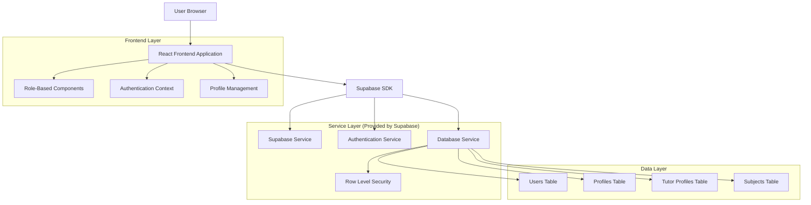
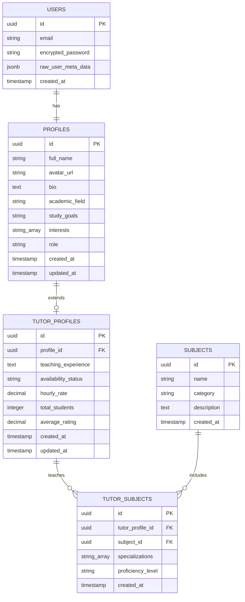

# NeuroLearn Dual-Role Authentication System - Technical Architecture Document

## 1. Architecture Design



## 2. Technology Description

- Frontend: React@18 + TypeScript + tailwindcss@3 + vite
- Backend: Supabase (Authentication, Database, RLS)
- Database: PostgreSQL (via Supabase)
- State Management: React Context API
- UI Components: Custom components with Lucide React icons

## 3. Route Definitions

| Route | Purpose |
|-------|---------|
| /auth/register | Enhanced registration page with role selection |
| /auth/login | Login page with role-based redirection logic |
| /onboarding | Student onboarding (existing) |
| /tutor/onboarding | New tutor-specific onboarding flow |
| /dashboard | Student dashboard (existing, enhanced) |
| /tutor/dashboard | New tutor dashboard |
| /profile | Role-specific profile management |
| /tutor/subjects | Tutor subject and specialization management |

## 4. API Definitions

### 4.1 Core API

**User Registration with Role**
```
POST /api/auth/register
```

Request:
| Param Name | Param Type | isRequired | Description |
|------------|------------|------------|-------------|
| email | string | true | User email address |
| password | string | true | User password |
| full_name | string | true | User's full name |
| role | string | true | User role: 'student' or 'tutor' |

Response:
| Param Name | Param Type | Description |
|------------|------------|-------------|
| success | boolean | Registration success status |
| user | object | User object with role metadata |

**Profile Creation/Update**
```
POST /api/profile
PUT /api/profile
```

Request:
| Param Name | Param Type | isRequired | Description |
|------------|------------|------------|-------------|
| full_name | string | true | User's full name |
| bio | string | false | User biography |
| academic_field | string | true | Academic field of interest |
| role | string | true | User role |
| subjects | string[] | false | Tutor subjects (tutors only) |
| specializations | string[] | false | Tutor specializations (tutors only) |

**Tutor Profile Management**
```
GET /api/tutor/profile
POST /api/tutor/subjects
PUT /api/tutor/subjects
```

## 5. Data Model

### 5.1 Data Model Definition



### 5.2 Data Definition Language

**Enhanced Profiles Table**
```sql
-- Update existing profiles table to include role
ALTER TABLE profiles 
ADD COLUMN role VARCHAR(20) DEFAULT 'student' CHECK (role IN ('student', 'tutor'));

-- Create index for role-based queries
CREATE INDEX idx_profiles_role ON profiles(role);
```

**Tutor Profiles Table**
```sql
-- Create tutor-specific profile extension
CREATE TABLE tutor_profiles (
    id UUID PRIMARY KEY DEFAULT gen_random_uuid(),
    profile_id UUID REFERENCES profiles(id) ON DELETE CASCADE,
    teaching_experience TEXT,
    availability_status VARCHAR(20) DEFAULT 'available' CHECK (availability_status IN ('available', 'busy', 'offline')),
    hourly_rate DECIMAL(10,2),
    total_students INTEGER DEFAULT 0,
    average_rating DECIMAL(3,2) DEFAULT 0.00,
    created_at TIMESTAMP WITH TIME ZONE DEFAULT NOW(),
    updated_at TIMESTAMP WITH TIME ZONE DEFAULT NOW()
);

-- Create indexes
CREATE INDEX idx_tutor_profiles_profile_id ON tutor_profiles(profile_id);
CREATE INDEX idx_tutor_profiles_availability ON tutor_profiles(availability_status);
CREATE INDEX idx_tutor_profiles_rating ON tutor_profiles(average_rating DESC);
```

**Subjects Table**
```sql
-- Create subjects table for tutor specializations
CREATE TABLE subjects (
    id UUID PRIMARY KEY DEFAULT gen_random_uuid(),
    name VARCHAR(100) NOT NULL UNIQUE,
    category VARCHAR(50) NOT NULL,
    description TEXT,
    created_at TIMESTAMP WITH TIME ZONE DEFAULT NOW()
);

-- Insert initial subjects
INSERT INTO subjects (name, category, description) VALUES
('Mathematics', 'STEM', 'Algebra, Calculus, Geometry, Statistics'),
('Physics', 'STEM', 'Classical Mechanics, Thermodynamics, Electromagnetism'),
('Chemistry', 'STEM', 'Organic, Inorganic, Physical Chemistry'),
('Biology', 'STEM', 'Cell Biology, Genetics, Ecology, Anatomy'),
('English Literature', 'Languages', 'Poetry, Prose, Drama, Literary Analysis'),
('Spanish', 'Languages', 'Grammar, Conversation, Literature'),
('French', 'Languages', 'Grammar, Conversation, Literature'),
('History', 'Social Sciences', 'World History, Regional Studies'),
('Psychology', 'Social Sciences', 'Cognitive, Behavioral, Developmental'),
('Computer Science', 'STEM', 'Programming, Algorithms, Data Structures');
```

**Tutor Subjects Junction Table**
```sql
-- Create junction table for tutor-subject relationships
CREATE TABLE tutor_subjects (
    id UUID PRIMARY KEY DEFAULT gen_random_uuid(),
    tutor_profile_id UUID REFERENCES tutor_profiles(id) ON DELETE CASCADE,
    subject_id UUID REFERENCES subjects(id) ON DELETE CASCADE,
    specializations TEXT[], -- specific areas within the subject
    proficiency_level VARCHAR(20) DEFAULT 'intermediate' CHECK (proficiency_level IN ('beginner', 'intermediate', 'advanced', 'expert')),
    created_at TIMESTAMP WITH TIME ZONE DEFAULT NOW(),
    UNIQUE(tutor_profile_id, subject_id)
);

-- Create indexes
CREATE INDEX idx_tutor_subjects_tutor_id ON tutor_subjects(tutor_profile_id);
CREATE INDEX idx_tutor_subjects_subject_id ON tutor_subjects(subject_id);
CREATE INDEX idx_tutor_subjects_proficiency ON tutor_subjects(proficiency_level);
```

**Row Level Security Policies**
```sql
-- Enable RLS on new tables
ALTER TABLE tutor_profiles ENABLE ROW LEVEL SECURITY;
ALTER TABLE subjects ENABLE ROW LEVEL SECURITY;
ALTER TABLE tutor_subjects ENABLE ROW LEVEL SECURITY;

-- Tutor profiles policies
CREATE POLICY "Users can view tutor profiles" ON tutor_profiles FOR SELECT TO authenticated USING (true);
CREATE POLICY "Tutors can manage their own profile" ON tutor_profiles 
    FOR ALL TO authenticated USING (
        EXISTS (
            SELECT 1 FROM profiles p 
            WHERE p.id = tutor_profiles.profile_id 
            AND p.id = auth.uid() 
            AND p.role = 'tutor'
        )
    );

-- Subjects policies (public read access)
CREATE POLICY "Anyone can view subjects" ON subjects FOR SELECT TO anon, authenticated USING (true);

-- Tutor subjects policies
CREATE POLICY "Anyone can view tutor subjects" ON tutor_subjects FOR SELECT TO authenticated USING (true);
CREATE POLICY "Tutors can manage their own subjects" ON tutor_subjects 
    FOR ALL TO authenticated USING (
        EXISTS (
            SELECT 1 FROM tutor_profiles tp
            JOIN profiles p ON tp.profile_id = p.id
            WHERE tp.id = tutor_subjects.tutor_profile_id
            AND p.id = auth.uid()
            AND p.role = 'tutor'
        )
    );

-- Grant permissions
GRANT SELECT ON subjects TO anon, authenticated;
GRANT ALL PRIVILEGES ON tutor_profiles TO authenticated;
GRANT ALL PRIVILEGES ON tutor_subjects TO authenticated;
```

**Update existing profiles RLS policy**
```sql
-- Update profiles policy to handle role-based access
DROP POLICY IF EXISTS "Users can view their own profile" ON profiles;
CREATE POLICY "Users can view their own profile" ON profiles 
    FOR SELECT TO authenticated USING (auth.uid() = id);

CREATE POLICY "Users can view tutor profiles" ON profiles 
    FOR SELECT TO authenticated USING (role = 'tutor');
```