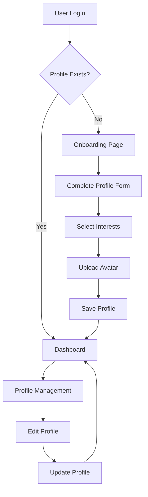

# NeuroLearn User Profiles System - Product Requirements Document

## 1. Product Overview

The User Profiles System extends NeuroLearn's existing authentication to provide personalized user experiences through comprehensive profile management and onboarding flows.

- This system addresses the need for personalized learning experiences by collecting user preferences, academic backgrounds, and learning goals during onboarding.
- Target users include students, educators, and lifelong learners who want customized educational content and tracking of their learning journey.

## 2. Core Features

### 2.1 User Roles

| Role | Registration Method | Core Permissions |
|------|---------------------|------------------|
| New User | Email/password or social login via existing auth | Can access onboarding flow, must complete profile setup |
| Registered User | Profile completed through onboarding | Full access to all NeuroLearn features with personalized content |
| Admin User | Existing admin privileges | Can view and manage all user profiles, access analytics |

### 2.2 Feature Module

Our user profiles system consists of the following main pages:
1. **Onboarding Page**: Profile setup form, interest selection, academic field configuration, study goals definition.
2. **Profile Management Page**: View and edit profile information, avatar upload, preferences management.
3. **Profile Dashboard**: Personal learning analytics, progress tracking, achievement display.

### 2.3 Page Details

| Page Name | Module Name | Feature description |
|-----------|-------------|---------------------|
| Onboarding Page | Profile Setup Form | Collect full name, bio, academic field, study goals with validation and error handling |
| Onboarding Page | Interest Selection | Multi-select interface for choosing learning interests with search and categorization |
| Onboarding Page | Avatar Upload | Image upload with preview, cropping, and default avatar options |
| Profile Management | Profile Editor | Edit all profile fields with real-time validation and save confirmation |
| Profile Management | Privacy Settings | Control profile visibility, data sharing preferences, and account settings |
| Profile Management | Account Security | Change password, enable 2FA, view login history through existing auth system |
| Profile Dashboard | Learning Analytics | Display study time, progress metrics, completed courses, and achievement badges |
| Profile Dashboard | Personalized Recommendations | Show suggested content based on interests and academic field |

## 3. Core Process

**New User Flow:**
1. User signs up through existing registration system → Supabase creates auth.users entry
2. User logs in for first time → System checks for profiles table entry
3. If no profile exists → Redirect to onboarding page
4. User completes onboarding form → Profile data saved to profiles table
5. User redirected to personalized dashboard

**Existing User Flow:**
1. User logs in → System verifies profile exists
2. User accesses profile management → Can edit profile information
3. User views dashboard → Personalized content based on profile data

## 4. User Interface Design

### 4.1 Design Style

- **Primary Colors**: Existing NeuroLearn brand colors (primary, secondary from current theme)
- **Button Style**: Consistent with existing UI components (rounded corners, gradient backgrounds)
- **Font**: Inter or system fonts matching current design system
- **Layout Style**: Card-based design with clean spacing, consistent with existing pages
- **Icons**: Lucide React icons (already used in codebase) for consistency
- **Form Elements**: Match existing Input, Button, and Card components

### 4.2 Page Design Overview

| Page Name | Module Name | UI Elements |
|-----------|-------------|-------------|
| Onboarding Page | Profile Setup Form | Multi-step wizard with progress indicator, form validation, smooth transitions |
| Onboarding Page | Interest Selection | Tag-based selection with search bar, category filters, visual feedback for selections |
| Onboarding Page | Avatar Upload | Drag-and-drop upload area, image preview, crop functionality, default avatar grid |
| Profile Management | Profile Editor | Tabbed interface, inline editing, save/cancel buttons, success notifications |
| Profile Dashboard | Analytics Display | Charts and graphs using existing chart components, progress bars, achievement cards |

### 4.3 Responsiveness

The system is designed mobile-first with responsive breakpoints matching the existing NeuroLearn design system. Touch interactions are optimized for mobile devices, with appropriate button sizes and gesture support for image uploads and form navigation.