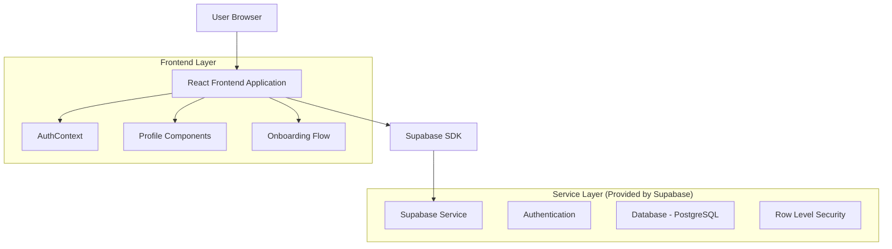
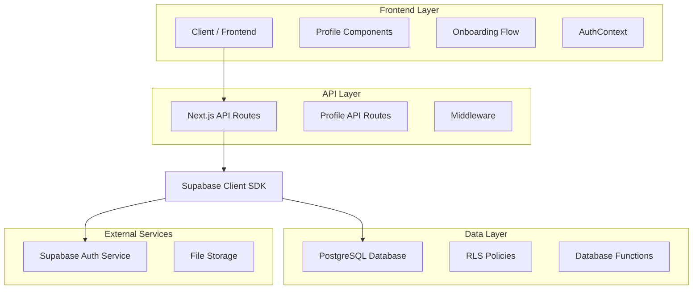
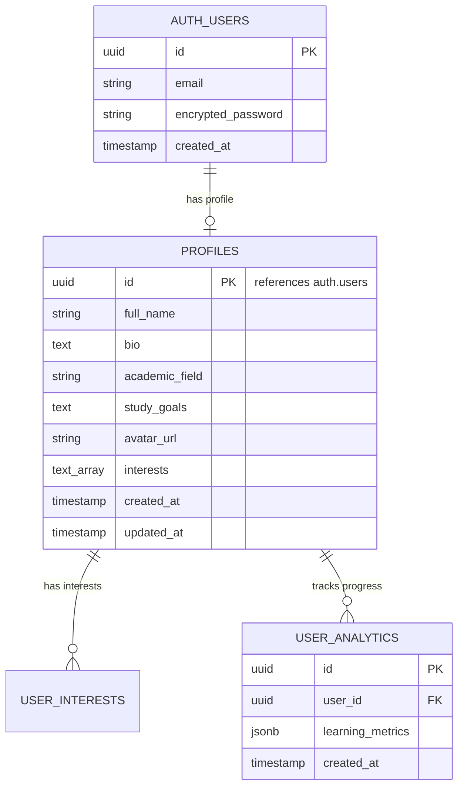

# NeuroLearn User Profiles System - Technical Architecture Document

## 1. Architecture Design



## 2. Technology Description

- Frontend: React@18 + Next.js@14.2.0 + TypeScript + Tailwind CSS + Lucide React icons
- Backend: Supabase (Authentication + PostgreSQL Database)
- State Management: React Context (existing AuthContext)
- Form Handling: React Hook Form + Zod validation
- UI Components: Existing component library (Button, Input, Card, etc.)

## 3. Route Definitions

| Route | Purpose |
|-------|---------|
| /auth/register | User registration with basic information collection |
| /auth/login | User authentication and profile existence check |
| /onboarding | First-time user profile setup and interest selection |
| /profile | User profile management and editing interface |
| /profile/settings | Privacy settings and account preferences |
| /dashboard | Personalized dashboard with profile-based recommendations |

## 4. API Definitions

### 4.1 Core API

**Profile Management**
```
GET /api/profile
```
Response:
| Param Name | Param Type | Description |
|-----------|-------------|-------------|
| profile | ProfileData | Complete user profile information |
| exists | boolean | Whether profile exists for current user |

**Profile Creation**
```
POST /api/profile
```
Request:
| Param Name | Param Type | isRequired | Description |
|-----------|-------------|-------------|-------------|
| full_name | string | true | User's full name |
| bio | string | false | User biography |
| academic_field | string | true | Field of study |
| study_goals | string | true | Learning objectives |
| interests | string[] | true | Array of learning interests |
| avatar_url | string | false | Profile picture URL |

**Profile Update**
```
PUT /api/profile
```
Request: Same as POST with optional fields for partial updates

**Interest Categories**
```
GET /api/interests/categories
```
Response:
| Param Name | Param Type | Description |
|-----------|-------------|-------------|
| categories | InterestCategory[] | Available interest categories with options |

Example Profile Data:
```json
{
  "id": "abc-123-def",
  "full_name": "Jane Doe",
  "bio": "Passionate about learning",
  "academic_field": "Physics",
  "study_goals": "Prepare for exams",
  "avatar_url": "avatar.png",
  "interests": ["Quantum Mechanics", "Mathematics", "Machine Learning"],
  "created_at": "2024-01-01T00:00:00Z"
}
```

## 5. Server Architecture Diagram



## 6. Data Model

### 6.1 Data Model Definition



### 6.2 Data Definition Language

**Profiles Table**
```sql
-- Create profiles table
CREATE TABLE profiles (
    id UUID REFERENCES auth.users ON DELETE CASCADE PRIMARY KEY,
    full_name TEXT,
    avatar_url TEXT,
    bio TEXT,
    academic_field TEXT,
    study_goals TEXT,
    interests TEXT[], -- store multiple interests directly
    created_at TIMESTAMP WITH TIME ZONE DEFAULT NOW(),
    updated_at TIMESTAMP WITH TIME ZONE DEFAULT NOW()
);

-- Create indexes for better performance
CREATE INDEX idx_profiles_academic_field ON profiles(academic_field);
CREATE INDEX idx_profiles_interests ON profiles USING GIN(interests);
CREATE INDEX idx_profiles_created_at ON profiles(created_at DESC);

-- Enable Row Level Security
ALTER TABLE profiles ENABLE ROW LEVEL SECURITY;

-- Create RLS policies for profiles
CREATE POLICY "Users can view their own profile" ON profiles
    FOR SELECT USING (auth.uid() = id);

CREATE POLICY "Users can create their own profile" ON profiles
    FOR INSERT WITH CHECK (auth.uid() = id);

CREATE POLICY "Users can update their own profile" ON profiles
    FOR UPDATE USING (auth.uid() = id);

CREATE POLICY "Users can delete their own profile" ON profiles
    FOR DELETE USING (auth.uid() = id);

-- Grant permissions
GRANT SELECT ON profiles TO anon;
GRANT ALL PRIVILEGES ON profiles TO authenticated;

-- Create function to update updated_at timestamp
CREATE OR REPLACE FUNCTION update_updated_at_column()
RETURNS TRIGGER AS $$
BEGIN
    NEW.updated_at = NOW();
    RETURN NEW;
END;
$$ language 'plpgsql';

-- Create trigger for updated_at
CREATE TRIGGER update_profiles_updated_at 
    BEFORE UPDATE ON profiles 
    FOR EACH ROW 
    EXECUTE FUNCTION update_updated_at_column();

-- Insert sample data for testing
INSERT INTO profiles (id, full_name, bio, academic_field, study_goals, avatar_url, interests)
VALUES (
    'sample-user-id',
    'Jane Doe',
    'Passionate about learning and exploring new technologies',
    'Computer Science',
    'Master machine learning and AI concepts',
    'https://example.com/avatar.jpg',
    ARRAY['Machine Learning', 'Artificial Intelligence', 'Data Science', 'Programming']
) ON CONFLICT (id) DO NOTHING;
```

**Interest Categories Reference Table (Optional)**
```sql
-- Create interest categories for better UX
CREATE TABLE interest_categories (
    id UUID PRIMARY KEY DEFAULT gen_random_uuid(),
    name TEXT NOT NULL,
    description TEXT,
    interests TEXT[] NOT NULL,
    created_at TIMESTAMP WITH TIME ZONE DEFAULT NOW()
);

-- Insert predefined categories
INSERT INTO interest_categories (name, description, interests) VALUES
('STEM', 'Science, Technology, Engineering, Mathematics', 
 ARRAY['Mathematics', 'Physics', 'Chemistry', 'Biology', 'Computer Science', 'Engineering']),
('Languages', 'Language learning and linguistics',
 ARRAY['English', 'Spanish', 'French', 'German', 'Chinese', 'Japanese', 'Linguistics']),
('Business', 'Business and entrepreneurship',
 ARRAY['Marketing', 'Finance', 'Management', 'Entrepreneurship', 'Economics', 'Strategy']),
('Arts', 'Creative and artistic fields',
 ARRAY['Music', 'Visual Arts', 'Literature', 'Theater', 'Film', 'Design', 'Photography']),
('Technology', 'Modern technology and digital skills',
 ARRAY['Programming', 'Web Development', 'Mobile Development', 'AI/ML', 'Data Science', 'Cybersecurity']);

-- Enable RLS and grant permissions
ALTER TABLE interest_categories ENABLE ROW LEVEL SECURITY;
CREATE POLICY "Anyone can view interest categories" ON interest_categories FOR SELECT TO anon, authenticated USING (true);
GRANT SELECT ON interest_categories TO anon, authenticated;
```